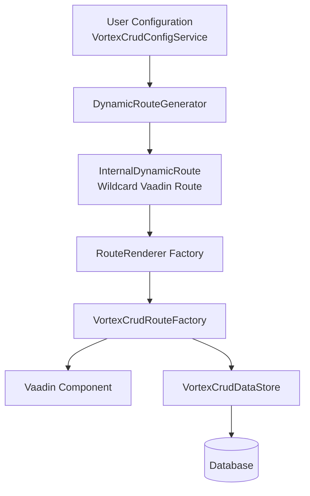

# CLAUDE.md - AI Assistant Guide for vortex-crud

> **Last Updated**: 2025-11-16
>
> This document provides comprehensive guidance for AI assistants working with the vortex-crud codebase. Read this file completely before making any code changes.

---

## Table of Contents

1. [Critical Information](#critical-information)
2. [Project Overview](#project-overview)
3. [Technology Stack](#technology-stack)
4. [Architecture & Core Concepts](#architecture--core-concepts)
5. [Module Structure](#module-structure)
6. [Data Access Patterns](#data-access-patterns)
7. [Configuration Patterns](#configuration-patterns)
8. [UI Components & Route Factories](#ui-components--route-factories)
9. [Security & Authentication](#security--authentication)
10. [Testing Strategy](#testing-strategy)
11. [Development Workflow](#development-workflow)
12. [Common Pitfalls](#common-pitfalls)
13. [Key File Locations](#key-file-locations)
14. [Contributing Guidelines](#contributing-guidelines)

---

## Critical Information

### ⚠️ THIS IS NOT VANILLA SPRING BOOT!

**vortex-crud uses its own architectural patterns that differ significantly from traditional Spring Boot applications.**

### **DO NOT:**
- ❌ Create custom repository methods beyond basic `JpaRepository<Entity, ID>`
- ❌ Create `@Service` classes for data access logic
- ❌ Use `@Transactional` for CRUD operations (framework handles it)
- ❌ Create custom implementations like `UserDetailsService`
- ❌ Add methods to repository interfaces
- ❌ Create DAO classes or traditional data access layers
- ❌ Use direct field manipulation or reflection for entity field access

### **DO:**
- ✅ Use `VortexCrudDataStore` directly for ALL data access
- ✅ Look at existing implementations before creating new features:
  - `FormRouteFactory.java` - Form-based CRUD operations
  - `FormDialogFactory.java` - Dialog-based entity editing
  - `SignUpView.java` - User creation with password hashing
- ✅ Use `VortexCrudDataStoreFactoryRegistry` to get DataStores
- ✅ Use `ReflectionService` for field access, NOT direct field manipulation
- ✅ Implement logic directly in Views using the VortexCrudDataStore pattern
- ✅ Follow the declarative configuration approach

### Golden Rule for New Features

**When adding functionality, implement it directly in the View using the same pattern as existing Views. Do NOT create separate `@Service` classes or traditional Spring components.**

---

## Project Overview

**vortex-crud** is a high-level framework built on Vaadin Flow for creating CRUD applications with complex relational data. It uses declarative configuration to define routes, UI components, entities, and relationships.

### Key Characteristics

- **Declarative**: Define routes and forms via configuration objects, not code
- **Modular**: Fully customizable UI components using Vaadin
- **Type-Safe**: Supports both JPA (annotation-based) and jOOQ (type-safe SQL)
- **Dynamic**: Routes are generated at runtime from configuration
- **Abstraction Layers**: Multiple levels of abstraction for flexibility

### What Makes It Different

Unlike **Directus** (no-code, configuration-based):
- Uses static Java code for configuration
- Database schema validation in Java code
- Fine-grained control over data models and logic

Unlike **Vaadin Flow** (component framework):
- Operates at a higher level of abstraction
- Declarative route and form configuration
- Automatic UI generation from data models
- Built-in CRUD operations and entity management

---

## Technology Stack

### Core Dependencies

| Technology | Version | Purpose |
|------------|---------|---------|
| **Java** | 21 | Language |
| **Spring Boot** | 4.0.0 | DI and application framework |
| **Vaadin Flow** | 25.0.0-beta9 | UI components |
| **jOOQ** | 3.19.16/3.19.22 | Type-safe SQL (optional) |
| **JPA/Hibernate** | 6.5.2.Final | ORM (optional) |
| **SQLite** | 3.47.1.0 | Development database |
| **Liquibase** | 4.29.0 | Database migrations |
| **Lombok** | Latest | Boilerplate reduction |
| **Selenium** | Latest | UI testing |

### Additional Vaadin Components

- **FullCalendar2**: 6.3.1 (calendar views)
- **Hugerte for Flow**: 1.0.8 (rich text editor)

---

## Architecture & Core Concepts

### High-Level Architecture



### Key Concepts

#### 1. **VortexCrudConfigService**
- Main entry point for configuration
- Implemented by users to provide `Application` configuration
- Injected via Spring dependency injection

**Location**: `core/src/main/java/com/github/appreciated/vortex_crud/core/service/VortexCrudConfigService.java`

#### 2. **Application Configuration**
- Root configuration object containing:
  - Routes (navigation and UI definitions)
  - Data Stores (table/entity configurations)
  - Security settings (authentication, authorization)
  - i18n configuration

#### 3. **Route Renderer**
- Defines how a route is displayed
- Types: Grid, List, Kanban, Calendar, Form, Master-Detail, Submenu
- Each has a corresponding factory class

#### 4. **Data Store**
- Abstraction over database table/entity
- Contains field definitions (columns)
- NOT a Spring Repository - custom abstraction

#### 5. **Form Elements**
- UI fields within forms
- Bound to Data Store fields
- Automatically rendered based on field type

### Terminology

| Term | Definition |
|------|------------|
| **Data Store** | Abstraction layer (like Repository/DAO) managing data for a single table |
| **Field** | Represents a database column as a child of the Data Store |
| **Route** | Defines navigational paths and display configurations |
| **Form** | Specialized route for creating/editing data |
| **Element** | UI field within a form, binds to a Data Store field |
| **Route Renderer** | Factory that creates Vaadin components for a route |
| **Route Factory** | Implementation of VortexCrudRouteFactory for specific route types |

---

## Module Structure

### Maven Modules (6 total)

```
vortex-crud-root/
├── core/                    # Core framework, UI factories, config models
├── jpa/                     # JPA implementation with annotations
├── jooq/                    # jOOQ implementation with type-safety
├── security/
│   ├── core/               # Security framework integration
│   └── userstore-local/    # Local database authentication
├── ui-test-base/           # Shared Selenium test infrastructure
└── examples/
    ├── jpa-sqlite-example/              # Simple JPA demo
    ├── jooq-sqlite-example/             # Simple jOOQ demo
    ├── jooq-project-management-demo/    # Advanced: 8 tables, custom fields
    └── jooq-dev-platform-demo/          # Advanced: 12 tables, GitHub-like
```

### Core Module Structure

```
core/src/main/java/com/github/appreciated/vortex_crud/core/
├── config/                          # Configuration models & route generation
│   ├── model/                       # POJOs (Application, RouteRenderer, etc.)
│   │   └── fields/                  # Field type definitions
│   ├── DynamicRouteGenerator.java   # VaadinServiceInitListener - registers routes
│   └── VortexCrudPathToRouteResolver.java
│
├── service/
│   └── VortexCrudConfigService.java # Main configuration entry point
│
├── entity/
│   ├── data_store/
│   │   └── VortexCrudDataStore.java # Core CRUD interface (NOT Spring Repo!)
│   └── reflection/                  # Field access utilities
│
├── ui/
│   ├── factories/
│   │   ├── route/                   # Route factory implementations
│   │   │   ├── grid/               # GridRouteFactory
│   │   │   ├── list/               # ListRouteFactory
│   │   │   ├── kanban/             # KanbanFactory
│   │   │   ├── calendar/           # CalendarFactory
│   │   │   ├── form/               # FormRouteFactory, FormSlideRouteFactory
│   │   │   ├── master_detail/      # MasterDetailRouteFactory
│   │   │   └── submenu/            # SubmenuRouteFactory
│   │   ├── form/elements/          # Form field components
│   │   ├── dialog/                 # Dialog factories
│   │   └── item/                   # Card/item renderers
│   └── routes/
│       ├── InternalDynamicRoute.java    # Dynamic route resolver
│       └── ProxyRouterLayout.java       # Layout wrapper
│
└── security/                        # Security integration
```

---

## Data Access Patterns

### The VortexCrudDataStore Pattern

**CRITICAL**: This is the core data access abstraction. Do NOT use traditional Spring patterns.

#### Interface Definition

**Location**: `core/src/main/java/com/github/appreciated/vortex_crud/core/entity/data_store/VortexCrudDataStore.java`

```java
public interface VortexCrudDataStore<FieldType, ModelClass> {
    // Create
    ModelClass newInstance();
    ModelClass insertRecord(ModelClass record);

    // Read
    ModelClass getRecordById(Object id);
    List<ModelClass> getAllRecords();
    List<ModelClass> getRecordsFromTableWhereColumnEquals(FieldType field, Object value);
    List<ModelClass> getRecordsFromTableWhereColumnLike(FieldType field, String pattern);

    // Update
    ModelClass updateRecordById(Object id, ModelClass record);

    // Delete
    void deleteRecordById(Object id);

    // Pagination
    DataProvider<ModelClass, ?> getDataProvider();

    // Metadata
    FieldType getIdField();
    Object getIdValue(ModelClass record);
    // ... more methods
}
```

#### Usage Pattern

```java
// Get DataStore from registry (NOT autowiring a repository!)
VortexCrudDataStore<FieldType, Object> dataStore =
    dataStoreFactoryRegistry.getDataStore(repositoryKey);

// Create new entity
Object entity = dataStore.newInstance();

// Set field values using ReflectionService
reflectionService.setValue(entity, fieldName, value);

// Save to database
dataStore.insertRecord(entity);

// Query
List<Object> results = dataStore.getRecordsFromTableWhereColumnEquals(
    fieldName,
    searchValue
);
```

#### Reference Implementations

**Must read before implementing new features:**

1. **`FormRouteFactory.java`**
   - Location: `core/src/main/java/com/github/appreciated/vortex_crud/core/ui/factories/route/form/FormRouteFactory.java`
   - Shows: CRUD operations in forms

2. **`FormDialogFactory.java`**
   - Location: `core/src/main/java/com/github/appreciated/vortex_crud/core/ui/factories/dialog/FormDialogFactory.java`
   - Shows: Dialog-based entity creation/editing

3. **`SignUpView.java`**
   - Location: `security/core/src/main/java/com/github/appreciated/vortex_crud/security/core/view/SignUpView.java`
   - Shows: User creation with password hashing, field validation

### JPA Implementation

**Location**: `jpa/src/main/java/com/github/appreciated/vortex_crud/jpa/service/config/JpaRepositoryDataStore.java`

- Wraps Spring `JpaRepository` as `VortexCrudDataStore`
- Field types defined via annotations on entities
- Uses reflection to access entity fields

### jOOQ Implementation

**Location**: `jooq/src/main/java/com/github/appreciated/vortex_crud/jooq/service/JooqDataStore.java`

- Uses jOOQ `DSLContext` for type-safe queries
- Field types defined manually in configuration
- Uses generated jOOQ table classes

---

## Configuration Patterns

### JPA Pattern (Annotation-Based)

#### Entity Definition with Field Annotations

**Available Annotations** (`jpa/src/main/java/com/github/appreciated/vortex_crud/jpa/service/annoations/`):
- `@TextField` - Single-line text input
- `@TextAreaField` - Multi-line text
- `@EmailField` - Email validation
- `@PasswordField` - Password masking
- `@IntegerNumberField` - Integer input
- `@DoubleNumberField` - Decimal input
- `@BigDecimalNumberField` - High-precision decimal
- `@DateField` - Date picker
- `@DateTimePickerField` - Date and time
- `@CheckboxField` - Boolean
- `@SelectField` - Dropdown (for enums)
- `@ReferenceField` - Foreign key reference
- `@ImageField` - Image upload
- `@VideoField` - Video handling

**Example Entity**:

```java
@Entity
public class Project {
    @Id
    @GeneratedValue(strategy = GenerationType.IDENTITY)
    @IntegerNumberField
    private Integer id;

    @TextField
    private String name;

    @TextAreaField
    private String description;

    @DateField
    private LocalDate endDate;

    @ReferenceField
    @ManyToOne
    private User owner;

    // Getters and setters...
}
```

#### Configuration Service

```java
@Service
public class ExampleJpaConfiguration implements
    VortexCrudConfigurationProvider<JpaRepository<?, ?>, String, JpaRepository<?, ?>> {

    private final ProjectRepository projectRepository;

    @Override
    public Application<JpaRepository<?, ?>, String, JpaRepository<?, ?>> get() {
        // No need to define fields - auto-detected from annotations!

        FormRoute<...> projectForm = JpaFormRoute.builder()
            .dataStoreKey(projectRepository)  // JpaRepository instance
            .title("route.projects.title")
            .formConfiguration(JpaFormRendererConfiguration.builder()
                .titleField("name")  // String field names
                .children(List.of(
                    JpaFieldElement.builder("name", "labels.name").build(),
                    JpaFieldElement.builder("description", "labels.description").build(),
                    JpaFieldElement.builder("endDate", "labels.end_date").build()
                ))
                .build())
            .build();

        GridRoute<...> projectGrid = JpaGridRoute.builder()
            .dataStoreKey(projectRepository)
            .title("route.projects.list")
            .defaultRoute(true)
            .configuration(JpaGridItemRendererConfiguration.builder()
                .titleField("name")
                .descriptionField("description")
                .build())
            .writeRoles(List.of("admin", "manager"))
            .child(projectForm)
            .build();

        Map<String, RouteRenderer<...>> routes = Map.of(
            "projects", projectGrid
        );

        return JpaApplication.builder()
            .applicationName("application.name")
            .i18nBundlePrefix("messages")
            .routes(routes)
            .withIdentityAndAccessManagement(/* ... */)
            .build();
    }
}
```

### jOOQ Pattern (Manual Configuration)

#### Generated jOOQ Classes

After running `mvn generate-sources`, jOOQ generates type-safe table classes from database schema.

**Example**: `com.github.appreciated.vortex_crud.example.jooq.generated.tables.Projects`

#### Configuration Service

```java
@Service
public class ExampleJooqConfiguration implements
    VortexCrudConfigurationProvider<TableRecord<?>, TableField<?, ?>, TableImpl<?>> {

    @Override
    public Application<TableRecord<?>, TableField<?, ?>, TableImpl<?>> get() {
        // Manual field definition
        Map<TableImpl<?>, DataStoreConfig<...>> dataStores = Map.of(
            PROJECTS, JooqDataStoreConfig.of(PROJECTS)
                .withFields(Map.of(
                    PROJECTS.ID, new IdField<>(),
                    PROJECTS.NAME, new TextField<>(),
                    PROJECTS.DESCRIPTION, new TextAreaField<>(),
                    PROJECTS.END_DATE, new DateField<>()
                ))
                .build()
        );

        RouteRenderer<...> projectForm = JooqRouteRenderer.of(FormRouteFactory.class)
            .withDataStore(PROJECTS)  // TableImpl instance
            .withTitle("route.projects.title")
            .withConfiguration(JooqRouteRendererConfiguration.of(FormFactory.class)
                .withTitleField(PROJECTS.NAME)  // TableField instances
                .withChildren(
                    JooqFieldElement.of(PROJECTS.NAME, "labels.name"),
                    JooqFieldElement.of(PROJECTS.DESCRIPTION, "labels.description"),
                    JooqFieldElement.of(PROJECTS.END_DATE, "labels.end_date")
                )
                .build())
            .build();

        Map<String, RouteRenderer<...>> routes = Map.of(
            "projects", JooqRouteRenderer.of(GridRouteFactory.class)
                .withDataStore(PROJECTS)
                .withDefaultRoute(true)
                .withConfiguration(JooqGridOrListRendererConfiguration.of(CardFactory.class)
                    .withTitleField(PROJECTS.NAME)
                    .withDescriptionField(PROJECTS.DESCRIPTION)
                    .build())
                .withChild(projectForm)
                .build()
        );

        return JooqApplication.builder()
            .withApplicationName("application.name")
            .withI18nBundlePrefix("messages")
            .withRoutes(routes)
            .withDataStores(dataStores)
            .build();
    }
}
```

### Key Differences: JPA vs jOOQ

| Aspect | JPA | jOOQ |
|--------|-----|------|
| **Field Definition** | Annotations on entities | Manual field maps in config |
| **Field References** | String field names | Type-safe `TableField` instances |
| **Auto-Detection** | Fields auto-detected | Must define all fields |
| **Type Safety** | Runtime (reflection) | Compile-time |
| **Configuration** | Less verbose | More verbose but type-safe |
| **Data Store Key** | `JpaRepository<?, ?>` | `TableImpl<?>` |

---

## UI Components & Route Factories

### Route Types

All route factories implement `VortexCrudRouteFactory` with a single method: `Component renderRoute()`.

**Location**: `core/src/main/java/com/github/appreciated/vortex_crud/core/ui/factories/route/`

| Route Type | Factory Class | Purpose | Configuration |
|------------|---------------|---------|---------------|
| **Grid** | `GridRouteFactory` | Card grid with filtering | `GridItemRendererConfiguration` |
| **List** | `ListRouteFactory` | Scrollable list view | `ListItemRendererConfiguration` |
| **Kanban** | `KanbanFactory` | Drag-and-drop board | `KanbanConfiguration` |
| **Calendar** | `CalendarFactory` | Calendar/timeline | `CalendarConfiguration` |
| **Form** | `FormRouteFactory` | CRUD form | `FormRendererConfiguration` |
| **Form Slide** | `FormSlideRouteFactory` | Side panel form | `FormRendererConfiguration` |
| **Multi-Form** | `MultiFormRouteFactory` | Multi-step forms | `MultiFormConfiguration` |
| **Master-Detail** | `MasterDetailRouteFactory` | Split view | `MasterDetailConfiguration` |
| **Submenu** | `SubmenuRouteFactory` | Nested navigation | N/A (contains other routes) |

### Route Resolution Flow

1. **Startup**: `DynamicRouteGenerator` (VaadinServiceInitListener) registers wildcard routes
2. **Navigation**: User navigates to URL (e.g., `/projects/123/edit`)
3. **Resolution**: `InternalDynamicRoute.beforeEnter()` parses URL path
4. **Factory Lookup**: `VortexCrudRouteFactoryRegistry` finds matching factory
5. **Rendering**: Factory's `renderRoute()` creates Vaadin component
6. **Display**: Component added to `ProxyRouterLayout`

### Form Elements

**Location**: `core/src/main/java/com/github/appreciated/vortex_crud/core/ui/factories/form/elements/`

Form elements bind Data Store fields to UI components:

```java
// JPA
JpaFieldElement.builder("fieldName", "i18n.label.key")
    .required(true)
    .readOnly(false)
    .build()

// jOOQ
JooqFieldElement.of(TABLE.FIELD, "i18n.label.key")
```

Special element types:
- `OneToManyFieldElement` - Collection editing (e.g., project tasks)
- `ManyToManyFieldElement` - Multi-select relationships (e.g., user roles)

---

## Security & Authentication

### Architecture

**Location**: `security/`

```
security/
├── core/                                    # Core security abstractions
│   ├── config/
│   │   ├── SecurityConfig.java             # Spring Security configuration
│   │   ├── VortexCrudSecurityAutoConfiguration.java
│   │   ├── VortexCrudNavigationAccessChecker.java  # Route access control
│   │   └── VortexCrudRoleProvider.java
│   ├── view/
│   │   ├── LoginView.java                  # Login UI
│   │   ├── SignUpView.java                 # Registration UI
│   │   └── AccessDeniedView.java
│   └── service/
│       └── VortexCrudLogoutService.java
│
└── userstore-local/                         # Local database authentication
    ├── config/
    │   └── LocalStorageVortexCrudRbacPermissionChecker.java
    ├── view/
    │   └── LocalIdentityAndAccessManagement.java
    └── service/
        └── LocalStorageUserContextService.java
```

### Configuration Example

```java
.withIdentityAndAccessManagement(
    LocalIdentityAndAccessManagement.of(userRepository)
        .withRoles(Roles.builder()
            .withRoles(List.of("admin", "manager", "viewer"))
            .build())
        .withSignUp(true)
        .withLoginView(LoginView.class)
        .withSignUpView(SignUpView.class)
        .withUsername(JpaFieldElement.of("username", "labels.username"))
        .withPassword(JpaFieldElement.of("passwordHash", "labels.password"))
        .withSignUpFields(
            JpaFieldElement.of("firstName", "labels.firstName"),
            JpaFieldElement.of("lastName", "labels.lastName")
        )
        .build()
)
```

### User Entity Example

```java
@Entity
public class User {
    @Id
    @GeneratedValue(strategy = GenerationType.IDENTITY)
    private Integer id;

    @EmailField
    private String username;

    @PasswordField
    private String passwordHash;

    @TextField
    private String firstName;

    @TextField
    private String lastName;

    @ManyToMany
    private Set<Role> roles;
}
```

### Role-Based Access Control

Routes support role restrictions:

```java
.withReadRoles(List.of("admin", "manager", "viewer"))
.withWriteRoles(List.of("admin", "manager"))
```

### CRITICAL: Security Pattern

**DO NOT** create traditional Spring Security components:
- ❌ `UserDetailsService`
- ❌ Custom authentication providers
- ❌ Custom repository methods for authentication

**DO** use the VortexCrudDataStore pattern as shown in `SignUpView.java`.

---

## Testing Strategy

### Structure

```
ui-test-base/                          # Shared infrastructure
├── src/main/java/.../ui_test_base/
│   ├── BaseUITest.java               # Selenium test base
│   ├── config/
│   │   └── VortexCrudTestConfiguration.java
│   ├── pages/                        # Page Objects
│   │   ├── GridPage.java
│   │   ├── FormPage.java
│   │   ├── KanbanPage.java
│   │   └── ...
│   └── tests/                        # Abstract test classes
│       ├── AbstractGridTest.java
│       ├── AbstractKanbanTest.java
│       ├── AbstractMasterDetailTest.java
│       └── ...

jpa/src/test/java/.../test/jpa/ui/   # JPA-specific tests
├── grid/JpaGridTest.java
├── kanban/JpaKanbanTest.java
├── form_slide/JpaFormSlideTest.java
└── resources/.../ui/*_test.sql       # Test data

jooq/src/test/java/.../test/jooq/ui/ # jOOQ-specific tests
├── grid/JooqGridTest.java
├── kanban/JooqKanbanTest.java
└── resources/.../ui/*_test.sql       # Test data
```

### Test Pattern

1. **Abstract Test** in `ui-test-base` defines test logic
2. **Concrete Test** in `jpa` or `jooq` extends abstract test
3. **Test Data** loaded from SQL file next to test
4. **Page Objects** centralized in `ui-test-base/pages/`

**Example**:

```java
// Abstract test
public abstract class AbstractGridTest extends BaseUITest {
    @Test
    public void testGridRendering() {
        GridPage gridPage = new GridPage(driver);
        gridPage.navigate();
        assertTrue(gridPage.hasCards());
    }
}

// JPA implementation
public class JpaGridTest extends AbstractGridTest {
    // Inherits all test methods
    // Uses JPA-specific test configuration
}
```

### Running Tests

```bash
# JPA tests
cd jpa
mvn test

# jOOQ tests
cd jooq
mvn test
```

---

## Development Workflow

### Initial Setup

```bash
# Clone repository
git clone <repository-url>
cd vortex-crud

# Install all modules to local Maven repo
mvn clean install
```

### Running Examples

#### JPA Example (Simple)

```bash
cd examples/jpa-sqlite-example
mvn spring-boot:run
```

Access at: `http://localhost:8080`

#### jOOQ Example (Simple)

```bash
cd examples/jooq-sqlite-example
mvn clean generate-sources  # Generate jOOQ classes
mvn spring-boot:run
```

Access at: `http://localhost:8080`

#### Advanced Demo Applications

**Project Management** (8 tables, custom fields):
```bash
cd examples/jooq-project-management-demo
mvn clean generate-sources
mvn spring-boot:run -Dserver.port=8081
```

**Dev Platform** (12 tables, GitHub-like):
```bash
cd examples/jooq-dev-platform-demo
mvn clean generate-sources
mvn spring-boot:run -Dserver.port=8082
```

### Build Process

#### JPA Workflow

1. **Liquibase** creates/updates database schema from changelogs
2. **Hibernate** validates entity classes against schema
3. **Application** uses annotated entities

#### jOOQ Workflow

1. **Liquibase** creates/updates database schema
2. **jOOQ Codegen** generates type-safe Java classes from schema
3. **Application** uses generated classes

### Database Migrations

**Structure**:
```
src/main/resources/db/changelog/
├── db.changelog-master.yaml        # Master changelog
├── vortex-crud/
│   ├── V1.sql                      # System tables (users, roles, audit_log)
│   └── V2.sql                      # Additional system tables
└── database/
    └── V1.sql                      # Application-specific tables
```

**System Tables** (in `vortex-crud/V1.sql`):
- `users` - User accounts
- `roles` - Role definitions
- `user_roles` - Many-to-many user-role mapping
- `audit_log` - Audit trail

**Application Tables** (in `database/V1.sql`):
- Your custom tables (e.g., `projects`, `tasks`)

### Configuration Files

**JPA Example**:
```properties
# application.properties
spring.datasource.url=jdbc:sqlite:jpa-example-database.db
spring.jpa.hibernate.ddl-auto=validate
spring.liquibase.enabled=true
spring.liquibase.change-log=classpath:db/changelog/db.changelog-master.yaml
```

**jOOQ Example** (additional pom.xml config):
```xml
<plugin>
    <groupId>org.jooq</groupId>
    <artifactId>jooq-codegen-maven</artifactId>
    <executions>
        <execution>
            <goals>
                <goal>generate</goal>
            </goals>
        </execution>
    </executions>
    <configuration>
        <jdbc>
            <url>jdbc:sqlite:jooq-example-database.db</url>
        </jdbc>
        <generator>
            <database>
                <name>org.jooq.meta.sqlite.SQLiteDatabase</name>
            </database>
            <target>
                <packageName>com.example.generated</packageName>
            </target>
        </generator>
    </configuration>
</plugin>
```

### Hot Reload

Vaadin supports hot reload in development mode:

1. Make code changes
2. Build with Maven (or IDE auto-build)
3. Refresh browser

---

## Common Pitfalls

### 1. Using Traditional Spring Patterns

**Problem**: Creating custom repository methods or service classes

```java
// ❌ WRONG
public interface UserRepository extends JpaRepository<User, Integer> {
    User findByUsername(String username);  // Don't add custom methods!
}

@Service
public class UserService {  // Don't create service classes!
    public User createUser(User user) { ... }
}
```

**Solution**: Use VortexCrudDataStore

```java
// ✅ CORRECT
VortexCrudDataStore<String, Object> userStore =
    dataStoreFactoryRegistry.getDataStore(userRepository);

List<Object> users = userStore.getRecordsFromTableWhereColumnEquals(
    "username",
    usernameValue
);
```

### 2. Direct Field Access

**Problem**: Using reflection or direct field access

```java
// ❌ WRONG
User user = new User();
user.setName("John");  // Direct access
```

**Solution**: Use ReflectionService

```java
// ✅ CORRECT
Object user = dataStore.newInstance();
reflectionService.setValue(user, "name", "John");
```

### 3. Missing i18n Keys

**Problem**: Hardcoded strings in UI

```java
// ❌ WRONG
.withTitle("Projects")
```

**Solution**: Use i18n keys

```java
// ✅ CORRECT
.withTitle("route.projects.title")
```

Then define in `src/main/resources/messages.properties`:
```properties
route.projects.title=Projects
```

### 4. Forgetting jOOQ Code Generation

**Problem**: Running jOOQ example without generating classes first

```bash
# ❌ WRONG
mvn spring-boot:run  # Will fail if classes not generated
```

**Solution**: Always generate first

```bash
# ✅ CORRECT
mvn clean generate-sources
mvn spring-boot:run
```

### 5. Incorrect Type Parameters

**Problem**: Mismatching generic type parameters

```java
// ❌ WRONG - JPA example with jOOQ types
VortexCrudConfigurationProvider<TableRecord<?>, TableField<?, ?>, TableImpl<?>>
```

**Solution**: Use correct types

```java
// ✅ CORRECT - JPA
VortexCrudConfigurationProvider<JpaRepository<?, ?>, String, JpaRepository<?, ?>>

// ✅ CORRECT - jOOQ
VortexCrudConfigurationProvider<TableRecord<?>, TableField<?, ?>, TableImpl<?>>
```

### 6. Not Reading Reference Implementations

**Problem**: Implementing features without looking at existing code

**Solution**: Always check these first:
- `FormRouteFactory.java` - Standard CRUD patterns
- `SignUpView.java` - User creation patterns
- `FormDialogFactory.java` - Dialog patterns

### 7. Creating Unnecessary Files

**Problem**: Creating separate configuration files, DTOs, or helper classes

**Solution**: Use the declarative configuration approach - everything is configured in the `VortexCrudConfigService` implementation

---

## Key File Locations

### Must-Read Files

| File | Purpose | Location |
|------|---------|----------|
| **README.md** | Feature overview, getting started | `/README.md` |
| **AGENTS.md** | Critical anti-patterns for AI | `/AGENTS.md` |
| **DEV_README.md** | Developer onboarding | `/DEV_README.md` |
| **CLAUDE.md** | This file | `/CLAUDE.md` |

### Core Interfaces

| Interface | Location |
|-----------|----------|
| **VortexCrudConfigService** | `core/src/main/java/.../service/VortexCrudConfigService.java` |
| **VortexCrudDataStore** | `core/src/main/java/.../entity/data_store/VortexCrudDataStore.java` |
| **VortexCrudRouteFactory** | `core/src/main/java/.../ui/factories/route/VortexCrudRouteFactory.java` |

### Configuration Models

| Model | Location |
|-------|----------|
| **Application** | `core/src/main/java/.../config/model/Application.java` |
| **RouteRenderer** | `core/src/main/java/.../config/model/RouteRenderer.java` |
| **DataStoreConfig** | `core/src/main/java/.../config/model/DataStoreConfig.java` |
| **FormRoute** | `core/src/main/java/.../config/model/FormRoute.java` |

### Reference Implementations

| Implementation | Location |
|----------------|----------|
| **FormRouteFactory** | `core/src/main/java/.../ui/factories/route/form/FormRouteFactory.java` |
| **GridRouteFactory** | `core/src/main/java/.../ui/factories/route/grid/GridRouteFactory.java` |
| **SignUpView** | `security/core/src/main/java/.../view/SignUpView.java` |
| **JpaRepositoryDataStore** | `jpa/src/main/java/.../service/config/JpaRepositoryDataStore.java` |
| **JooqDataStore** | `jooq/src/main/java/.../service/JooqDataStore.java` |

### Example Configurations

| Example | Location |
|---------|----------|
| **JPA Simple** | `examples/jpa-sqlite-example/src/main/java/.../ExampleJpaConfiguration.java` |
| **jOOQ Simple** | `examples/jooq-sqlite-example/src/main/java/.../ExampleJooqConfiguration.java` |
| **Project Management** | `examples/jooq-project-management-demo/src/main/java/.../ProjectManagementConfiguration.java` |
| **Dev Platform** | `examples/jooq-dev-platform-demo/src/main/java/.../DevPlatformConfiguration.java` |

---

## Contributing Guidelines

### Before Making Changes

1. ✅ Read this entire CLAUDE.md file
2. ✅ Read `/AGENTS.md` for critical anti-patterns
3. ✅ Review reference implementations (FormRouteFactory, SignUpView)
4. ✅ Check if similar functionality already exists
5. ✅ Understand the VortexCrudDataStore pattern

### When Adding Features

1. **Research First**: Look at existing implementations
2. **Follow Patterns**: Use the same patterns as existing code
3. **Avoid Spring Boilerplate**: No services, custom repos, or DAOs
4. **Use VortexCrudDataStore**: For all data access
5. **Test Both Implementations**: If adding core features, test with JPA and jOOQ
6. **Update Examples**: Update example applications if relevant
7. **i18n**: Use internationalization keys, not hardcoded strings

### Code Style

- **Builders**: Use Lombok `@Builder` for configuration objects
- **Immutability**: Prefer immutable configuration objects
- **Type Safety**: Use generics properly
- **Naming**: Follow existing naming conventions
  - `*Factory` for factory classes
  - `*Configuration` for config classes
  - `*Route` for route models

### Testing

- **UI Tests**: Add UI tests for new route types
- **Abstract Tests**: Create abstract test in `ui-test-base` if applicable
- **Test Data**: Provide SQL seed data
- **Both Implementations**: Test JPA and jOOQ if feature is core

### Documentation

- **JavaDoc**: Add JavaDoc for public APIs
- **README**: Update README.md if adding user-facing features
- **AGENTS.md**: Update if you discover common pitfalls
- **CLAUDE.md**: Update this file for architectural changes

### Git Workflow

Currently on branch: `claude/claude-md-mi234jsg72pox7ui-0158epkYB7sN6eRjKzhj8btL`

```bash
# Make changes
git add .
git commit -m "Descriptive commit message"

# Push to feature branch
git push -u origin claude/claude-md-mi234jsg72pox7ui-0158epkYB7sN6eRjKzhj8btL
```

---

## Quick Reference

### Type Parameters Cheat Sheet

**JPA**:
```java
VortexCrudConfigurationProvider<
    JpaRepository<?, ?>,  // ModelClass
    String,                // FieldType
    JpaRepository<?, ?>    // RepositoryType
>
```

**jOOQ**:
```java
VortexCrudConfigurationProvider<
    TableRecord<?>,     // ModelClass
    TableField<?, ?>,   // FieldType
    TableImpl<?>        // RepositoryType
>
```

### Common Tasks

**Get DataStore**:
```java
VortexCrudDataStore<FieldType, Object> store =
    dataStoreFactoryRegistry.getDataStore(key);
```

**Create Entity**:
```java
Object entity = store.newInstance();
reflectionService.setValue(entity, field, value);
store.insertRecord(entity);
```

**Query**:
```java
List<Object> results = store.getRecordsFromTableWhereColumnEquals(field, value);
```

**Define Route (JPA)**:
```java
JpaGridRoute.builder()
    .dataStoreKey(repository)
    .configuration(...)
    .build()
```

**Define Route (jOOQ)**:
```java
JooqRouteRenderer.of(GridRouteFactory.class)
    .withDataStore(TABLE)
    .withConfiguration(...)
    .build()
```

---

## Additional Resources

### Framework Documentation
- **Vaadin Flow**: https://vaadin.com/docs/latest/flow
- **Spring Boot**: https://docs.spring.io/spring-boot/docs/current/reference/html/
- **jOOQ**: https://www.jooq.org/doc/latest/manual/
- **Liquibase**: https://docs.liquibase.com/

### Internal Documentation
- Main README: `/README.md`
- Developer Guide: `/DEV_README.md`
- Agent Guidelines: `/AGENTS.md`
- Original Concept: `/original-concept.md`

### Example Schemas
- Dev Platform Schema: `/schema-design-dev-platform.sql`
- Project Management Schema: `/schema-design-project-management.sql`

---

## Conclusion

**vortex-crud** is a powerful framework that requires understanding its unique patterns. The key to success is:

1. **Abandon traditional Spring Boot patterns** - Use VortexCrudDataStore
2. **Study reference implementations** - FormRouteFactory, SignUpView, etc.
3. **Think declaratively** - Configure, don't code
4. **Follow the builder pattern** - Use Lombok builders throughout
5. **Understand the abstractions** - Routes, DataStores, Elements

When in doubt, consult existing implementations and `/AGENTS.md` for guidance on what NOT to do.

Happy coding! 🚀
