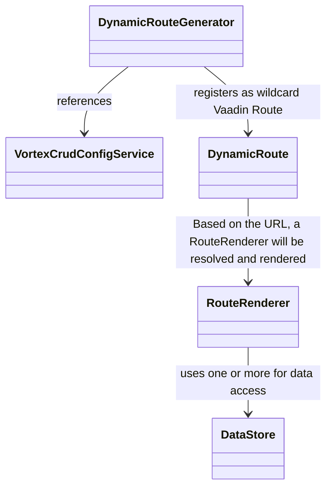
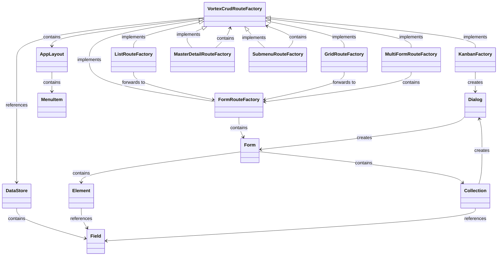
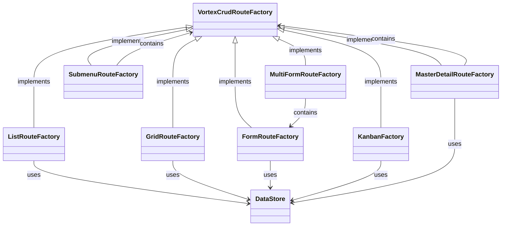

# vortex-crud 


This is a high-level framework built on top of Vaadin Flow, designed to simplify the creation of CRUD applications relying on relationships between data. It uses a declarative configuration approach to define routes, UI components, entities, relationships, and data bindings, reducing the need for manual coding. By providing multiple abstraction layers, `vortex-crud` leverages Vaadin Flow to dynamically generate routes and offers default implementations for UI representation, allowing developers to quickly build and manage CRUD interfaces with minimal effort.

Beyond basic CRUD, the framework makes it easy to interconnect and navigate relational data—linking entities like users with roles or products with categories—and to edit that data through multiple interfaces such as forms, grids, cards, kanban boards, or master–detail views.

Thanks to its **modular** design, `vortex-crud` allows developers to fully customize the user interface using Vaadin components. This provides high flexibility in designing the frontend while still benefiting from the default implementations of `vortex-crud`, which can be extended or replaced as needed.

To keep route configuration lean and type-safe, renderer-specific models now implement a minimal `RouteConfig` interface instead of inheriting from a monolithic base class.

## Table of Contents

1. **[Introduction](#introduction)**
   - **[Inspiration](#inspiration)**
   - **[Tech Stack](#tech-stack)**
   - **[Key Features](#key-features)**
2. **[Features in Detail](#features-in-detail)**
   - **[Listing Data](#listing-data)**
      - **[Grid](#grid)**
      - **[Cards](#cards)**
      - **[Kanban](#kanban)**
      - **[Master-Detail](#master-detail)**
   - **[Nesting routes using Subroute](#nesting-routes-using-subroute)**
   - **[Editing Data](#editing-data)**
      - **[Input Types](#input-types)**
      - **[Relationships](#relationships)**
3. **[Code Examples](#code-examples)**
4. **[Getting Started](#getting-started)**
   - **[Terminology](#terminology)**
   - **[Configuration with jOOQ](#configuration-with-jooq)**
   - **[Configuration with JPA](#configuration-with-jpa)**
5. **[Database Modeling](#database-modeling)**
   - **[System-Defined Tables](#system-defined-tables)**
   - **[Example User-Defined Tables](#example-user-defined-tables)**
6. **[Architecture](#architecture)**
   - **[Basic Principles](#basic-principles)**
   - **[Relationship Between Routes and Forms](#relationship-routes-forms)**
   - **[Data Handling](#data-handling)**
   - **[Data Access](#data-access)**
7. **[Roadmap](#roadmap)**
8. **[Contributing](#contributing)**
9. **[Further Development](#further-development)**

# <a name="introduction">Introduction</a>
## <a name="inspiration">Inspiration</a>
`vortex-crud` was inspired by systems like [Directus](https://github.com/directus/directus), which enable user-friendly management of entities and their relationships. However, unlike Directus, which offers a dynamic model, configuration-based solution that requires no code, `vortex-crud` takes a different approach.

Unlike **Directus**, `vortex-crud` relies on static Java code for configuration, providing developers with fine-grained control over data models and underlying logic. This means database schema validation happens directly within the Java code, ensuring the schema stays consistent and aligned with the application. As a result, developers can flexibly extend and reuse the schema, benefiting from a clear and verifiable structure.

The key difference to **Vaadin Flow** is that `vortex-crud` operates at a much higher level of abstraction. While Vaadin is a framework for building UI components, `vortex-crud` simplifies the creation and management of CRUD applications by offering a declarative configuration for routes, UI components, and data bindings. Developers can focus less on manual coding, as the framework automatically handles many tasks, such as generating routes and UI elements based on the defined model. As a side note, Vaadin and `vortex-crud` can both be used at once.

## <a name="tech-stack">Tech Stack</a>
- **Spring Boot**: Making heavy use of dependency injection
- **Vaadin Flow**: Frontend UI components for building interactive applications
- **JPA or jOOQ**: To access your database either use JPA or jOOQ
 
## <a name="key-features">Key Features</a>
- **Declarative definition of Forms and Routes**: Rapidly create complex, user-friendly CRUD applications by describing the application.
- **Modular Architecture**: If the default implementations don't suffice, rely on a fully modular and flexible [architecture](#architecture).
- **Automatic Entity Management**: Let `vortex-crud` handle basic or more complex cases of entity management. For more complicated use cases, provide a custom implementation.
    - **jOOQ Support**
    - **JPA Support**
        - **Database Schema Validation**: Receive notifications if the data model no longer fits your application.
- **i18n Support**
- **Entity Relationship Support**: Manage relationships between entities (One-to-One, One-to-Many, Many-to-Many).
- **Menu**
- **Appbar**: With app name and icon
- **Nested Hierarchies**
- **Data Filtering**: Filter entity lists in "grid," "list," and "master-detail" routes.
- **Media Support**: Image, video, PDF, and file field types available
- **Multi-Selection Fields**: Support for multi-select with ComboBox and CheckboxGroup variants
- **Custom Action Buttons**: Add custom action buttons to routes for specialized workflows
- **Custom Routes**: Add routes not visible in the menu.
- **Lifecycle Hooks**: Intercept operations with before/after hooks for Create, Update, Delete, and Read operations
- **Field Validation**: Use built-in Vaadin validators (email, URL, regex, range, string length) with support for custom validation logic
- **Demo Applications**: Two production-ready demo apps showcasing real-world usage:
- **Project Management Demo** (Time Tracking, Subtasks, Workflow Transitions)
- **Development Platform** (Dashboard, Wiki, Notifications, GitHub/GitLab-style)

# <a name="supported-routes-inputs">Features in Detail</a>

The main point of this project is, that it decouples rendering from data. 

## <a name="listing-data">Listing Data</a>

`vortex-crud` provides multiple route renderer types for displaying and interacting with your data:

### Grid
Displays data in a card-based grid layout with filtering and navigation.


### Cards
List view with scrollable card display for browsing entities.


### Kanban
Kanban board with drag-and-drop support for workflow management.


### Master-Detail
Split view with a master list on the left and detail panel on the right.


### Form
Standard form view for creating and editing entities.


### Additional Route Types

- **Form Slide**: Form displayed in a slide-out side panel. This is configured by using a `FormRoute` (or `JooqFormRoute`/`JpaFormRoute`) and setting the dialog factory to `FormSlideFactory`.
- **Single Form**: Allows form routes to function as root routes for editing a specific entity instance by ID (e.g., user profile editing). Configured via `SingleFormRoute` model.
- **Multi-Form**: Handles multiple forms in a single route configuration, enabling complex multi-step or multi-entity editing workflows. Configured via `MultiFormRoute` model, which accepts a list of `FormRoute` instances.
- **Kanban**: Kanban board with drag-and-drop columns (configured via `KanbanFactory` or `KanbanRoute`)
- **Calendar**: Calendar and timeline views for date-based entities (configured via `CalendarFactory` or `CalendarRoute`)
- **Submenu**: Creates nested menu structures for hierarchical navigation, allowing grouping of related routes (configured via `SubmenuRoute` model).
- **Search**: Global search results view, aggregating results from configured routes (configured via `SearchRoute` model)
- **Single Component**: Route displaying a single full-page input component, useful for document editing or specific single-field workflows (configured via `SingleComponentRoute` model)
- **Custom**: Enables the integration of fully custom Vaadin components/views into the routing system (configured via `CustomRoute` model)

## <a name="ui-actions">UI Actions</a>
A flexible action system to add interactivity to views:

- **GlobalRouteAction**: Buttons placed at the top of a view (e.g., "Add New", "Export").
- **SingleEntityRouteAction**: Actions available for individual items/rows (e.g., "Edit", "Delete", "View Details").
- **MultiEntityRouteAction**: Bulk actions for selected groups of items (e.g., "Delete Selected").
- **DataStoreDropdownMenuAction**: Dropdown menu actions for compact interfaces.

## <a name="ui-components">UI Components & Factories</a>
Reusable building blocks for a consistent user interface:

- **Dialogs**: `FormDialogFactory`, `ConnectDialogFactory`, `VortexCrudDialogFactory` for consistent modal interactions.
- **Layouts**: `DefaultRouterLayout` provides the standard application shell with navigation.
- **Factories**: `CardFactory` renders entities as cards in List and Kanban views.
- **Search & Filtering**: `GenericFilterableDataProvider` and `SearchField` components enable data exploration.
- **Notifications**: `NotificationPanel` component displays user notifications, supporting read/unread status and timestamps.

## <a name="nesting-routes-using-subroute">Nesting routes using Subroute</a>


## <a name="editing-data">Editing Data</a>

### Input Types
A rich set of fields for data input and display, handling various data types and relationships:

- **Basic Input**: `TextField`, `TextAreaField`, `PasswordField`, `EmailField`.
- **Numeric**: `IntegerField`, `DoubleField`, `BigDecimalField`.
- **Boolean**: `CheckboxField`.
- **Date & Time**: `DateField`, `DateTimePickerField`.
- **Selection & Relationships**:
    - `SelectField`: For static lists or Enum values.
    - `MultiSelectField` / `MultiSelectValueField`: For selecting multiple values or relations.
    - `ReferenceField`: For selecting a single related entity (Many-to-One).
    - `Collection`: For managing One-to-Many or Many-to-Many relationships inline (e.g. subtasks, comments).
        - Configured via `CollectionConfiguration` (or `Collection` model).
        - **Key Properties**:
            - `form`: Defines the `FormRoute` used to edit the child items.
            - `oneToMany` / `manyToMany`: Defines the relationship type and target.
            - `listFactory`: Custom factory for listing items (optional).
- **Rich Media & Files**:
    - `ImageField`: For uploading and displaying images.
    - `VideoField`: For uploading and playing videos.
    - `PdfField`: For uploading and viewing PDF documents.
    - `FileField`: For generic file upload and download.
- **Rich Content**: `MarkDownField` for rich text editing.
- **System**: `IdField`, `NumericIdField`, `StringIdField` for handling entity identifiers.

## <a name="configuration-models">Configuration & Data Models</a>
Models that define the application's structure and behavior:

- **DataStoreConfig**: The central configuration for mapping data to views.
- **IdentityAndAccessManagement (IAM)**: Configuration for Role-Based Access Control (RBAC), defining Roles and permissions.
- **NotificationPanelConfiguration**: Configuration for the global notification panel (bell icon), including message sources, timestamps, and read status management.
- **Relationships**: Configuration support for OneToMany and ManyToMany relationships.
- **Auditing & Versioning**: Configuration models for tracking changes (implementation depends on the backend).

### Lifecycle Hooks
`vortex-crud` supports lifecycle hooks to intercept data operations. These are configured using the `DataStoreHooks` builder:

```java
DataStoreHooks<MyRecord> hooks = DataStoreHooks.<MyRecord>builder()
    .beforeCreate(record -> validate(record))
    .afterCreate(record -> sendNotification(record))
    .beforeUpdate(record -> checkPermission(record))
    .build();
```

# <a name="code-examples">Code Examples</a>

The repository includes several example applications located in the `examples/` directory to help you get started and understand different aspects of the framework.

## Feature Showcases
Comprehensive examples demonstrating all available field types, route renderers, and configuration options.

- **[jOOQ SQLite Example](examples/jooq-sqlite-example)** (`examples/jooq-sqlite-example`)
  The primary reference implementation for jOOQ integration. It provides a complete overview of the framework's capabilities, including:
  - **All Field Types**: From basic text/numbers to rich media (Image, Video, PDF) and collections.
  - **All Route Types**: Grid, List, Kanban, Master-Detail, Calendar, Form Slide, Submenus, and Custom routes.
  - **Advanced Features**: Many-to-Many relationships, Security (RBAC, Login/Signup), Auditing, Versioning, and Custom DataStores.

- **[JPA SQLite Example](examples/jpa-sqlite-example)** (`examples/jpa-sqlite-example`)
  The counterpart to the jOOQ example, demonstrating the same comprehensive feature set using JPA. It highlights:
  - **Annotation-Based Configuration**: Defining field types directly on Entity classes.
  - **JPA Repositories**: Using Spring Data JPA repositories as DataStores.
  - **Entity Relationships**: Handling JPA associations in the UI.

## Domain-Specific Demos
Real-world scenarios showcasing how to build specific types of applications.

- **[Project Management Demo](examples/jooq-project-management-demo)** (`examples/jooq-project-management-demo`)
  A project management tool featuring Projects, Tasks, Milestones, and Labels. It demonstrates a **Custom Field System** where users can dynamically define new fields for entities, stored as JSON.
  - **Key Features**: Time Tracking, Subtasks, Comments, Attachments, and complex Role-Based Access Control using strategies. It also showcases **Workflow Transitions** (e.g., Start Progress, Review, Done) implemented via `SingleEntityRouteAction`.

- **[Developer Platform Demo](examples/jooq-dev-platform-demo)** (`examples/jooq-dev-platform-demo`)
  A platform similar to GitHub/GitLab, managing Repositories, Issues, Pull Requests, and Organizations. Like the Project Management demo, it utilizes the custom field system for extensibility.
  - **Key Features**: Dashboard with analytics, Wiki/Git integration, Star/Watch repositories, and a Notification system.

- **[Resource Planner Demo](examples/jooq-ressource-planner-demo)** (`examples/jooq-ressource-planner-demo`)
  An application for scheduling appointments and managing resources.
  - **Key Features**:
    - **Customer Management**: Dedicated entity and view for customers.
    - **Recurring Appointments**: Support for repeating events.
    - **Resource View**: A Master-Detail view for browsing Rooms and managing their appointments.
    - **Resource Board**: A Kanban board grouping appointments by Room.
    - **Availability Checking**: Implemented using **DataStore Hooks** to prevent double-booking.
    - **Customer Management**: Dedicated entity and view for customers.

## <a name="configuration">Getting Started</a>
`vortex-crud` currently supports only Java-based configuration to define routes and data stores. Below is a smaller example of how to configure a part of a project management application using jOOQ and JPA.

### <a name="terminology">Terminology</a>
- **Data Store**: An abstraction layer (similar to a Spring Repository or DAO) that manages data for a single database table.
    - **Field**: Represents a database column as a child component of the data store.
- **Route**: Defines navigational paths and display configurations (e.g., grids, lists, or Kanban boards). Routes are linked to specific data stores to fetch and display data.
    - **Form**: A specialized type of route that includes elements for creating or editing data. It can interact with one or multiple data stores, depending on the elements it contains.
        - **Element**: A UI field within the form, serving as a child component that binds to a specific field in the data store.

### <a name="configuration-jooq">vortex-crud with jOOQ</a>
Here is a brief example of how to use the jOOQ integration with `vortex-crud`. For a more comprehensive example, refer to `examples/jooq-sqlite-example`.

```java
@Service
public class ExampleJooqConfiguration implements VortexCrudConfigurationProvider<TableRecord<?>, TableField<?, ?>, TableImpl<?>> {

    private final DSLContext dsl;

    public ExampleJooqConfiguration(DSLContext dsl) {
        this.dsl = dsl;
    }

    @Override
    public Application<TableRecord<?>, TableField<?, ?>, TableImpl<?>> get() {
        // Configure accessible data and its editable fields for vortex-crud
        var projectsConfig = JooqDataStoreConfig.builder(PROJECTS, dsl)
                        .fields(Map.of(
                                PROJECTS.ID, new JooqNumericIdField(),
                                PROJECTS.NAME, new JooqTextField(),
                                PROJECTS.DESCRIPTION, new JooqTextAreaField()
                        ))
                        .build();

        // Define a reusable form for editing entities from the "PROJECTS" datastore
        var projectForm = JooqFormRoute.builder()
                .dataStoreConfig(projectsConfig)
                .title("route.projects.title-cards")
                .itemFactory(new CardFactory())
                .titleField(PROJECTS.NAME)
                .fields(List.of(
                        JooqFieldElement.of(PROJECTS.NAME, "route.projects.labels.name").build()
                        // ...
                ))
                .build();

        // Configure a grid route for displaying and navigating PROJECTS entries
        Map<String, RouteRenderer<TableRecord<?>, TableField<?, ?>, TableImpl<?>>> routes = Map.of(
                "projects-cards", JooqGridRoute.builder()
                        .defaultRoute(true)
                        .dataStoreConfig(projectsConfig)
                        .iconFactory(FACTORY::create)
                        .title("route.projects.title-cards")
                        .itemFactory(new CardFactory())
                        .titleField(PROJECTS.NAME)
                        .descriptionField(PROJECTS.DESCRIPTION)
                        .writeRoles(List.of("manager", "admin"))
                        .form(projectForm)
                        .build()
                // ...
        );

        // Build the vortex-crud application using defined routes and datastores
        return JooqApplication.builder()
                .applicationName("application.name")
                .i18nBundlePrefix("some_i18n")
                .routes(routes)
                .build();
    }
}
```

### <a name="configuration-jpa">vortex-crud with JPA</a>
Below is another brief example of how to use the JPA integration with `vortex-crud`. A more detailed example can be found under `examples/jpa-sqlite-example`.

#### Key Difference: JPA uses Annotation-Based Field Configuration

Unlike jOOQ (which uses manual field configuration), **JPA field types are defined using annotations directly on entity fields**. This provides a cleaner, more declarative approach that keeps field metadata close to the entity definition.

#### Available JPA Field Annotations

**Basic Text Fields:**
- `@TextField` - Single-line text input
- `@EmailField` - Email validation + text input
- `@PasswordField` - Password input with masking
- `@TextAreaField` - Multi-line text input

**Numeric Fields:**
- `@IntegerNumberField` - Integer numbers
- `@DoubleNumberField` - Decimal numbers
- `@BigDecimalNumberField` - High-precision decimal numbers

**Date/Time Fields:**
- `@DateField` - Date picker
- `@DateTimePickerField` - Date and time picker

**Selection Fields:**
- `@CheckboxField` - Boolean input
- `@SelectField` - Dropdown selection (for enums)
- `@ReferenceField` - Foreign key reference to another entity

**Media Fields:**
- `@ImageField` - Image upload and display
- `@VideoField` - Video handling
- `@PdfField` - PDF file upload and handling
- `@FileField` - General file upload and handling

**Multi-Selection Fields:**
- `@MultiSelectField` - Multi-selection with ComboBox or CheckboxGroup
- `@MultiSelectValueField` - Multi-select for enums and string values

#### JPA Entity Example with Annotations

```java
@Entity
public class Project {
    @Id
    @GeneratedValue(strategy = GenerationType.IDENTITY)
    @IntegerNumberField
    private Integer id;

    @TextField
    private String name;

    @TextAreaField
    private String description;

    @DateField
    private LocalDate endDate;

    @ReferenceField
    @ManyToOne
    private User owner;
}
```

#### JPA Configuration Example

```java
@Service
public class ExampleJpaConfiguration implements VortexCrudConfigurationProvider<JpaRepository<?, ?>, String, JpaRepository<?, ?>> {

    private final ProjectRepository projectRepository;
    private final JpaFieldAnnotationRegistryService fieldService;

    public ExampleJpaConfiguration(ProjectRepository projectRepository, JpaFieldAnnotationRegistryService fieldService) {
        this.projectRepository = projectRepository;
        this.fieldService = fieldService;
    }

    @Override
    public Application<JpaRepository<?, ?>, String, JpaRepository<?, ?>> get() {
        var projectStore = new JpaRepositoryDataStore<>(projectRepository, fieldService);
        var projectsConfig = JpaDataStoreConfig.builder(projectRepository, projectStore)
             .withServices(fieldService, Map.of())
             .build();

        var projectForm = JpaFormRoute.builder()
                .dataStoreConfig(projectsConfig)
                .title("route.projects.title-cards")
                .itemFactory(new CardFactory())
                .titleField("name")
                .fields(List.of(
                        JpaFieldElement.builder("name", "route.projects.labels.name").build(),
                        JpaFieldElement.builder("description", "route.projects.labels.description").build(),
                        JpaFieldElement.builder("endDate", "route.projects.labels.end_date").build()
                        // Fields are automatically detected from entity annotations
                ))
                .build();

        Map<String, RouteRenderer<JpaRepository<?, ?>, String, JpaRepository<?, ?>>> routes = Map.of(
                "projects-cards", JpaGridRoute.builder()
                        .defaultRoute(true)
                        .dataStoreConfig(projectsConfig)
                        .iconFactory(FACTORY::create)
                        .title("route.projects.title-cards")
                        .itemFactory(new CardFactory())
                        .titleField("name")
                        .descriptionField("description")
                        .writeRoles(List.of("manager", "admin"))
                        .form(projectForm)
                        .build()
                // ...
        );

        return JpaApplication.builder()
                .applicationName("application.name")
                .i18nBundlePrefix("some_i18n")
                .routes(routes)
                .build();
    }
}
```

**Note:** Field types are automatically detected from the annotations on your JPA entities - no need to manually configure them in the DataStoreConfig.

## Security & Authentication

`vortex-crud` includes a security module for user management and authentication. The implementation uses `vortex-crud`'s own data access patterns rather than traditional Spring Security approaches.

### Configuration Example

Configure authentication and user management in your application configuration. You can define granular permissions for routes and fields.

```java
.identityAndAccessManagement(
    LocalIdentityAndAccessManagement.builder()
        .dataStoreConfig(userDataStoreConfig) // Assuming user data store config is created
        .availableRoles(Roles.builder().roles(List.of("manager", "admin")).build())
        .defaultReadRoles(List.of("user")) // Default roles required to read data
        .defaultWriteRoles(List.of("admin")) // Default roles required to write data
        .signUpEnabled(true)
        .loginView(LoginView.class)
        .signUpView(SignUpView.class)
        .username(JpaFieldElement.builder("username", "labels.username").build())
        .password(JpaFieldElement.builder("passwordHash", "labels.password").build())
        .signUpFields(List.of(
            JpaFieldElement.builder("firstName", "labels.firstName")
                .readOnlyForRoles(List.of("guest")) // Field-level permission
                .build(),
            JpaFieldElement.builder("lastName", "labels.lastName").build()
        ))
        .build()
)
```

### Granular Permissions
`vortex-crud` supports fine-grained access control:
- **Route Level**: Use `.writeRoles(...)` and `.readOnlyRoles(...)` on any route configuration (e.g., `GridRoute`, `FormRoute`) to restrict access.
- **Field Level**: Use `.readOnlyForRoles(...)` on form elements (like `JpaFieldElement` or `JooqFieldElement`) to make specific fields read-only for certain user roles.

### User Entity Example

```java
@Entity
public class User {
    @Id
    @GeneratedValue(strategy = GenerationType.IDENTITY)
    private Integer id;

    @EmailField
    private String username;

    @PasswordField
    private String passwordHash;

    @TextField
    private String firstName;

    @TextField
    private String lastName;

    @ManyToMany
    private Set<Role> roles;

    // getters and setters...
}
```

### Key Architectural Note

`vortex-crud` uses its own `VortexCrudDataStore` abstraction for user management. **Do not** create traditional Spring Security components like `UserDetailsService` or custom repository methods. The framework handles data access through its own patterns - see `SignUpView.java` in the security module for a reference implementation.

# <a name="core-concept">Database Modeling</a>
`vortex-crud` does not impose its own database model. Instead, users define their own data model, and `vortex-crud` integrates seamlessly with it. The JPA implementation of `vortex-crud` ensures that the view representation is consistent with the provided model. However, certain system-defined tables are required, particularly those for auditing, user management, and role management:

```sql
-- Predefined system tables (examples)
CREATE TABLE users (...);
CREATE TABLE roles (...);
CREATE TABLE user_roles (...);
CREATE TABLE audit_log (...);
```

## <a name="data-model-example">Example User-Defined Tables</a>
Users can define custom tables as needed, such as `projects`, `tasks`, and `task_comments`:

```sql
CREATE TABLE projects (...);
CREATE TABLE tasks (...);
CREATE TABLE task_comments (...);
```

# <a name="roadmap">Roadmap</a>

## 🧱 Foundation Hardening

Before growing the feature surface further, the existing core needs to earn the "solid foundation" claim. These items take priority over new features.

### Reliability & Trust Pass
**Impact**: Critical | **Effort**: Medium

The codebase must hold up to the scrutiny of teams building their company tools on it:
- Hard review pass over core: remove leftover exploratory comments, dead code, and unused classes
- Unit test coverage for core behaviors (data binding, route resolution, RBAC checks, dynamic fields, kanban workflow) — not just Selenium smoke tests
- Startup-time configuration validation with actionable error messages (unknown select keys, roles referenced in `writeRoles` but not declared/seeded, missing i18n keys, field/DB type mismatches)
- CI enforcement: examples must compile and boot on every change

**Value**: Trust is the product. A framework that asks teams to build on it gets judged on exactly this.

### Honest Runtime Typing
**Impact**: High | **Effort**: Medium

The configuration API is type-safe by design — the generics are the deliberate price for that and stay. The runtime layer underneath (`Binder<Object>`, reflection-based access, raw casts) should be hardened and honestly documented:
- Reduce raw/unchecked casts in core (KanbanView, form binding paths) where possible
- Fail fast with descriptive errors where runtime types can mismatch (instead of `ClassCastException`)
- Document precisely what is checked at compile time, at startup, and at runtime

**Value**: Adopters know exactly what guarantees they get and when.

### Scalable Data Paths
**Impact**: High | **Effort**: Medium

Current hot paths cap out early (kanban fetches up to 1000 rows per column and filters in memory; JSON-stored dynamic field values cannot be filtered or sorted):
- Push kanban column filtering into the data store (one query per column, or one grouped query)
- Query strategy for dynamic fields (JSON functions where the DB supports them, optional index/shadow columns)
- Cache dynamic workflow/field definitions per request instead of querying per interaction
- Define and document an honest scale envelope (target: 10k+ entities per board/grid)

**Value**: "Internal Jira" means years of accumulated tasks. The data paths must survive that.

### First-Class Escape Hatches
**Impact**: High | **Effort**: Medium

Every real internal tool needs at least one thing the framework doesn't provide. Today that means dropping to raw Vaadin in a `CustomRoute` and losing binding, RBAC, and i18n support:
- Document `FormLogic` as stable, supported API with examples (auto-calculation, dynamic filtering)
- Stable typed accessors for form components (no `instanceof` against internal wrapper types)
- Helpers so `CustomRoute`/`CustomViewFactoryRoute` views can reuse data stores, permission checks, i18n, and navigation
- Cookbook: "when you outgrow the declarative model" — the supported path from config to custom code

**Value**: The escape hatch decides whether users stay on the framework or fork away from it.

### Schema Evolution & Migration Workflow
**Impact**: High | **Effort**: High

Change is the hardest part of the current model: every schema change requires a hand-written Liquibase changeset, a jOOQ regeneration, and a matching configuration update — three artifacts that must stay in sync manually. This is the biggest source of friction for humans and the biggest failure mode for LLM agents:
- Config-first migration drafting: diff the declared configuration/entities against the actual schema and generate Liquibase changeset drafts for review
- One-command change workflow: apply changeset → regenerate jOOQ classes → surface the config locations that need updating
- Extend startup schema validation (today JPA-only via Hibernate `validate`) to the jOOQ side with actionable mismatch errors
- Lean on dynamic fields and dynamic workflows for the volatile parts of a domain — they exist precisely so that day-to-day change needs **no** migration; reserve real migrations for structural changes
- Migration linting: catch destructive changes (dropped columns with data, type narrowing) before they run

**Value**: A framework for evolving internal tools is judged by the cost of change, not the cost of the first version.

## 🎯 High Priority Features

### Bulk Operations & Multi-Select Actions
**Impact**: High | **Effort**: Medium

The most requested feature for production CRUD applications:
- Multi-select checkboxes in Grid/List views
- Batch actions (delete, update fields, assign categories, etc.)
- Declarative bulk action configuration
- Confirmation dialogs for destructive operations
- Progress indicators for long-running bulk operations

**Value**: Every production application needs this. Enables efficient data management workflows.

### Export Features
**Impact**: High | **Effort**: Medium

Essential for business applications:
- Export current view to CSV, Excel, PDF
- Respect active filters and sorting
- Custom column selection
- Template-based PDF reports
- Scheduled exports
- Email export results

**Value**: Critical business requirement. Enables reporting and data sharing.

### Advanced Filter Builder UI
**Impact**: High | **Effort**: Medium

Power user feature for complex data queries:
- Visual filter builder with AND/OR conditions
- Field-specific operators (contains, starts with, between, in, etc.)
- Save and load filter presets
- Shareable filter URLs
- Quick filters for common queries
- Filter templates

**Value**: Dramatically improves usability for data-heavy applications.

### Inline Grid Editing
**Impact**: Medium | **Effort**: Medium

Modern UX improvement for quick edits:
- Double-click cell to edit in place
- Field-specific inline editors
- Client-side and server-side validation
- Batch save changes
- Keyboard navigation (Tab, Enter, Escape)
- Undo/redo support

**Value**: Reduces friction for common editing tasks. Expected in modern applications.

## 🚀 New Route Types

### TreeRoute (Hierarchical Data)
**Impact**: High | **Effort**: Medium

For displaying hierarchical relationships:
- Tree/accordion views for parent-child data
- Expandable/collapsable nodes
- Drag-and-drop reordering
- Inline node editing
- Breadcrumb navigation

**Use Cases**: Organization charts, category trees, file systems, comment threads, menu structures

### Dashboard Route
**Impact**: High | **Effort**: High

Configurable analytics and overview pages:
- Widget-based layout system
- Metric cards (counts, sums, averages)
- Chart widgets (bar, line, pie, etc.)
- Recent activity feeds
- Quick action buttons
- Responsive grid layout

**Value**: High visibility feature. Great for demos and marketing.

### Report Route
**Impact**: Medium | **Effort**: Medium

Dedicated reporting interface:
- Parameter-based report generation
- Template-based layouts
- Export to multiple formats
- Scheduled report generation
- Report history and versioning

## 🔧 Enhanced Features

### Import Features
**Impact**: High | **Effort**: High

Complement to export functionality:
- Bulk import from CSV, Excel, JSON
- Field mapping UI
- Validation and error reporting
- Preview before commit
- Conflict resolution strategies
- Import templates

### Enhanced Validation
- **Cross-field validation**: Validate relationships between fields
- **Async validation**: Server-side uniqueness checks, external API validation
- **Conditional validation**: Rules that change based on other field values
- **Custom validation messages**: i18n-aware error messages
- **Field dependency chains**: Automatically validate dependent fields

### Additional Field Types
- **TimeField**: Time-only picker (without date)
- **DurationField**: Time period input (hours, minutes, seconds)
- **CurrencyField**: Monetary values with currency symbols
- **PhoneField**: Phone number validation and formatting
- **URLField**: URL validation with link preview
- **ColorField**: Color picker for theme/branding
- **JSONField**: Raw JSON editing with syntax highlighting
- **CodeField**: Code editor with syntax highlighting
- **RatingField**: Star ratings, thumbs up/down
- **SliderField**: Numeric range selection

### Collection Editing Enhancements
- **Spreadsheet-style editing**: Excel-like interface for collections
- **Drag-and-drop reordering**: Visual reordering of collection items
- **Bulk collection operations**: Add/remove/update multiple items at once
- **Collection filtering**: Filter items within collections
- **Collection sorting**: Custom sort orders

## 🔐 Security & Authentication

### Enhanced Authentication Options
- Integration with [Keycloak](https://github.com/keycloak/keycloak)
- OAuth2 / OpenID Connect support
- SAML 2.0 support
- Multi-factor authentication (MFA)
- Social login providers

### Advanced Authorization
- **Permission inheritance**: Hierarchical role structures
- **Field-level permissions**: Show/hide/read-only fields based on roles
- **Row-level security**: Filter data based on user context
- **Dynamic permissions**: Rules evaluated at runtime
- **Audit trail**: Track who accessed/modified what data

## 🔌 API & Integration

### REST API Generation
**Impact**: High | **Effort**: High

Auto-generate REST endpoints from data stores:
- OpenAPI/Swagger documentation
- Configurable endpoint exposure
- JWT authentication
- Rate limiting and throttling
- API versioning
- CORS configuration
- Request/response transformers

### GraphQL API Support
**Impact**: Medium | **Effort**: High

Optional GraphQL endpoint generation:
- Schema generation from data stores
- Query and mutation resolvers
- Filtering and pagination
- Real-time subscriptions
- GraphQL Playground integration

### Webhook Support
**Impact**: Medium | **Effort**: Medium

Trigger external systems on entity changes:
- Configurable webhook endpoints
- Event filtering (create, update, delete)
- Retry logic and dead letter queues
- Signature verification
- Webhook testing tools

## 📊 Advanced Features

### Entity Versioning
**Status**: Configuration defined, implementation pending

Track complete entity history:
- Automatic version snapshots on changes
- Version comparison UI
- Rollback to previous versions
- Version metadata (timestamp, user, comment)

### Full Audit Logging
**Status**: Configuration structure defined, implementation pending

Comprehensive change tracking:
- Who changed what and when
- Before/after value comparison
- Audit log UI for administrators
- Configurable retention policies
- Export audit logs

### Soft Delete
**Status**: Planned

Recoverable deletion:
- Mark records as deleted instead of removing
- Trash/restore functionality
- Auto-purge after retention period
- Filter to show/hide deleted records

### Prefiltered Routes
**Status**: Planned

Routes that show filtered data subsets:
- "My Tasks", "Overdue Projects", etc.
- Declarative filter configuration
- Count badges for filtered views
- Combined with role-based access

## ⚡ Performance & Optimization

### Query Optimization
- **N+1 detection**: Automatic detection and warnings
- **Eager/lazy loading**: Configurable fetch strategies
- **Query result caching**: Configurable cache layers
- **Database index recommendations**: Analyze and suggest indexes
- **Pagination optimization**: Efficient large dataset handling

### Lazy Loading UI
- Lazy-loaded form sections (tabs, accordions)
- Virtual scrolling for large lists
- Progressive image loading
- Code splitting for routes

## 🎨 UI/UX Improvements

### Theme System
- Comprehensive theming support
- White-labeling capabilities
- Custom CSS variable sets
- Theme preview/switcher
- Dark mode support

### Responsive Design
- Mobile-optimized layouts
- Tablet-specific views
- Touch-friendly controls
- Responsive form layouts
- Mobile navigation patterns

### Accessibility
- WCAG 2.1 AA compliance
- Screen reader optimization
- Keyboard navigation
- High contrast themes
- Focus management

## 📖 Developer Experience

### Simplified Configuration DSL
- Shorthand methods for common patterns
- Sensible defaults to minimize configuration
- Configuration templates (user management, blog, e-commerce)
- Fluent API improvements
- Complete the `Jooq*`/`Jpa*` syntactic-sugar layer so the three type parameters only surface where they add safety — the generics themselves are a deliberate design decision (they are what makes the configuration type-safe) and will not be removed

### Enhanced Documentation
- Interactive tutorials
- Video walkthroughs
- Architecture decision records (ADRs)
- Live examples in documentation
- Configuration cookbook

### Developer Tools
- Configuration validation at startup
- Clear error messages with fix suggestions
- Performance monitoring dashboard
- Debug mode with detailed logging
- Configuration diff tool

## 🎁 Starter Templates

Production-ready application templates:
- **Blog/CMS**: Content management with categories, tags, comments
- **E-commerce Admin**: Products, orders, inventory management
- **User Management System**: Organizations, teams, permissions
- **Project Management**: Tasks, milestones, time tracking
- **CRM**: Contacts, leads, opportunities, activities
- **Help Desk**: Tickets, SLA tracking, knowledge base

## 📝 Other Enhancements

### Custom Repository Support
Allow custom data sources beyond databases:
- File system access
- External API integration
- In-memory data stores
- Hybrid data sources

### Notifications
- In-app notification system
- Email notifications
- Push notifications
- Notification preferences per user
- Notification templates

# <a name="architecture">Architecture</a>
The architecture of `vortex-crud` is modular and declarative, designed to streamline CRUD application development with minimal coding effort. Built on Vaadin Flow, it automatically generates routes and manages entities and their relationships using jOOQ or JPA.

A collection of central registries acts as the core for generating Vaadin components, including routes, forms, and data stores, all based on configuration metadata. This approach ensures flexibility, scalability, and seamless integration while allowing for easy customization of data handling, UI rendering, and complex entity management.

While the `core` module handles the UI implementations and the generation of routes, the data store implementations are separated into the `jooq` and `jpa` modules for better modularity.

## <a name="core-services">Core Services</a>
The framework is powered by several core services:

- **Dynamic Routing**: `DynamicRouteGenerator` automatically builds and registers Vaadin routes based on your configuration.
- **Data Store Abstraction**: `VortexCrudDataStore` provides a unified API for data access, including complex filtering, sorting, and pagination, allowing the core UI to be backend-agnostic.
- **Security**: `VortexCrudRbacPermissionChecker` ensures users only access routes and actions permitted by their roles.
- **Internationalization**: `TranslationService` manages localization across the application.
- **File Management**: `LocalFileResourceProvider` (and variants) handles the storage and retrieval of file assets.
- **Context**: `VortexCrudContext` aggregates application services and provides execution context to stateless UI factories.

## Basic Principles
At its core, `vortex-crud` relies on dependency injection, with the `VortexCrudConfigService` as the entry point. The implementation of this service is provided by the user. Based on the configuration defined in `VortexCrudConfigService`, the `DynamicRouteGenerator` automatically registers the necessary routes.



## <a name="data-handling">Data Handling and Management</a>

`vortex-crud` uses an SQLite database during development. The database is accessed through the `VortexCrudDataStore` service, and the validation of the data model is data store-specific to ensure that the schema matches the configuration. Custom `DataStore` implementations are also supported, requiring only the implementation of the relevant interface.

### The VortexCrudDataStore Pattern

**Important:** `vortex-crud` uses its own data access abstraction instead of traditional Spring patterns. This is a core architectural decision that differentiates it from vanilla Spring Boot applications.

#### Reference Implementations

To understand how to work with `VortexCrudDataStore`, examine these existing implementations:
- **`SignUpView.java`** - Shows how to create and save user entities with password hashing
- **`FormRouteFactory`** - Demonstrates form-based entity editing
- **`FormDialogFactory`** - Shows dialog-based entity creation/editing

#### Why This Pattern?

This abstraction allows `vortex-crud` to:
- Support both JPA and jOOQ with the same configuration API
- Automatically validate schema against configuration
- Generate UI components dynamically from metadata
- Maintain a clean separation between UI and data access

The following diagram provides a simplified view of the architecture, illustrating the relationships between different components. Note that factories (like `CardFactory`) are instantiated directly in the configuration and passed to the route definitions, providing a clear and type-safe way to define UI behavior.

## <a name="relationship-routes-forms">Relationship Between Route Renderers and Forms</a>

**Note:** All route factories implement the `VortexCrudRouteFactory` interface. Routes are defined using the `RouteRenderer` configuration model.



## <a name="data-access">Data Access</a>

The following provides a simplified overview of how data renderers access data. As with other components, classes are not instantiated directly; instead, they are created based on the types specified in the configuration.

**Note:** All route factories implement `VortexCrudRouteFactory` and use `VortexCrudDataStore` for data access.



# <a name="contributing">Contributing</a>
`vortex-crud` is open-source and welcomes contributions! If you’d like to contribute, open an issue and let's discuss.

# <a name="further-development">Setup a development environment</a>

To get started with development

1. **Clone the repository**
2. **Run the `install` goal at the project root module `vortex-crud`**
3. **Run the jooq example application**:
    - Go to: `examples\jooq-sqlite-example\`
    - Run `com.github.appreciated.vortex_crud.example.jooq.Application`
    - Make sure to set the working directory according to the Maven module `jooq-sqlite-example`

## <a name="ui-testing">UI Testing</a>
The project includes a shared test module `ui-test-base` which provides a robust infrastructure for UI verification using **Playwright**. This module contains abstract test classes (e.g., `AbstractGridTest`, `AbstractKanbanTest`) that can be extended to test your specific implementations, ensuring that your `vortex-crud` application works as expected across different backend implementations (JPA/jOOQ).

For more detailed information on the project structure, modules, and testing infrastructure, please refer to [DEV_README.md](DEV_README.md).
