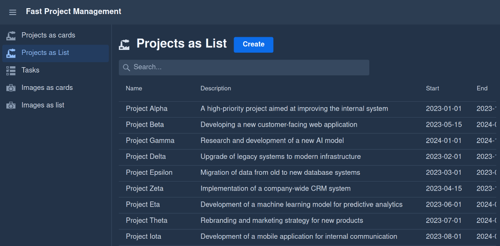
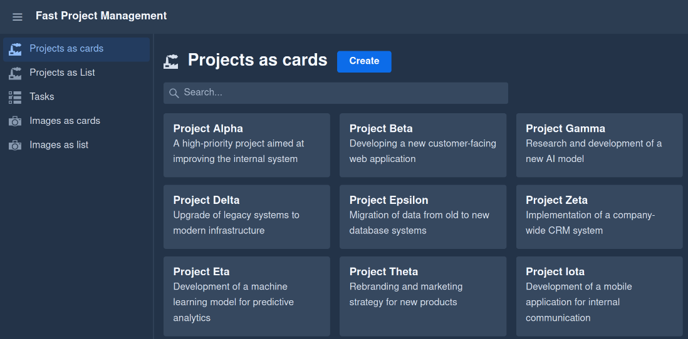
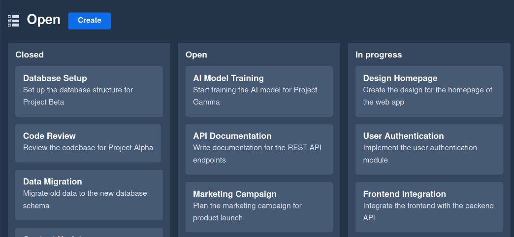
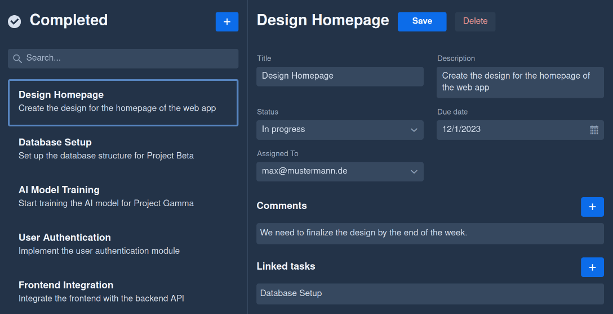
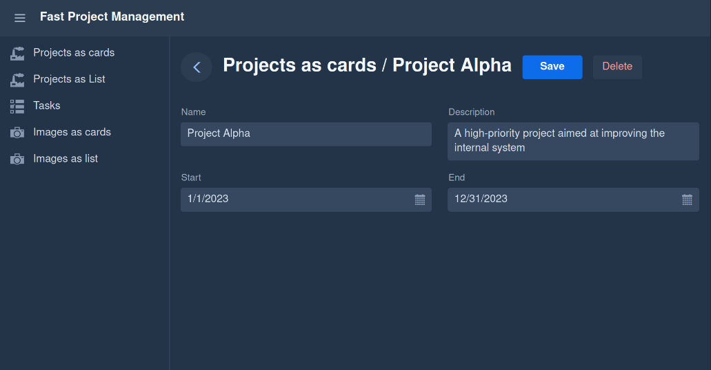
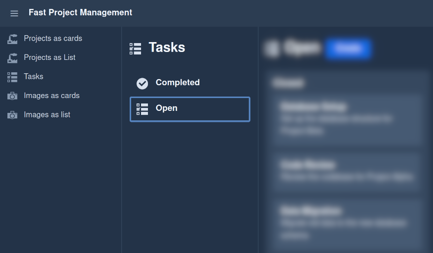
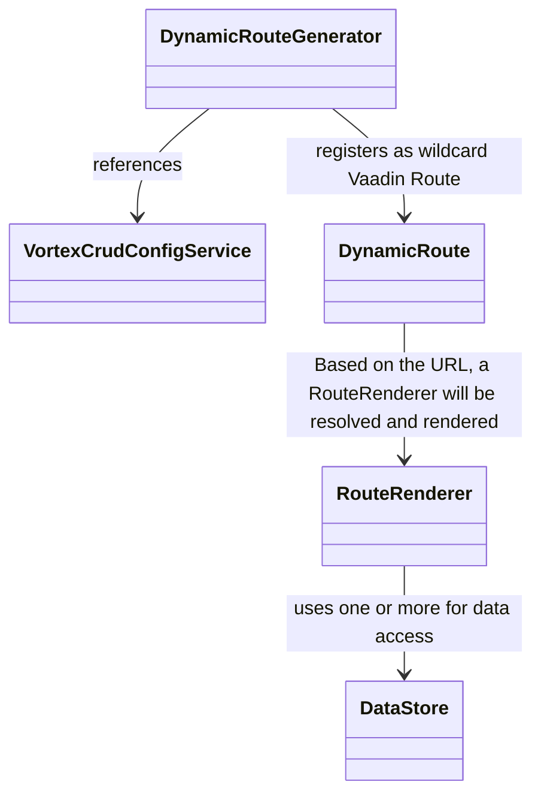
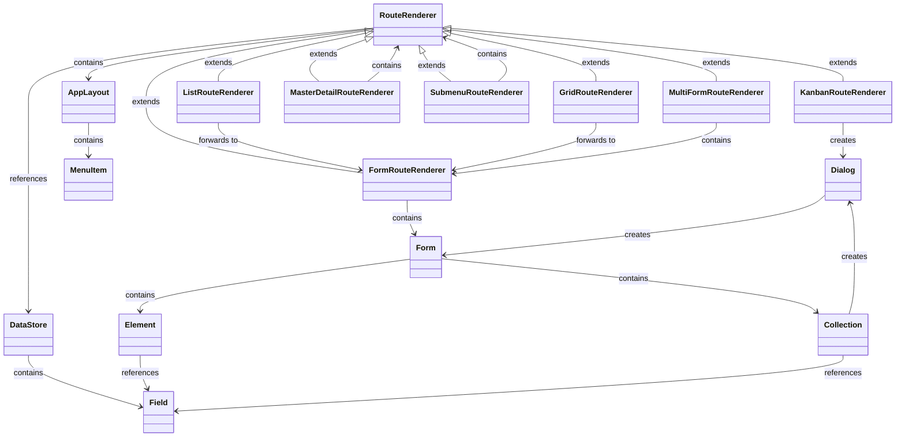
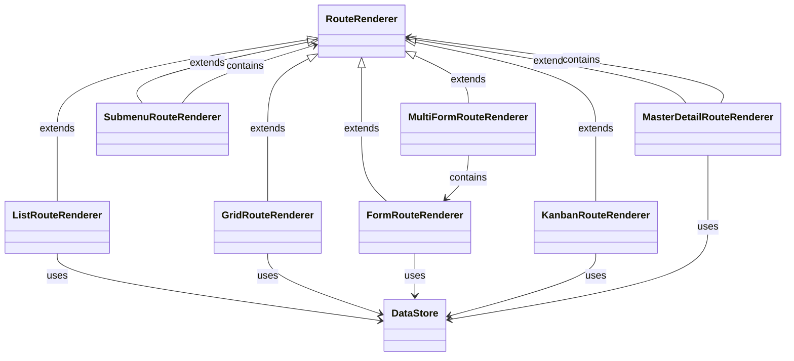

# vortex-crud 


`vortex-crud` is a high-level framework built on top of Vaadin Flow, designed to simplify the creation of CRUD applications. It uses a declarative configuration approach to define routes, UI components, entities, relationships, and data bindings, reducing the need for manual coding. By providing multiple abstraction layers, `vortex-crud` leverages Vaadin Flow to dynamically generate routes and offers default implementations for UI representation, allowing developers to quickly build and manage CRUD interfaces with minimal effort.

## Table of Contents

1. **[Introduction](#introduction)**
   - **[Inspiration](#inspiration)**
   - **[Tech Stack](#tech-stack)**
   - **[Key Features](#key-features)**
2. **[Features in Detail](#features-in-detail)**
   - **[Listing Data](#listing-data)**
      - **[Grid](#grid)**
      - **[Cards](#cards)**
      - **[Kanban](#kanban)**
      - **[Master-Detail](#master-detail)**
   - **[Nesting routes using Subroute](#nesting-routes-using-subroute)**
   - **[Editing Data](#editing-data)**
      - **[Input Types](#input-types)**
      - **[Relationships](#relationships)**
3. **[Getting Started](#getting-started)**
   - **[Terminology](#terminology)**
   - **[Configuration with jOOQ](#configuration-with-jooq)**
   - **[Configuration with JPA](#configuration-with-jpa)**
4. **[Database Modeling](#database-modeling)**
   - **[System-Defined Tables](#system-defined-tables)**
   - **[Example User-Defined Tables](#example-user-defined-tables)**
5. **[Architecture](#architecture)**
   - **[Basic Principles](#basic-principles)**
   - **[Relationship Between Routes and Forms](#relationship-between-routes-and-forms)**
   - **[Data Handling](#data-handling)**
   - **[Data Access](#data-access)**
6. **[Roadmap](#roadmap)**
7. **[Contributing](#contributing)**
8. **[Further Development](#further-development)**

# <a name="untroduction">Introduction</a>
## <a name="inspiration">Inspiration</a>
`vortex-crud` was inspired by systems like [Directus](https://github.com/directus/directus), which enable user-friendly management of entities and their relationships. However, unlike Directus, which offers a dynamic, configuration-based solution that requires no code, `vortex-crud` takes a different approach.

Unlike **Directus**, `vortex-crud` relies on static Java code for configuration, providing developers with fine-grained control over data models and underlying logic. This means database schema validation happens directly within the Java code, ensuring the schema stays consistent and aligned with the application. As a result, developers can flexibly extend and reuse the schema, benefiting from a clear and verifiable structure.

Another key distinction from **Vaadin Flow** is that `vortex-crud` operates at a much higher level of abstraction. While Vaadin is a framework for building UI components, `vortex-crud` simplifies the creation and management of CRUD applications by offering a declarative configuration for routes, UI components, and data bindings. Developers can focus less on manual coding, as the framework automatically handles many tasks, such as generating routes and UI elements based on the defined model.

Thanks to its **modular** design, `vortex-crud` allows developers to fully customize the user interface using Vaadin components. This provides high flexibility in designing the frontend while still benefiting from the default implementations of `vortex-crud`, which can be extended or replaced as needed.

At its core, `vortex-crud` provides a solid foundation for CRUD applications, focusing on flexibility, maintainability, and a clean separation of logic and presentation.

## <a name="tech-stack">Tech Stack</a>
- **Spring Boot**: Backend API development and dependency injection
- **Vaadin Flow**: Frontend UI components for building interactive applications
- **JPA or jOOQ**: `vortex-crud` supports accessing the database using either JPA or jOOQ

## <a name="key-features">Key Features</a>
- **Declarative definition of Forms and Routes**: Rapidly create complex, user-friendly CRUD applications by describing the application.
- **Modular Architecture**: If the default implementations don't suffice, rely on a fully modular and flexible [architecture](#architecture).
- **Automatic Entity Management**: Let `vortex-crud` handle basic or more complex cases of entity management. For more complicated use cases, provide a custom implementation.
    - **jOOQ Support**
    - **JPA Support**
        - **Database Schema Validation**: Receive notifications if the data model no longer fits your application.
- **i18n Support**
- **Entity Relationship Support**: Manage relationships between entities (One-to-One, One-to-Many).
- **Menu**
- **Appbar**: With app name and icon
- **Nested Hierarchies**
- **Data Filtering**: Filter entity lists in "grid," "list," and "master-detail" routes.
- **[WIP] Media Support**: Easily manage and view media.
- **Custom Routes**: Add routes not visible in the menu.

# <a name="supported-routes-inputs">Features in Detail</a>

The main point of this project is, that it decouples rendering from data. 

## <a name="listing-data">Listing Data</a>
### Grid  
  

### Cards 


### Kanban 


### Master-Detail


### **Edit Data with a Form Route**


## <a name="nesting-routes-using-subroute">Nesting routes using Subroute</a>


## <a name="editing-data">Editing Data</a>
### Input
- **Inputs**:
  - Text
  - Date
  - DateTime
  - Image
  - Number
  - Select
  - Checkbox
  - TextArea
- **Relationships**: One-to-One, Many-to-One, [WIP] Many-to-Many

## <a name="configuration">Getting Started</a>
`vortex-crud` currently supports only Java-based configuration to define routes and data stores. Below is a smaller example of how to configure a part of a project management application using jOOQ and JPA.

### <a name="terminology">Terminology</a>
**Routes**: Define navigational paths and display configurations (e.g., grids, lists, or Kanban boards). They connect to specific data stores for fetching and displaying data.

**Data Stores**: Represent database tables, including field configurations (e.g., input types, validations) and relationships (e.g., one-to-many, many-to-many).

**Forms**: Child components of routes used for creating or editing data. Forms use data stores to render fields and manage relationships through collections.

**Relationships**: Routes connect to data stores, and forms are nested within routes. Forms handle CRUD operations on data fetched via stores, including related entities (e.g., tasks with comments or related tasks).

### <a name="configuration-jooq">vortex-crud with jOOQ</a>
Here is a brief example of how to use the jOOQ integration with `vortex-crud`. For a more comprehensive example, refer to `examples/jooq-sqlite-example`.

```java
@Service
public class ExampleJooqConfiguration implements VortexCrudConfigurationProvider<Table<?>, TableField<?, ?>> {
    @Override
    public Application<Table<?>, TableField<?, ?>> get() {
        // Configure accessible data and its editable fields for vortex-crud
        Map<Table<?>, DataStoreConfig<Table<?>, TableField<?, ?>>> dataStores = Map.of(
                PROJECTS, JooqDataStoreConfig.of(JooqDataStore.class)
                        .withFields(Map.of(
                                PROJECTS.ID, new JooqField(IdFieldFactory.class, true), // Render projects.id as id field
                                PROJECTS.NAME, new JooqField(TextFieldFactory.class, true, true), // Render projects.name as required text field
                                PROJECTS.DESCRIPTION, new JooqField(TextAreaFieldFactory.class, false, false) // Render projects.description as optional text area
                        ))
                        .build()
                // ...
        );

        // Define a reusable form for editing entities from the "PROJECTS" datastore
        Route<Table<?>, TableField<?, ?>> projectForm = JooqRoute.of(FormRouteFactory.class)
                .withDataStore(PROJECTS)
                .withTitle("route.projects.title-cards") // i18n key for the title
                .withConfiguration(JooqRouteConfiguration.of(CardFactory.class)
                        .withTitleField(PROJECTS.NAME) // Field to display as the card title
                        .withChildren(
                                new JooqFormElement(PROJECTS.NAME, "field", "route.projects.labels.name") // Form element with i18n key
                                // ...
                        )
                        .build())
                .build();

        // Configure a grid route for displaying and navigating PROJECTS entries
        Map<String, Route<Table<?>, TableField<?, ?>>> routes = Map.of(
                "projects-cards", JooqRoute.of(GridRouteFactory.class) // will register a grid route under f.e. localhost:8080/projects-cards to make PROJECTS editable
                        .withDefaultRoute(true)
                        .withDataStore(PROJECTS)
                        .withIconFactory(FACTORY::create)
                        .withTitle("route.projects.title-cards")
                        .withConfiguration(GridOrListConfiguration.Builder.<Table<?>, TableField<?, ?>>of(CardFactory.class)
                                .withTitleField(PROJECTS.NAME) // Displayed as the grid title
                                .withDescriptionField(PROJECTS.DESCRIPTION) // Displayed as the grid description
                                .build())
                        .withRoles(List.of("manager", "admin")) // Restrict access to specific roles
                        .withChild(projectForm) // register child form route to edit PROJECTS entities f.e. localhost:8080/projects-cards/1
                        .build()
                // ...
        );

        // Build the vortex-crud application using defined routes and datastores
        return JooqApplication.of()
                .withName("application.name")
                .withI18nBundlePrefix("some_i18n")
                .withRoutes(routes)
                .withDataStores(dataStores)
                .build();
    }
}
```

### <a name="configuration-jpa">vortex-crud with JPA</a>
Below is another brief example of how to use the JPA integration with `vortex-crud`. A more detailed example can be found under `examples/jpa-postgresql-example`.

```java
@Service
public class ExampleJpaConfiguration implements VortexCrudConfigurationProvider<Entity, Object> {
    @Override
    public Application<String, String> get() {
        Route<String, String> projectForm = JpaRoute.of(FormRouteFactory.class)
                .withDataStore("projects")
                .withTitle("route.projects.title-cards")
                .withConfiguration(JpaRouteConfiguration.of(CardFactory.class)
                        .withTitleField("name")
                        .withChildren(
                                new JpaFormElement("name", "field", "route.projects.labels.name")
                                // ...
                        )
                        .build())
                .build();
    
        Map<String, DataStoreConfig<String, String>> dataStores = Map.of(
                "projects", JpaDataStoreConfig.of(JpaDataStore.class)
                        .withFields(Map.of(
                                "id", new JpaField(IdFieldFactory.class, true),
                                "name", new JpaField(TextFieldFactory.class, true, true),
                                "description", new JpaField(TextAreaFieldFactory.class, false, false)
                                // ...
                        ))
                        .build()
                // ...
        );
    
        Map<String, Route<String, String>> routes = Map.of(
                "projects-cards", JpaRoute.of(GridRouteFactory.class)
                        .withDefaultRoute(true)
                        .withDataStore("projects")
                        .withIconFactory(FACTORY::create)
                        .withTitle("route.projects.title-cards")
                        .withConfiguration(GridOrListConfiguration.Builder.<String, String>of(CardFactory.class)
                                .withTitleField("name")
                                .withDescriptionField("description")
                                .build())
                        .withRoles(List.of("manager", "admin"))
                        .withChild(projectForm)
                        .build()
                // ...
        );
  
        return JpaApplication.of()
                .withName("application.name")
                .withI18nBundlePrefix("some_i18n")
                .withRoutes(routes)
                .withDataStores(dataStores)
                .build();
    }
}
```

# <a name="core-concept">Database Modeling</a>
`vortex-crud` does not impose its own database model. Instead, users define their own data model, and `vortex-crud` integrates seamlessly with it. The JPA implementation of `vortex-crud` ensures that the view representation is consistent with the provided model. However, certain system-defined tables are required, particularly those for auditing, user management, and role management:

```sql
-- Predefined system tables (examples)
CREATE TABLE users (...);
CREATE TABLE roles (...);
CREATE TABLE user_roles (...);
CREATE TABLE audit_log (...);
```

## <a name="data-model-example">Example User-Defined Tables</a>
Users can define custom tables as needed, such as `projects`, `tasks`, and `task_comments`:

```sql
CREATE TABLE projects (...);
CREATE TABLE tasks (...);
CREATE TABLE task_comments (...);
```

# <a name="roadmap">Roadmap</a>
- **Form Navigation**: Enable navigation within forms to other routes or sub-routes using a new input type called "routeRenderer."
- **Field Validation**: Support for basic and advanced field validation hooks.
- **User and Role Management & Authentication**: (Optionally using [Authentik](https://github.com/goauthentik/authentik) / [Keycloak](https://github.com/keycloak/keycloak))
- **Additional Form Controls**: Include controls like Radio Button Groups, Select Groups, Links, etc.
- **Role-Based Access Control (RBAC)**
- **Entity Versioning**
- **Entity Auditing**
- **Hook Points**: Add custom hook points for enhanced flexibility.
- **Prefiltered Routes**: Display only specific items in routes as needed.
- **Additional Routes**:
  - **Calendar Route**: Example from [Directus](https://directus.pizza/admin/content/posts?bookmark=45)
  - **Map Route**: Display entities on a map based on latitude and longitude columns.
  - **Generic Block Route**: Support for generic blocks with a flexible factory system.
- **Custom Menu Routes**: Add custom routes to the menu.
- **Alternative Collection Editing**: Offer different ways to edit collections.
- **Configuration Pre-Checks**: Validate the application configuration fully at startup.
- **Styling**: Improve styling options.
- **Database Index Check**: Verify that suitable indices are available, given that the UI and database are defined in a machine-parsable format.
- **Route Filters**: Add filtering options for "kanban" routes.
- **API Endpoints**: Allow providing API endpoints to access data stores programmatically.

# <a name="architecture">Architecture</a>
The architecture of `vortex-crud` is modular and declarative, designed to streamline CRUD application development with minimal coding effort. Built on Vaadin Flow, it automatically generates routes and manages entities and their relationships using jOOQ or JPA.

A collection of central registries acts as the core for generating Vaadin components, including routes, forms, and data stores, all based on configuration metadata. This approach ensures flexibility, scalability, and seamless integration while allowing for easy customization of data handling, UI rendering, and complex entity management.

While the `core` module handles the UI implementations and the generation of routes, the data store implementations are separated into the `jooq` and `jpa` modules for better modularity.

## Basic Principles
At its core, `vortex-crud` relies on dependency injection, with the `VortexCrudConfigService` as the entry point. The implementation of this service is provided by the user. Based on the configuration defined in `VortexCrudConfigService`, the `DynamicRouteGenerator` automatically registers the necessary routes.



## <a name="data-handling">Data Handling and Management</a>
`vortex-crud` uses an SQLite database during development. The database is accessed through the `VortexCrudDataStore` service, and the validation of the data model is data store-specific to ensure that the schema matches the configuration. Custom `DataStore` implementations are also supported, requiring only the implementation of the relevant interface.

The following diagram provides a simplified view of the architecture, illustrating the relationships between different components. It's important to note that classes are not instantiated directly; instead, they are created based on the types specified in the configuration. The `FactoryRegistry` retrieves the appropriate component factory from the configuration and returns the corresponding instance.

## <a name="relationship-routes-forms">Relationship Between Route Renderers and Forms</a>



## <a name="data-access">Data Access</a>

The following provides a simplified overview of how data renderers access data. As with other components, classes are not instantiated directly; instead, they are created based on the types specified in the configuration.



# <a name="contributing">Contributing</a>
`vortex-crud` is open-source and welcomes contributions! If you’d like to contribute, open an issue and let's discuss.

# <a name="further-development">Further Development</a>

To get started for using this framework see in the chapter [Getting Started](#getting-started).

1. **Clone the repository**
2. **Run one of the example applications**:
    - The database will be initialized automatically.
    - Start the example application:
      ```bash
      ./mvnw spring-boot:run
      ```
      
