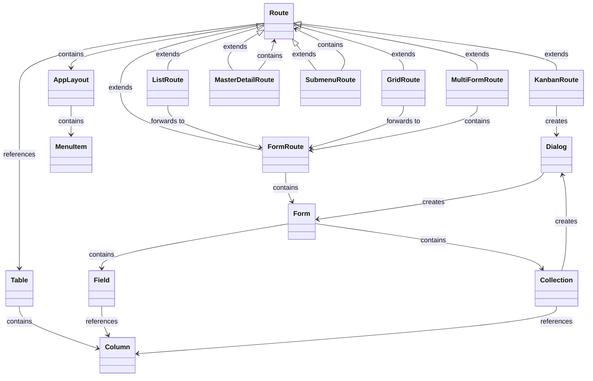
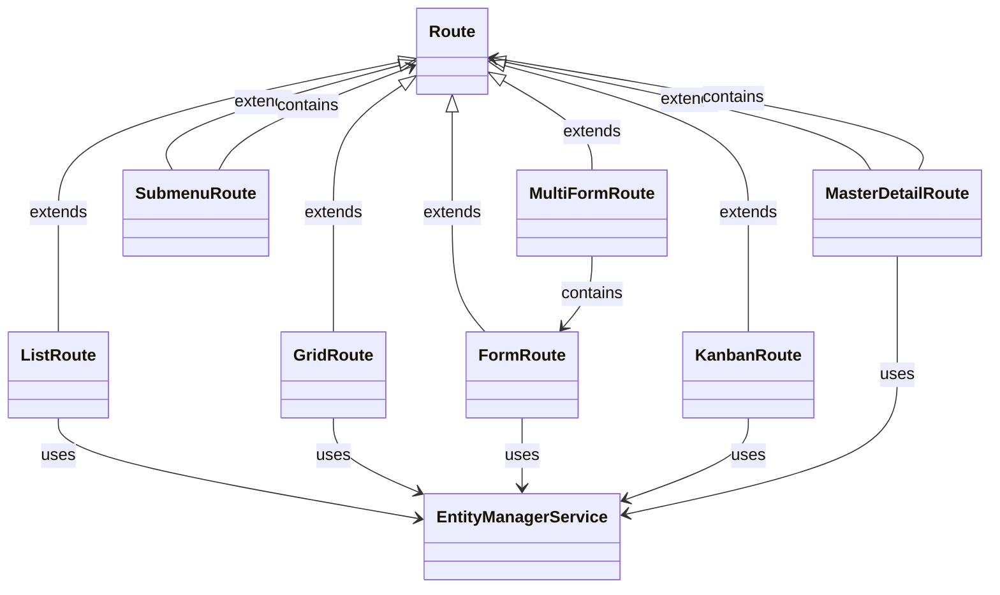

# turbo-crud


`turbo-crud` is a high-level framework built on top of Vaadin Flow, designed to simplify the creation of CRUD-style applications through configuration-driven definitions of routes, UI, entities, and data binding. By providing several abstraction layers, `turbo-crud` uses Vaadin to dynamically generate routes and includes default implementations for UI representation. This approach enables developers to focus on configuration rather than writing code, enhancing both development speed and flexibility.

## Tech-Stack
- **Spring Boot**: Backend API development and dependency injection
- **Vaadin Flow**: Frontend UI components for building interactive applications
- **HOCON**: A powerful and human-readable configuration format [(see here)](https://github.com/lightbend/config)

## Key Features
- **Configuration-Driven UI and Route Generation**: Rapidly create complex, user-friendly CRUD applications through configuration alone, without writing Java code.
- **Modular Architecture**: The architecture is modular and flexible at every level ([see under Architecture](#Architecture)), allowing for custom implementations.
- **Entity Management**: `turbo-crud` handles data management by default; You need to define the data model.
- **Custom Repositories**: Use custom data repositories for cases where the default Entity Manager is not ideal.
- **Database Schema Validation**: The `turbo-crudDatabaseSchemaValidator` verifies that the database schema matches the configuration at startup.
- **UI Components and Factories**: Factory implementations such as `DefaultEntityDetailFactoryImpl` and `DefaultEntityItemCardFactoryImpl` dynamically configure UI components.
- **i18n Support**
- **Entity Relationship Support**: Manage relationships between entities (1:1, 1:N).
- **Nested Hierarchies**
- **Multiple Forms at Once**: Create views containing multiple forms simultaneously.
- **[WIP] Additional Routes**:
    - **Kanban Route**
- **Filtering data**: Filter entity lists in "grid," "list," and "master-detail" routes.
- **[WIP] Media Support**: Add, remove, and view media as individual fields

## Roadmap (in no particular order)
- **Extended Entity Relationship Support**: Add, remove, and view relationships (N:M).
- **Form Navigation**: Enable navigation within forms to other routes or sub-routes using a new input type called "route."
- **Field Validation**: Support for basic and advanced field validation hooks.
- **User and Role Management & Authentication**: (optionally using Authentik)
- **Additional Form Controls**: Include controls like Radio Button Groups, Select Groups, Links, etc.
- **Role-Based Access Control (RBAC)**
- **Entity Versioning**
- **Entity Auditing**
- **Hook Points**: Add custom hook points for enhanced flexibility.
- **Prefiltered Routes**: Display only specific items in routes as needed.
- **Additional Routes**:
    - **Calendar Route**: Example from [Directus](https://directus.pizza/admin/content/posts?bookmark=45)
    - **Map Route**: Display entities on a map based on latitude and longitude columns.
    - **Generic Block Route**: Support for generic blocks with a flexible factory system.
- **Custom Menu Routes**: Add custom routes to the menu.
- **Alternative Collection Editing**: Offer different ways to edit collections.
- **Configuration Pre-Checks**: Validate the application configuration fully at startup.
- **Styling**: Improve styling options.
- **Database Index Check**: Verify that suitable indices are available, given that the UI and database are defined in a machine-parsable format.
- **Route Filters**: Add filtering options for "kanban" routes.
- **Code Generation**: Generate Vaadin code from using a given HOCON turbo-crud configuration to support top-down workflows, including models and repositories.
- **API-Endpoint**: Allow defining API endpoints using the configuration file

## Data Handling and Management
turbo-crud utilizes the H2 database during development. The database is accessed by the service `TurboCrudEntityManagerService`, while the `TurboCrudDatabaseSchemaValidator` ensures the schema aligns with the HOCON configuration at startup. Custom EntityManagerService implementations are also supported, requiring only an interface implementation.

### Core Concept: User-Defined Database Model
The database model is defined by the user, with turbo-crud validating that the view representation aligns with this model. Some system-defined tables, such as those for auditing, user, and role management, are exceptions:

```sql
-- Predefined system tables (examples)
CREATE TABLE users (...);
CREATE TABLE roles (...);
CREATE TABLE user_roles (...);
CREATE TABLE audit_log (...);
```

### Example User-Defined Tables
Users can define tables like `projects`, `tasks`, and `task_comments` as needed:

```sql
CREATE TABLE projects (...);
CREATE TABLE tasks (...);
CREATE TABLE task_comments (...);
```

## Architecture

The following diagram provides a simplified view of the architecture, illustrating relationships between various components. Note that classes are not instantiated directly; instead, they are instantiated based on types specified in the configuration (e.g., "factory" = "grid" or "type" = "form"). A `FactoryRegistry` retrieves and returns the appropriate component factory based on this configuration.

### Relationship between Routes and Forms


### Data Access


## Configuration via HOCON
turbo-crud supports configuration through HOCON files, defining routes and tables.

**Note**: Although Java classes can theoretically be used for configuration (as HOCON files are parsed into Java classes), this approach is not currently supported. HOCON is preferred for its readability and maintainability.

### Example Configuration

Below is an example of configuring a route and the associated table:

```hocon
application {
  #...
  tables = {
    "projects" {
      fields {
        id {factory: "id", primary: true},
        name {factory: "text", required: true, validation {max-length: 255}},
        description {factory: "textarea", validation {max-length: 500}},
        start_date {factory: "date"},
        end_date {factory: "date"},
        created_at {factory: "datetime"},
        updated_at {factory: "datetime"}
      }
    }
    # ...
  }
  # ...  
  routes = {
    "projects-cards" {
      default-route: true
      factory: "grid"
      repository: "projects"
      icon: "FACTORY"
      title: "route.projects.title-cards"
      configuration {
        factory: "card"
        title-field: "name"
        description-field: "description"
      }
      roles: ["manager", "admin"]
      child: ${application.forms.project} #This is not feaure of turbo-crud but rather a HOCON feature called "substitution" 
    }
    # ...
  }

  forms { # Form configuration values to be used for HOCON substitution
    project: {
      repository: "projects"
      factory: "form"
      title: "route.projects.title-cards"
      configuration {
        title-field: "name"
        children: [
          {type: "field", field: "name", label: "route.projects.labels.name"},
          {type: "field", field: "description", label: "route.projects.labels.description"},
          {type: "field", field: "start_date", label: "route.projects.labels.start_date"},
          {type: "field", field: "end_date", label: "route.projects.labels.end_date"}
        ]
      }
    }
    # ...
  }
}
```

## Application Configuration (HOCON Format)
Here’s a more complete sample configuration for setting up a project management application:

```hocon
application {
  name: "application.name"

  i18n-bundle-prefix: "some_i18n"

  user-management {
    enabled: true
    access-control {
      roles: ["manager", "admin"]
    }
    sign-up: true
    additional-fields: [{name: "start_date", type: "date"}]
  }

  selects {
    task-status {
      open: "selects.task-status.open"
      todo: "selects.task-status.todo"
      work-in-progress: "selects.task-status.progress"
      closed: "selects.task-status.closed"
    }
  }

  versioning {
    enabled: true
    repositories: ["projects", "tasks", "task_comments"]
  }

  auditing {
    enabled: true
    actions: ["create", "update", "delete", "login", "logout"]
  }

  repositories {
    "projects" {
      fields {
        id {factory: "id", primary: true},
        name {factory: "text", required: true, validation {max-length: 255}},
        description {factory: "textarea", validation {max-length: 500}},
        start_date {factory: "date"},
        end_date {factory: "date"},
        created_at {factory: "datetime"},
        updated_at {factory: "datetime"}
      }
    },
    "tasks" {
      fields {
        id {factory: "id", primary: true},
        title {factory: "text", required: true, validation {max-length: 255}},
        description {factory: "textarea", validation {max-length: 1000}},
        assigned_to {factory: "reference", repository: "users", field: "id", filter-field: "username", children: ["username"]},  # 1:1 Relation
        status {factory: "select", values: "task-status"},
        due_date {factory: "date", read-only-for-roles: ["developer"]},
        created_at {factory: "datetime"},
        updated_at {factory: "datetime"}
      }
    },
    "task_comments" {
      fields {
        id {factory: "id", primary: true},
        comment_text {factory: "textarea", validation {max-length: 1000}},
        user_id {factory: "number"},
        created_at {factory: "datetime", default: "now()"}
      }
    }
    "images" {
      fields {
        id {factory: "id", primary: true},
        title {factory: "text", required: true, validation {max-length: 255}},
        url {factory: "image", required: true},
      }
    }
  }

  routes {
    "projects-cards" {
      default-route: true
      factory: "grid"
      repository: "projects"
      icon: "FACTORY"
      title: "route.projects.title-cards"
      configuration {
        factory: "card"
        title-field: "name"
        description-field: "description"
      }
      roles: ["manager", "admin"]
      child: ${application.forms.project} #This is not feaure of turbo-crud but rather a HOCON feature called "substitution" 
    }
    "tasks" {
      icon: "TASKS"
      repository: "tasks"
      title: "route.tasks.title"
      factory: "submenu"
      children {
        "open" {
          icon: "TASKS"
          repository: "tasks"
          title: "route.open-tasks.title"
          factory: "kanban"
          configuration {
            factory: "card"
            title-field: "title"
            description-field: "description"
            column-field: "status"
          }
          child: ${application.forms.task} # HOCON substitution
        }
        "done" {
          icon: "CHECK_CIRCLE"
          repository: "tasks"
          title: "route.done-tasks.title"
          factory: "master-detail"
          configuration {
            factory: "card"
            title-field: "title"
            description-field: "description"
          }
          child: ${application.forms.task} # HOCON substitution
        }
      }
    }
    "images" {
      factory: "grid"
      repository: "images"
      icon: "CAMERA"
      title: "route.images.title"
      configuration {
        factory: "card"
        title-field: "title"
        image-field: "url"
      }
      roles: ["manager", "admin"] 
      child: ${application.forms.image} # HOCON substitution
    }
  }

  forms { # Form configuration values to be used for HOCON substitution
    task: {
      repository: "tasks"
      factory: "form"
      configuration {
        title-field: "title"
        children: [
          {type: "field", field: "title", label: "route.tasks.labels.title"},
          {type: "field", field: "description", label: "route.tasks.labels.description"},
          {type: "field", field: "status", label: "route.tasks.labels.status"},
          {type: "field", field: "due_date", label: "route.tasks.labels.due_date"},
          {type: "field", field: "assigned_to", label: "route.tasks.labels.assigned_to"}, # 1:1 Relation
          {
            type: "collection"  # 1:N Relation
            factory: "list"
            repository: "task_comments"
            reference-field: "task_id"
            label: "route.tasks.labels.comments"
            empty-message: "route.tasks.labels.comments-empty-message"
            children: [
              "comment_text"
            ]
            dialog {
              factory: "form"
              child {
                factory: "form"
                configuration {
                  title-field: "name"
                  children: [
                    {type: "field", field: "comment_text", label: "route.tasks.labels.comment"}
                  ]
                }
              }
            }
          }
        ]
      }
    }
    project: {
      repository: "projects"
      factory: "form"
      title: "route.projects.title-cards"
      configuration {
        title-field: "name"
        children: [
          {type: "field", field: "name", label: "route.projects.labels.name"},
          {type: "field", field: "description", label: "route.projects.labels.description"},
          {type: "field", field: "start_date", label: "route.projects.labels.start_date"},
          {type: "field", field: "end_date", label: "route.projects.labels.end_date"}
        ]
      }
    }
    image: {
      repository: "projects"
      factory: "form"
      title: "route.projects.title-cards"
      configuration {
        title-field: "name"
        children: [
          {type: "field", field: "title", label: "route.images.labels.title"},
          {type: "field", field: "url", label: "route.images.labels.image"},
        ]
      }
    }
  }
}
```

## Getting Started with Development

1. **Clone the repository**
2. **Run the application**:
   - Use the provided SQL schema to set up the database.
   - Configure application properties for H2 or other databases.
   - Start the Spring Boot server:
     ```bash
     ./mvnw spring-boot:run
     ```
