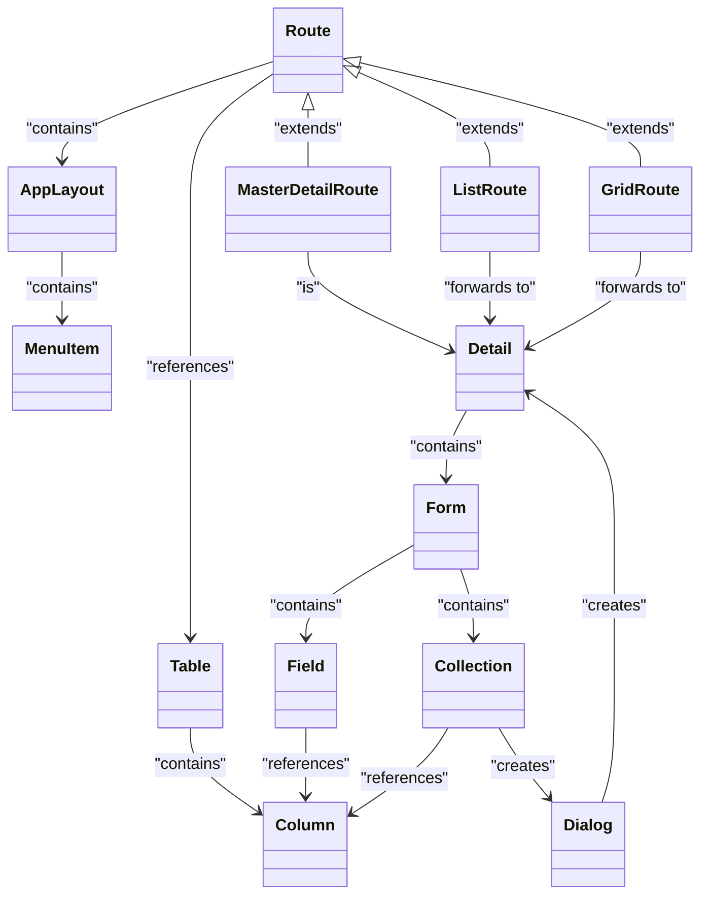

# TurboCRUD (Current Working Title)
 

TurboCRUD is a framework engineered to speed up the development of CRUD-style applications with Vaadin Flow. By introducing a high-level abstraction layer, it empowers developers to quickly build and customize applications while retaining the flexibility for more complex use cases. Designed with extensibility at its core, TurboCRUD makes it simple to adapt and expand features as project needs evolve.

Rather than replacing Vaadin Flow, TurboCRUD enhances it by streamlining repetitive tasks and promoting reusability of components. This enables developers to focus more on application-specific logic and customization, maximizing productivity and efficiency.

## Tech Stack
- **Spring Boot**: Backend API development and dependency injection
- **Vaadin Flow**: Frontend UI components for building interactive applications
- **HOCON**: Configuration format that is compact, readable, and supports imports

## Core Architecture and Key Features
- **Modular Architecture**: The Architecture is modular and flexible on every level (see [Architecture](#Architecture))
- **Flexible Configuration System**: Uses HOCON for dynamic configuration, making it easy to set up various parts of the application.
- **Database Schema Validation**: The `TurboCRUDDatabaseSchemaValidator` checks that the database schema matches the configuration at startup.
- **Dynamic Routing**: The `DynamicRoute` class enables routing based on configuration files, allowing flexible route management.
- **UI Components and Factories**: Factory implementations like `DefaultEntityDetailFactoryImpl` and `DefaultEntityItemCardFactoryImpl` dynamically configure UI components.
- **Low Code Entity Management**: The `GenericEntity` and `TurboCRUDEntityManagerService` handle generic entity management based on the database schema.
- **i18n Support**
- **Customizable Icons**
- **Entity Relationship Support**: Manage relationships between entities (1:n).

## Roadmap (in no particular order)
- **Extended Entity Relationship Support**: Add, remove, and view relationships (1:1, n:m).
- **Form Navigation**: Enable navigation in forms to other / custom routes.
- **Nested Hierarchies**
- **Field Validation**: Add support for basic and advanced field validation hooks.
- **Media Support**: Enable adding, removing, and viewing media (as field and as a collection)
- **User and Role Management & Authentication**: (optionally using Authentik)
- **Additional Form Controls**: Add controls like Radio Button Groups and Select Groups, Links etc.
- **Role-Based Access Control (RBAC)**
- **Entity Versioning**
- **Entity Auditing**
- **Hook Points**: Add custom hook points for further flexibility.
- **Custom Repositories**: Enable integration of custom data repositories.
- **Route Filters**: Add filtering for entity lists in "grid", "list", and "master-detail" routes.
- **Prefiltered Routes**: Show only specific items in routes as needed.
- **Additional Routes**:
    - **Calendar Route**: [Directus example](https://directus.pizza/admin/content/posts?bookmark=45)
    - **Kanban Route**: [Directus example](https://directus.pizza/admin/content/posts?bookmark=44)
    - **Map Route**: A route with a map where entities are shown on based on a latitude column and a longitude column
    - **Generic Block Route**: Support for generic blocks with flexible factory systems.
- **Custom Menu Routes**: Allow adding custom routes to the menu.
- **Alternative Collection Editing**: Provide alternative ways to the dialog to edit a Collection (see [Architecture](#Architecture)).
- **Multiple Forms in Detail Views**: Support so a Detail can contain multiple forms (see [Architecture](#Architecture)).
- **Configuration Pre-Checks**: Add checks to validate configuration before runtime.
- **Improve ability to validate the Configuration**: The configuration is not designed optimally for validation, requiring improvements to allow an effective validation.
- **Styling**: Improve styling options.
- **Check Database Index**: Since the UI and the Database is defined in a machine parsable format it is possible to check if fitting indices are available 

## Data Handling and Management
TurboCRUD uses an H2 database for development, managed by the custom class `TurboCRUDEntityManagerService`. The `TurboCRUDDatabaseSchemaValidator` ensures the database schema matches the HOCON configuration at startup.

### Core Concept: User-Defined Database Model
The database model is defined by the user, and TurboCRUD verifies that the view representation fits this model. However, some system-defined tables are exceptions, such as those for auditing, user, and role management:

```sql
-- Predefined system tables (examples)
CREATE TABLE users (...);
CREATE TABLE roles (...);
CREATE TABLE user_roles (...);
CREATE TABLE audit_log (...);
```

### Example User-Defined Tables
Users can define tables like `projects`, `tasks`, and `task_comments` to fit their needs:

```sql
CREATE TABLE projects (...);
CREATE TABLE tasks (...);
CREATE TABLE task_comments (...);
```

This version is concise, focusing on the key points while providing essential examples.
## Architecture

The diagram below presents a simplified version of the architecture, illustrating the relationships between the different components. The main difference between this representation and the actual architecture is that classes are not instantiated directly. Instead, instantiation is determined by the type specified in the configuration (e.g., "factory" = "grid" or "type" = "form"). A FactoryRegistry is used to retrieve and return the appropriate component factory based on this configuration.



## Configuration via HOCON
TurboCRUD supports configuration through HOCON files where routes and tables are defined.

Note: While Java classes could theoretically be used for configuration, as HOCON files are parsed into Java classes, this approach is not currently supported. HOCON is preferred as it enhances both readability and maintainability.

### Example Configuration

Below is an example of configuring a route and the associated table:

```hocon
application {
  #...
  tables = {
    "projects" = {
      columns = {
        id = {type = "id", primary = true},
        name = {type = "text", required = true, validation = {max-length = 255}},
        description = {type = "textarea", validation = {max-length = 500}},
        start_date = {type = "date"},
        end_date = {type = "date"},
        created_at = {type = "datetime"},
        updated_at = {type = "datetime"}
      }
    }
    # ...
  }
  # ...  
  routes = {
    "projects" = {
      default-route = true
      table = "projects"
      title = "route.projects.title-card"
      factory = "grid"
      icon = "FACTORY"
      factory-configuration {
        item-factory = {
          type = "card"
          title-column = "name"
          description-column = "description"
        }
        detail-factory {
          title-column = "name"
          type = "form", 
          children = [
            {column = "name", label = "route.projects.labels.name"},
            {column = "description", label = "route.projects.labels.description"},
            {column = "start_date", label = "route.projects.labels.start_date"},
            {column = "end_date", label = "route.projects.labels.end_date"}
          ]
        }
        access-control = { roles = ["manager", "admin"] }
      }
    }
    # ...
  }
}
```

## Application Configuration (HOCON Format)
Here’s a more complete sample configuration for setting up a project management application:

```hocon
application {
  name = "application.name"

  i18n-bundle-prefix = "some_i18n"

  user-management {
    enabled = true
    access-control = {
      roles = ["manager", "admin"]
    }
    registration = true
    additional-columns = [{name = "start_date", type = "date"}]
  }

  selects {
    task-status {
      open = "selects.task-status.open"
      todo = "selects.task-status.todo"
      work-in-progress = "selects.task-status.progress"
      closed = "selects.task-status.closed"
    }
  }

  versioning {
    enabled = true
    tables = ["projects", "tasks", "task_comments"]
  }

  auditing {
    enabled = true
    actions = ["create", "update", "delete", "login", "logout"]
  }

  tables = {
    "projects" = {
      columns = {
        id = {type = "id", primary = true},
        name = {type = "text", required = true, validation = {max-length = 255}},
        description = {type = "textarea", validation = {max-length = 500}},
        start_date = {type = "date"},
        end_date = {type = "date"},
        created_at = {type = "datetime"},
        updated_at = {type = "datetime"}
      }
    },
    "tasks" = {
      columns = {
        id = {type = "id", primary = true},
        title = {type = "text", required = true, validation = {max-length = 255}},
        description = {type = "textarea", validation = {max-length = 1000}},
        assigned_to = {type = "number"},
        status = {type = "select", values = "task-status"},
        due_date = {type = "date", read-only-for-roles = ["developer"]},
        created_at = {type = "datetime"},
        updated_at = {type = "datetime"}
      }
    },
    "task_comments" = {
      columns = {
        id = {type = "id", primary = true},
        comment_text = {type = "text", validation = {max-length = 1000}},
        user_id = {type = "number"},
        created_at = {type = "datetime", default = "now()"}
      }
    }
  }
  routes = {
    "projects" = {
      default-route = true
      table = "projects"
      title = "route.projects.title-card"
      factory = "grid"
      icon = "FACTORY"
      factory-configuration {
        item-factory = {
          type = "card"
          title-column = "name"
          description-column = "description"
        }
        detail-factory {
          title-column = "name"
          type = "form", children = [
            {column = "name", label = "route.projects.labels.name"},
            {column = "description", label = "route.projects.labels.description"},
            {column = "start_date", label = "route.projects.labels.start_date"},
            {column = "end_date", label = "route.projects.labels.end_date"},
          ]
        }
        access-control = {
          roles = ["manager", "admin"]
        }
      }
    },
    "tasks" = {
      table = "tasks"
      icon = "TASKS"
      title = "route.tasks.title"
      factory = "master-detail"
      factory-configuration = {
        item-factory = {
          type = "card"
          title-column = "title"
          description-column = "description"
        }
        detail-factory {
          title-column = "title"
          type = "form",
          children = [
            {column = "title", label = "route.tasks.labels.title"},
            {column = "description", label = "route.tasks.labels.description"},
            {column = "status", label = "route.tasks.labels.status"},
            {column = "due_date", label = "route.tasks.labels.due_date"}
            {
              type = "collection", # 1 to n relation
              factory = "list",
              collection-factory = {
                table = "task_comments", 
                foreign-key-column = "task_id"
                label = "route.tasks.labels.comments"
                dialog-factory = "form"
                empty-message = "route.tasks.labels.comments-empty-message"
                detail-factory {
                  title-column = "name"
                  type = "form", children = [
                    {column = "comment_text", label = "route.tasks.labels.comment"},
                  ]
                }
                children = [
                  {column = "comment_text", label = "route.tasks.labels.comment"}
                ]
              }
            }
          ]
        }
      }
      access-control = {
        roles = ["developer", "manager", "admin"]
      }
    }
  }
}
```

## Getting Started with Development

1. **Clone the repository**:
   ```bash
   git clone https://github.com/appreciated/turbo-crud.git
   ```
2. **Run the application**:
   - Use the provided SQL schema to set up the database.
   - Configure application properties for H2 or other databases.
   - Start the Spring Boot server:
     ```bash
     ./mvnw spring-boot:run
     ```

## License
This project is licensed under the MIT License.