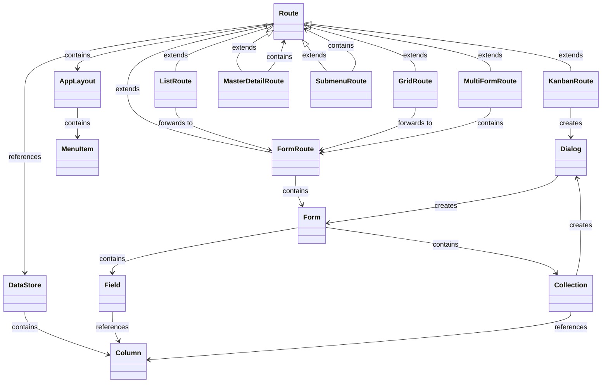
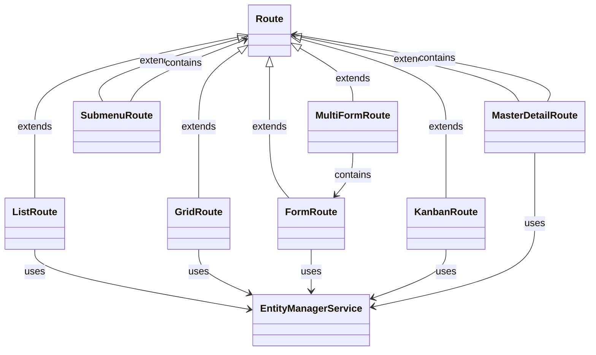

# turbo-crud


`turbo-crud` is a high-level framework built on top of Vaadin Flow, designed to simplify the creation of CRUD applications. It uses a declarative configuration approach to define routes, UI components, entities, relationships and data bindings, reducing the need for manual coding. By providing multiple abstraction layers, turbo-crud leverages Vaadin Flow to dynamically generate routes and offers default implementations for UI representation, allowing developers to quickly build and manage CRUD interfaces with minimal effort.

## Tech-Stack
- **Spring Boot**: Backend API development and dependency injection
- **Vaadin Flow**: Frontend UI components for building interactive applications

## Key Features
- **Configuration-Driven UI and Route Generation**: Rapidly create complex, user-friendly CRUD applications through configuration alone, without writing Java code.
- **Modular Architecture**: The architecture is modular and flexible at every level ([see under Architecture](#Architecture)), allowing for custom implementations.
- **Entity Management**: `turbo-crud` handles data management by default; You need to define the data model.
- **Custom DataStores**: Use custom data sources for cases where the default data manager is not ideal.
- **Database Schema Validation**: The `turbo-crudDatabaseSchemaValidator` verifies that the database schema matches the configuration at startup.
- **UI Components and Factories**: Factory implementations such as `DefaultEntityDetailFactoryImpl` and `DefaultEntityItemCardFactoryImpl` dynamically configure UI components.
- **i18n Support**
- **Entity Relationship Support**: Manage relationships between entities (One-To-One, One-To-Many).
- **Nested Hierarchies**
- **Multiple Forms at Once**: Create views containing multiple forms simultaneously.
- **[WIP] Additional Routes**:
    - **Kanban Route**
- **Filtering data**: Filter entity lists in "grid," "list," and "master-detail" routes.
- **[WIP] Media Support**: Add, remove, and view media as individual fields
- **Allow adding routes not visible in the menu**

## Roadmap (in no particular order)
- **Extended Entity Relationship Support**: Add, remove, and view entities from Many-To-Many relationships.
- **Form Navigation**: Enable navigation within forms to other routes or sub-routes using a new input type called "route".
- **Field Validation**: Support for basic and advanced field validation hooks.
- **User and Role Management & Authentication**: (optionally using Authentik)
- **Additional Form Controls**: Include controls like Radio Button Groups, Select Groups, Links, etc.
- **Role-Based Access Control (RBAC)**
- **Entity Versioning**
- **Entity Auditing**
- **Hook Points**: Add custom hook points for enhanced flexibility.
- **Prefiltered Routes**: Display only specific items in routes as needed.
- **Additional Routes**:
    - **Calendar Route**: Example from [Directus](https://directus.pizza/admin/content/posts?bookmark=45)
    - **Map Route**: Display entities on a map based on latitude and longitude columns.
    - **Generic Block Route**: Support for generic blocks with a flexible factory system.
- **Custom Menu Routes**: Add custom routes to the menu.
- **Alternative Collection Editing**: Offer different ways to edit collections.
- **Configuration Pre-Checks**: Validate the application configuration fully at startup.
- **Styling**: Improve styling options.
- **Database Index Check**: Verify that suitable indices are available, given that the UI and database are defined in a machine-parsable format.
- **Route Filters**: Add filtering options for "kanban" routes.
- **Code Generation**: Check feasibility to generate Vaadin code by utilizing a configuration in combination with the runtime implementations to support top-down workflows, including models and repositories.
- **API-Endpoints**: Allow defining API endpoints using the configuration file

## Data Handling and Management
turbo-crud utilizes the SQLite database during development. The database is accessed by the service `TurboCrudEntityManagerService`, while the `TurboCrudDatabaseSchemaValidator` ensures the schema aligns with the Java configuration at startup. Custom EntityManagerService implementations are also supported, requiring only an interface implementation.

### Core Concept: User-Defined Database Model
The database model is defined by the user, with turbo-crud validating that the view representation aligns with this model. Some system-defined tables, such as those for auditing, user, and role management, are exceptions:

```sql
-- Predefined system tables (examples)
CREATE TABLE users (...);
CREATE TABLE roles (...);
CREATE TABLE user_roles (...);
CREATE TABLE audit_log (...);
```

### Example User-Defined Tables
Users can define tables like `projects`, `tasks`, and `task_comments` as needed:

```sql
CREATE TABLE projects (...);
CREATE TABLE tasks (...);
CREATE TABLE task_comments (...);
```

## Architecture

The following diagram provides a simplified view of the architecture, illustrating relationships between various components. Note that classes are not instantiated directly; instead, they are instantiated based on types specified in the configuration (e.g., "factory" = "grid" or "type" = "form"). A `FactoryRegistry` retrieves and returns the appropriate component factory based on this configuration.

### Relationship between Routes and Forms


### Data Access

The following shows a simplified representation on how data is being accessed. As previously the same applies here, classes are not instantiated directly; instead, they are instantiated based on types specified in the configuration.


## Configuration via Java
turbo-crud supports configuration using java to define routes and data stores.

### Example Configuration
Below is an example of configuring a route and the associated data store:

```java
Map<String, DataStore> dataStores = Map.of(
        "projects", DataStore.Builder.of(JpaDataStore.class)
                .withFields(Map.of(
                        "id", new Field(IdFieldFactory.class, true),
                        "name", new Field(TextFieldFactory.class, true, true, Validation.Builder.of().withMaxLength(255).build()),
                        "description", new Field(TextAreaFieldFactory.class, false, false, Validation.Builder.of().withMaxLength(500).build()),
                        "start_date", new Field(DateFieldFactory.class),
                        "end_date", new Field(DateFieldFactory.class),
                        "created_at", new Field(DateTimePickerFactory.class),
                        "updated_at", new Field(DateTimePickerFactory.class)))
                .build()
        // ...
);
Route projectForm = Route.Builder.of(FormRouteFactory.class)
        .withDataStore("projects")
        .withTitle("route.projects.title-cards")
        .withConfiguration(RouteConfiguration.Builder.of(CardFactory.class)
                .withTitleField("name")
                .withChildren(
                        new FormElement("name", "field", "route.projects.labels.name"),
                        new FormElement("description", "field", "route.projects.labels.description"),
                        new FormElement("start_date", "field", "route.projects.labels.start_date"),
                        new FormElement("end_date", "field", "route.projects.labels.end_date")
                )
                .build())
        .build();
// ...
Map<String, Route> routes = Map.of(
        "projects-cards", Route.Builder.of(GridRouteFactory.class)
                .withDefaultRoute(true)
                .withDataStore("projects")
                .withIconFactory(FACTORY::create)
                .withTitle("route.projects.title-cards")
                .withConfiguration(GridOrListConfiguration.Builder.of(CardFactory.class)
                        .withTitleField("name")
                        .withDescriptionField("description")
                        .build())
                .withRoles(List.of("manager", "admin"))
                .withChild(projectForm)
                .build()
        // ...
);
example.com.github.appreciated.turbo_crud.example.jpa.com.github.appreciated.turbo_crud.example.jooq.Application configuration = example.com.github.appreciated.turbo_crud.example.jpa.com.github.appreciated.turbo_crud.example.jooq.Application.Builder.of()
        .withName("application.name")
        .withI18nBundlePrefix("some_i18n")
        .withUserManagement(UserManagement.Builder.of()
                .withEnabled(true)
                .withAccessControl(AccessControl.Builder.of().withRoles(List.of("manager", "admin")).build())
                .withSignUp(true)
                .withAdditionalFields(List.of(AdditionalField.Builder.of()
                        .withName("start_date")
                        .withType("date")
                        .build()))
                .build()
        )
        .withRoutes(routes)
        .withVersioning(Versioning.Builder.of().withDataStores("projects", "tasks", "task_comments").build())
        .withAuditing(Auditing.Builder.of().withActions("create", "update", "delete", "login", "logout").build())
        .withSelects(Selects.Builder.of().withConfigs(
                Map.of(
                        "task-status", Map.of(
                                "open", "selects.task-status.open",
                                "todo", "selects.task-status.todo",
                                "work-in-progress", "selects.task-status.progress",
                                "closed", "selects.task-status.closed"
                        )
                )).build())
        .withDataStores(dataStores)
        .build();
```

## Configuration
Here’s a more complete sample configuration for setting up a project management application:

```java
Route taskForm = Route.Builder.of(FormRouteFactory.class)
        .withDataStore("tasks")
        .withConfiguration(RouteConfiguration.Builder.of(CardFactory.class)
                .withTitleField("title")
                .withChildren(
                        new FormElement("title", "field", "route.tasks.labels.title"),
                        new FormElement("description", "field", "route.tasks.labels.description"),
                        new FormElement("status", "field", "route.tasks.labels.status"),
                        new FormElement("due_date", "field", "route.tasks.labels.due_date"),
                        new FormElement("assigned_to", "field", "route.tasks.labels.assigned_to"),
                        FormElement.Builder.of(null, "collection", "route.tasks.labels.comments")
                                .withFactory(ListCollectionFactory.class)
                                .withConfiguration(Collection.Builder.of(FormRouteFactory.class)
                                        .withData(CollectionData.Builder.of("task_comments")
                                                .withOneToMany(new OneToMany("task_id"))
                                                .withChildren("comment_text")
                                                .build())
                                        .withEmptyMessage("route.tasks.labels.comments-empty-message")
                                        .withChild(Route.Builder.of(FormRouteFactory.class)
                                                .withConfiguration(RouteConfiguration.Builder.of(CardFactory.class)
                                                        .withTitleField("name")
                                                        .withChildren(
                                                                new FormElement("comment_text", "field", "route.tasks.labels.comment")
                                                        )
                                                        .build())
                                                .build())
                                        .build())
                                .build(),
                        FormElement.Builder.of(null, "collection", "route.tasks.labels.related-tasks")
                                .withFactory(ListCollectionFactory.class)
                                .withConfiguration(Collection.Builder.of(ConnectDialogFactory.class)
                                        .withData(CollectionData.Builder.of("tasks")
                                                .withManyToMany(new ManyToMany("task_has_task",
                                                        "task_id",
                                                        "related_task_id",
                                                        "id"))
                                                .withChildren("title")
                                                .build())
                                        .withEmptyMessage("route.tasks.labels.related-tasks-empty-message")
                                        .withConfiguration(new CollectionConfig("title"))
                                        .build())
                                .build()
                )
                .build())
        .build();
Route projectForm = Route.Builder.of(FormRouteFactory.class)
        .withDataStore("projects")
        .withTitle("route.projects.title-cards")
        .withConfiguration(RouteConfiguration.Builder.of(CardFactory.class)
                .withTitleField("name")
                .withChildren(
                        new FormElement("name", "field", "route.projects.labels.name"),
                        new FormElement("description", "field", "route.projects.labels.description"),
                        new FormElement("start_date", "field", "route.projects.labels.start_date"),
                        new FormElement("end_date", "field", "route.projects.labels.end_date")
                )
                .build())
        .build();
Route imageForm = Route.Builder.of(FormRouteFactory.class)
        .withDataStore("images")
        .withTitle("route.projects.title-cards")
        .withConfiguration(RouteConfiguration.Builder.of(CardFactory.class)
                .withTitleField("title")
                .withChildren(
                        new FormElement("title", "field", "route.images.labels.title"),
                        new FormElement("url", "field", "route.images.labels.image")
                )
                .build())
        .build();

Map<String, DataStore> dataStores = Map.of(
        "projects", DataStore.Builder.of(JpaDataStore.class)
                .withFields(Map.of(
                        "id", new Field(IdFieldFactory.class, true),
                        "name", new Field(TextFieldFactory.class, true, true, Validation.Builder.of().withMaxLength(255).build()),
                        "description", new Field(TextAreaFieldFactory.class, false, false, Validation.Builder.of().withMaxLength(500).build()),
                        "start_date", new Field(DateFieldFactory.class),
                        "end_date", new Field(DateFieldFactory.class),
                        "created_at", new Field(DateTimePickerFactory.class),
                        "updated_at", new Field(DateTimePickerFactory.class)))
                .build(),
        "tasks", DataStore.Builder.of(JpaDataStore.class)
                .withFields(Map.of(
                        "id", new Field(IdFieldFactory.class, true),
                        "title", new Field(TextFieldFactory.class, true, true, Validation.Builder.of().withMaxLength(255).build()),
                        "description", new Field(TextAreaFieldFactory.class, false, false, Validation.Builder.of().withMaxLength(1000).build()),
                        "assigned_to", new Field(ReferenceFieldFactory.class, "id", "username", "users", List.of("username")) /* 1:1 Relation */ ,
                        "status", new Field(SelectFieldFactory.class, "task-status"),
                        "due_date", Field.Builder.of(DateFieldFactory.class).withReadOnlyForRoles("developer").build(),
                        "created_at", new Field(DateTimePickerFactory.class),
                        "updated_at", new Field(DateTimePickerFactory.class)))
                .build(),
        "task_has_task", DataStore.Builder.of(JpaDataStore.class)
                .withFields(Map.of(
                        "task_id", new Field(IdFieldFactory.class),
                        "related_task_id", new Field(IdFieldFactory.class)))
                .build(),
        "task_comments", DataStore.Builder.of(JpaDataStore.class)
                .withFields(Map.of(
                        "id", new Field(IdFieldFactory.class, true),
                        "comment_text", new Field(TextAreaFieldFactory.class, false, false, Validation.Builder.of().withMaxLength(1000).build()),
                        "user_id", new Field(NumberFieldFactory.class),
                        "created_at", Field.Builder.of(DateTimePickerFactory.class).build()))
                .build(),
        "images", DataStore.Builder.of(JpaDataStore.class)
                .withFields(Map.of(
                        "id", new Field(IdFieldFactory.class, true),
                        "title", Field.Builder.of(TextFieldFactory.class)
                                .withRequired(true)
                                .withValidation(Validation.Builder.of().withMaxLength(255).build())
                                .build(),
                        "url", Field.Builder.of(ImageFieldFactory.class)
                                .withConfiguration(new ImageFieldConfiguration(FileProvider.class))
                                .build()))
                .build());

Map<String, Route> routes = Map.of(
        "projects-cards", Route.Builder.of(GridRouteFactory.class)
                .withDefaultRoute(true)
                .withDataStore("projects")
                .withIconFactory(FACTORY::create)
                .withTitle("route.projects.title-cards")
                .withConfiguration(GridOrListConfiguration.Builder.of(CardFactory.class)
                        .withTitleField("name")
                        .withDescriptionField("description")
                        .build())
                .withRoles(List.of("manager", "admin"))
                .withChild(projectForm)
                .build(),
        "projects-list", Route.Builder.of(ListRouteFactory.class)
                .withDataStore("projects")
                .withIconFactory(FACTORY::create)
                .withTitle("route.projects.title-list")
                .withConfiguration(GridOrListConfiguration.Builder.of(CardFactory.class)
                        .withInlineEdit(true)
                        .withFilterField("name")
                        .withChildren(
                                new FormElement("name", "field", "route.projects.labels.name"),
                                new FormElement("description", "field", "route.projects.labels.description"),
                                new FormElement("start_date", "field", "route.projects.labels.start_date"),
                                new FormElement("end_date", "field", "route.projects.labels.end_date")
                        )
                        .build())
                .withRoles(List.of("manager", "admin"))
                .withChild(projectForm)
                .build(),
        "tasks", Route.Builder.of(SubmenuRouteFactory.class)
                .withIconFactory(TASKS::create)
                .withDataStore("tasks")
                .withTitle("route.tasks.title")
                .withChildrenMap(Map.of("open",
                        Route.Builder.of(KanbanDetailFactory.class)
                                .withIconFactory(TASKS::create)
                                .withDataStore("tasks")
                                .withTitle("route.open-tasks.title")
                                .withConfiguration(Kanban.Builder.of(CardFactory.class)
                                        .withTitleField("title")
                                        .withDescriptionField("description")
                                        .withColumnField("status")
                                        .build())
                                .withChild(taskForm)
                                .build(),
                        "done",
                        Route.Builder.of(MasterDetailRouteFactory.class)
                                .withIconFactory(CHECK_CIRCLE::create)
                                .withDataStore("tasks")
                                .withTitle("route.done-tasks.title")
                                .withConfiguration(GridOrListConfiguration.Builder.of(CardFactory.class)
                                        .withTitleField("title")
                                        .withDescriptionField("description")
                                        .build())
                                .withChild(taskForm)
                                .build()))
                .build(),
        "images-grid", Route.Builder.of(GridRouteFactory.class)
                .withDataStore("images")
                .withIconFactory(CAMERA::create)
                .withTitle("route.images-cards")
                .withConfiguration(GridOrListConfiguration.Builder.of(CardFactory.class)
                        .withTitleField("title")
                        .withImageField("url")
                        .withImageFactory(FileProvider.class)
                        .build())
                .withRoles(List.of("manager", "admin"))
                .withChild(imageForm)
                .build(),
        "images-list", Route.Builder.of(ListRouteFactory.class)
                .withDataStore("images")
                .withIconFactory(CAMERA::create)
                .withTitle("route.images-list")
                .withConfiguration(GridOrListConfiguration.Builder.of(CardFactory.class)
                        .withInlineEdit(true)
                        .withFilterField("title")
                        .withChildren(
                                new FormElement("url", "field", "route.projects.labels.description"),
                                new FormElement("title", "field", "route.projects.labels.name")
                        )
                        .build())
                .withRoles(List.of("manager", "admin"))
                .withChild(imageForm)
                .build());

example.com.github.appreciated.turbo_crud.example.jpa.com.github.appreciated.turbo_crud.example.jooq.Application configuration = example.com.github.appreciated.turbo_crud.example.jpa.com.github.appreciated.turbo_crud.example.jooq.Application.Builder.of()
        .withName("application.name")
        .withI18nBundlePrefix("some_i18n")
        .withUserManagement(UserManagement.Builder.of()
                .withEnabled(true)
                .withAccessControl(AccessControl.Builder.of().withRoles(List.of("manager", "admin")).build())
                .withSignUp(true)
                .withAdditionalFields(List.of(AdditionalField.Builder.of()
                        .withName("start_date")
                        .withType("date")
                        .build()))
                .build())
        .withRoutes(routes)
        .withVersioning(Versioning.Builder.of().withDataStores("projects", "tasks", "task_comments").build())
        .withAuditing(Auditing.Builder.of().withActions("create", "update", "delete", "login", "logout").build())
        .withSelects(Selects.Builder.of().withConfigs(
                Map.of("task-status", Map.of(
                        "open", "selects.task-status.open",
                        "todo", "selects.task-status.todo",
                        "work-in-progress", "selects.task-status.progress",
                        "closed", "selects.task-status.closed"
                ))).build())
        .withDataStores(dataStores)
        .build();
```

## Getting Started with Development

1. **Clone the repository**
2. **Run the application**:
   - Use the provided SQL schema to set up the database.
   - Configure application properties for SQLite or other databases.
   - Start the Spring Boot server:
     ```bash
     ./mvnw spring-boot:run
     ```
