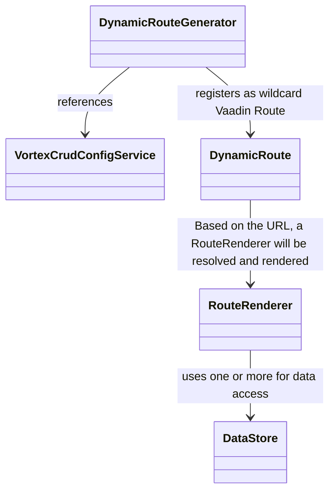
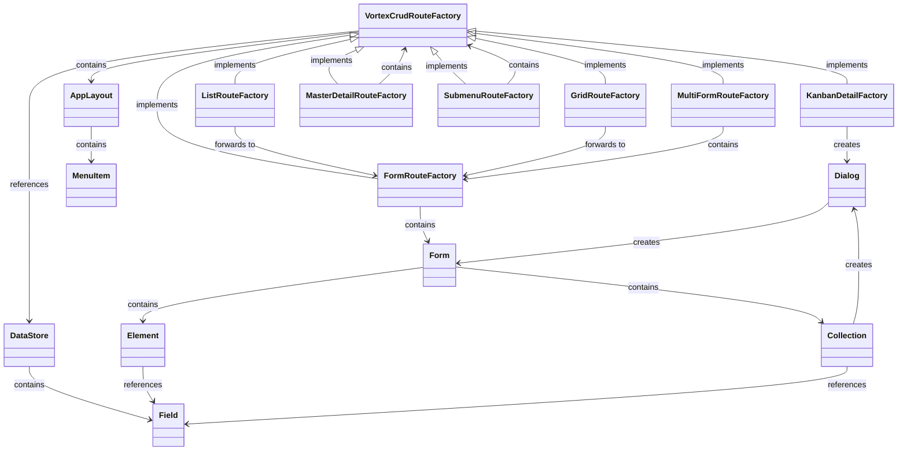
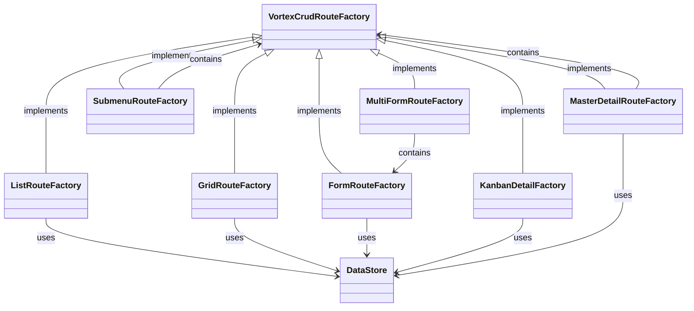

# vortex-crud 


This is a high-level framework built on top of Vaadin Flow, designed to simplify the creation of CRUD applications relying on relationships between data. It uses a declarative configuration approach to define routes, UI components, entities, relationships, and data bindings, reducing the need for manual coding. By providing multiple abstraction layers, `vortex-crud` leverages Vaadin Flow to dynamically generate routes and offers default implementations for UI representation, allowing developers to quickly build and manage CRUD interfaces with minimal effort.

Beyond basic CRUD, the framework makes it easy to interconnect and navigate relational data—linking entities like users with roles or products with categories—and to edit that data through multiple interfaces such as forms, grids, cards, kanban boards, or master–detail views.

Thanks to its **modular** design, `vortex-crud` allows developers to fully customize the user interface using Vaadin components. This provides high flexibility in designing the frontend while still benefiting from the default implementations of `vortex-crud`, which can be extended or replaced as needed.

To keep route configuration lean and type-safe, renderer-specific models now implement a minimal `RouteConfig` interface instead of inheriting from a monolithic base class.

## Table of Contents

1. **[Introduction](#introduction)**
   - **[Inspiration](#inspiration)**
   - **[Tech Stack](#tech-stack)**
   - **[Key Features](#key-features)**
2. **[Features in Detail](#features-in-detail)**
   - **[Listing Data](#listing-data)**
      - **[Grid](#grid)**
      - **[Cards](#cards)**
      - **[Kanban](#kanban)**
      - **[Master-Detail](#master-detail)**
   - **[Nesting routes using Subroute](#nesting-routes-using-subroute)**
   - **[Editing Data](#editing-data)**
      - **[Input Types](#input-types)**
      - **[Relationships](#relationships)**
3. **[Getting Started](#getting-started)**
   - **[Terminology](#terminology)**
   - **[Configuration with jOOQ](#configuration-with-jooq)**
   - **[Configuration with JPA](#configuration-with-jpa)**
4. **[Database Modeling](#database-modeling)**
   - **[System-Defined Tables](#system-defined-tables)**
   - **[Example User-Defined Tables](#example-user-defined-tables)**
5. **[Architecture](#architecture)**
   - **[Basic Principles](#basic-principles)**
   - **[Relationship Between Routes and Forms](#relationship-routes-forms)**
   - **[Data Handling](#data-handling)**
   - **[Data Access](#data-access)**
6. **[Roadmap](#roadmap)**
7. **[Contributing](#contributing)**
8. **[Further Development](#further-development)**

# <a name="introduction">Introduction</a>
## <a name="inspiration">Inspiration</a>
`vortex-crud` was inspired by systems like [Directus](https://github.com/directus/directus), which enable user-friendly management of entities and their relationships. However, unlike Directus, which offers a dynamic model, configuration-based solution that requires no code, `vortex-crud` takes a different approach.

Unlike **Directus**, `vortex-crud` relies on static Java code for configuration, providing developers with fine-grained control over data models and underlying logic. This means database schema validation happens directly within the Java code, ensuring the schema stays consistent and aligned with the application. As a result, developers can flexibly extend and reuse the schema, benefiting from a clear and verifiable structure.

The key difference to **Vaadin Flow** is that `vortex-crud` operates at a much higher level of abstraction. While Vaadin is a framework for building UI components, `vortex-crud` simplifies the creation and management of CRUD applications by offering a declarative configuration for routes, UI components, and data bindings. Developers can focus less on manual coding, as the framework automatically handles many tasks, such as generating routes and UI elements based on the defined model. As a side note, Vaadin and `vortex-crud` can both be used at once.

## <a name="tech-stack">Tech Stack</a>
- **Spring Boot**: Making heavy use of dependency injection
- **Vaadin Flow**: Frontend UI components for building interactive applications
- **JPA or jOOQ**: To access your database either use JPA or jOOQ
 
## <a name="key-features">Key Features</a>
- **Declarative definition of Forms and Routes**: Rapidly create complex, user-friendly CRUD applications by describing the application.
- **Modular Architecture**: If the default implementations don't suffice, rely on a fully modular and flexible [architecture](#architecture).
- **Automatic Entity Management**: Let `vortex-crud` handle basic or more complex cases of entity management. For more complicated use cases, provide a custom implementation.
    - **jOOQ Support**
    - **JPA Support**
        - **Database Schema Validation**: Receive notifications if the data model no longer fits your application.
- **i18n Support**
- **Entity Relationship Support**: Manage relationships between entities (One-to-One, One-to-Many).
- **Menu**
- **Appbar**: With app name and icon
- **Nested Hierarchies**
- **Data Filtering**: Filter entity lists in "grid," "list," and "master-detail" routes.
- **Media Support**: Image and video field types available (functionality in development)
- **Custom Routes**: Add routes not visible in the menu.

# <a name="supported-routes-inputs">Features in Detail</a>

The main point of this project is, that it decouples rendering from data. 

## <a name="listing-data">Listing Data</a>

`vortex-crud` provides multiple route renderer types for displaying and interacting with your data:

### Grid
Displays data in a card-based grid layout with filtering and navigation.


### Cards
List view with scrollable card display for browsing entities.


### Kanban
Kanban board with drag-and-drop support for workflow management.


### Master-Detail
Split view with a master list on the left and detail panel on the right.


### **Edit Data with a Form Route**
Standard form view for creating and editing entities.


### Additional Route Types

- **Form Slide**: Form displayed in a slide-out side panel (configured via `FormSlideRouteFactory`)
- **Multi-Form**: Handles multiple forms in a single route (configured via `MultiFormRouteFactory`)
- **Kanban**: Kanban board with drag-and-drop columns (configured via `KanbanDetailFactory`)
- **Submenu**: Creates nested menu structures for hierarchical navigation (configured via `SubmenuRouteFactory`)

## <a name="nesting-routes-using-subroute">Nesting routes using Subroute</a>


## <a name="editing-data">Editing Data</a>
### Input
- **Inputs**:
  - Text
  - Date
  - DateTime
  - Image
  - Number
  - Select
  - Checkbox
  - TextArea
- **Relationships**: One-to-One, Many-to-One, Many-to-Many

## <a name="configuration">Getting Started</a>
`vortex-crud` currently supports only Java-based configuration to define routes and data stores. Below is a smaller example of how to configure a part of a project management application using jOOQ and JPA.

### <a name="terminology">Terminology</a>
- **Data Store**: An abstraction layer (similar to a Spring Repository or DAO) that manages data for a single database table.
    - **Field**: Represents a database column as a child component of the data store.
- **Route**: Defines navigational paths and display configurations (e.g., grids, lists, or Kanban boards). Routes are linked to specific data stores to fetch and display data.
    - **Form**: A specialized type of route that includes elements for creating or editing data. It can interact with one or multiple data stores, depending on the elements it contains.
        - **Element**: A UI field within the form, serving as a child component that binds to a specific field in the data store.

### <a name="configuration-jooq">vortex-crud with jOOQ</a>
Here is a brief example of how to use the jOOQ integration with `vortex-crud`. For a more comprehensive example, refer to `examples/jooq-sqlite-example`.

```java
@Service
public class ExampleJooqConfiguration implements VortexCrudConfigurationProvider<TableRecord<?>, TableField<?, ?>, TableImpl<?>> {
    @Override
    public Application<TableRecord<?>, TableField<?, ?>, TableImpl<?>> get() {
        // Configure accessible data and its editable fields for vortex-crud
        Map<TableImpl<?>, DataStoreConfig<TableRecord<?>, TableField<?, ?>, TableImpl<?>>> dataStores = Map.of(
                PROJECTS, JooqDataStoreConfig.of(PROJECTS)
                        .withFields(Map.of(
                                PROJECTS.ID, new IdField<>( ),
                                PROJECTS.NAME, new TextField<>(),
                                PROJECTS.DESCRIPTION, new TextAreaField()
                        ))
                        .build()
                // ...
        );

        // Define a reusable form for editing entities from the "PROJECTS" datastore
        RouteRenderer<TableRecord<?>, TableField<?, ?>, TableImpl<?>> projectForm = JooqRouteRenderer.of(FormRouteFactory.class)
                .withDataStore(PROJECTS)
                .withTitle("route.projects.title-cards")
                .withConfiguration(JooqRouteRendererConfiguration.of(CardFactory.class)
                        .withTitleField(PROJECTS.NAME)
                        .withChildren(
                                new JooqFieldElement(PROJECTS.NAME, "route.projects.labels.name")
                                // ...
                        )
                        .build())
                .build();

        // Configure a grid route for displaying and navigating PROJECTS entries
        Map<String, RouteRenderer<TableRecord<?>, TableField<?, ?>, TableImpl<?>>> routes = Map.of(
                "projects-cards", JooqRouteRenderer.of(GridRouteFactory.class)
                        .withDefaultRoute(true)
                        .withDataStore(PROJECTS)
                        .withIconFactory(FACTORY::create)
                        .withTitle("route.projects.title-cards")
                        .withConfiguration(JooqGridOrListRendererConfiguration.of(CardFactory.class)
                                .withTitleField(PROJECTS.NAME)
                                .withDescriptionField(PROJECTS.DESCRIPTION)
                                .build())
                        .withRoles(List.of("manager", "admin"))
                        .withChild(projectForm)
                        .build()
                // ...
        );

        // Build the vortex-crud application using defined routes and datastores
        return JooqApplication.builder()
                .withName("application.name")
                .withI18nBundlePrefix("some_i18n")
                .withRoutes(routes)
                .withDataStores(dataStores)
                .build();
    }
}
```

### <a name="configuration-jpa">vortex-crud with JPA</a>
Below is another brief example of how to use the JPA integration with `vortex-crud`. A more detailed example can be found under `examples/jpa-sqlite-example`.

#### Key Difference: JPA uses Annotation-Based Field Configuration

Unlike jOOQ (which uses manual field configuration), **JPA field types are defined using annotations directly on entity fields**. This provides a cleaner, more declarative approach that keeps field metadata close to the entity definition.

#### Available JPA Field Annotations

**Basic Text Fields:**
- `@TextField` - Single-line text input
- `@EmailField` - Email validation + text input
- `@PasswordField` - Password input with masking
- `@TextAreaField` - Multi-line text input

**Numeric Fields:**
- `@IntegerNumberField` - Integer numbers
- `@DoubleNumberField` - Decimal numbers
- `@BigDecimalNumberField` - High-precision decimal numbers

**Date/Time Fields:**
- `@DateField` - Date picker
- `@DateTimePickerField` - Date and time picker

**Selection Fields:**
- `@CheckboxField` - Boolean input
- `@SelectField` - Dropdown selection (for enums)
- `@ReferenceField` - Foreign key reference to another entity

**Media Fields:**
- `@ImageField` - Image upload and display
- `@VideoField` - Video handling

#### JPA Entity Example with Annotations

```java
@Entity
public class Project {
    @Id
    @GeneratedValue(strategy = GenerationType.IDENTITY)
    @IntegerNumberField
    private Integer id;

    @TextField
    private String name;

    @TextAreaField
    private String description;

    @DateField
    private LocalDate endDate;

    @ReferenceField
    @ManyToOne
    private User owner;
}
```

#### JPA Configuration Example

```java
@Service
public class ExampleJpaConfiguration implements VortexCrudConfigurationProvider<JpaRepository<?, ?>, String, JpaRepository<?, ?>> {

    private final ProjectRepository projectRepository;

    public ExampleJpaConfiguration(ProjectRepository projectRepository) {
        this.projectRepository = projectRepository;
    }

    @Override
    public Application<JpaRepository<?, ?>, String, JpaRepository<?, ?>> get() {
        RouteRenderer<JpaRepository<?, ?>, String, JpaRepository<?, ?>> projectForm = JpaRouteRenderer.of(FormRouteFactory.class)
                .withDataStore(projectRepository)
                .withTitle("route.projects.title-cards")
                .withConfiguration(JpaRouteRendererConfiguration.of(CardFactory.class)
                        .withTitleField("name")
                        .withChildren(
                                new JpaFieldElement("name", "route.projects.labels.name"),
                                new JpaFieldElement("description", "route.projects.labels.description"),
                                new JpaFieldElement("endDate", "route.projects.labels.end_date")
                                // Fields are automatically detected from entity annotations
                        )
                        .build())
                .build();

        Map<String, RouteRenderer<JpaRepository<?, ?>, String, JpaRepository<?, ?>>> routes = Map.of(
                "projects-cards", JpaRouteRenderer.of(GridRouteFactory.class)
                        .withDefaultRoute(true)
                        .withDataStore(projectRepository)
                        .withIconFactory(FACTORY::create)
                        .withTitle("route.projects.title-cards")
                        .withConfiguration(JpaGridOrListRendererConfiguration.of(CardFactory.class)
                                .withTitleField("name")
                                .withDescriptionField("description")
                                .build())
                        .withRoles(List.of("manager", "admin"))
                        .withChild(projectForm)
                        .build()
                // ...
        );

        return JpaApplication.builder()
                .withName("application.name")
                .withI18nBundlePrefix("some_i18n")
                .withRoutes(routes)
                .build();
    }
}
```

**Note:** Field types are automatically detected from the annotations on your JPA entities - no need to manually configure them in the DataStoreConfig.

## Security & Authentication

`vortex-crud` includes a security module for user management and authentication. The implementation uses `vortex-crud`'s own data access patterns rather than traditional Spring Security approaches.

### Configuration Example

Configure authentication and user management in your application configuration:

```java
.withIdentityAndAccessManagement(
    LocalIdentityAndAccessManagement.of(userRepository)
        .withRoles(Roles.builder().withRoles(List.of("manager", "admin")).build())
        .withSignUp(true)
        .withLoginView(LoginView.class)
        .withSignUpView(SignUpView.class)
        .withUsername(new JpaFieldElement("username", "labels.username"))
        .withPassword(new JpaFieldElement("passwordHash", "labels.password"))
        .withSignUpFields(
            new JpaFieldElement("firstName", "labels.firstName"),
            new JpaFieldElement("lastName", "labels.lastName")
        )
        .build()
)
```

### User Entity Example

```java
@Entity
public class User {
    @Id
    @GeneratedValue(strategy = GenerationType.IDENTITY)
    private Integer id;

    @EmailField
    private String username;

    @PasswordField
    private String passwordHash;

    @TextField
    private String firstName;

    @TextField
    private String lastName;

    @ManyToMany
    private Set<Role> roles;

    // getters and setters...
}
```

### Key Architectural Note

`vortex-crud` uses its own `VortexCrudDataStore` abstraction for user management. **Do not** create traditional Spring Security components like `UserDetailsService` or custom repository methods. The framework handles data access through its own patterns - see `SignUpView.java` in the security module for a reference implementation.

# <a name="core-concept">Database Modeling</a>
`vortex-crud` does not impose its own database model. Instead, users define their own data model, and `vortex-crud` integrates seamlessly with it. The JPA implementation of `vortex-crud` ensures that the view representation is consistent with the provided model. However, certain system-defined tables are required, particularly those for auditing, user management, and role management:

```sql
-- Predefined system tables (examples)
CREATE TABLE users (...);
CREATE TABLE roles (...);
CREATE TABLE user_roles (...);
CREATE TABLE audit_log (...);
```

## <a name="data-model-example">Example User-Defined Tables</a>
Users can define custom tables as needed, such as `projects`, `tasks`, and `task_comments`:

```sql
CREATE TABLE projects (...);
CREATE TABLE tasks (...);
CREATE TABLE task_comments (...);
```

# <a name="roadmap">Roadmap</a>

### Security & Authentication
- **Enhanced Authentication Options**: Integration with [Keycloak](https://github.com/keycloak/keycloak) / OAuth2
- **Permission inheritance and role hierarchies**

### Developer Experience
- **Simplified Configuration DSL**: Reduce verbosity and nesting in configuration
  - Add shorthand methods for common patterns (e.g., `.quickForm("entity", "field1", "field2")`)
  - Provide sensible defaults to minimize required configuration
  - Create configuration templates for common use cases (user management, blog, e-commerce)
- **Enhanced Documentation**:
  - Interactive tutorial with step-by-step examples
  - Video tutorials for common scenarios
  - Architecture decision records (ADRs) explaining design choices
  - Keep code examples synchronized with actual implementation (automated tests for README examples)
- **Improved Error Messages**: Context-aware error messages with suggestions for fixes
- **Configuration Validation**: Validate configuration at startup with clear error reporting
  - Detect missing required fields
  - Warn about performance anti-patterns
  - Suggest optimizations

### Framework Flexibility
- **Hook Points & Extension API**: Comprehensive hook system for customization
  - Lifecycle hooks (before/after save, load, delete)
  - Validation hooks
  - Action hooks (if button pressed to this)
  - Data transformation hooks

### API & Integration
- **REST API Generation**: Auto-generate REST endpoints for data stores
  - OpenAPI/Swagger documentation
  - Configurable endpoint exposure (select which entities to expose)
  - JWT authentication for API access
  - Rate limiting and security controls
- **GraphQL API Support**: Optional GraphQL endpoint generation
- **Webhook Support**: Trigger external systems on entity changes
- **Export/Import**: Bulk data export and import (CSV, JSON, Excel)

### Enhanced Validation
- **Field Validation Framework**: Comprehensive validation system
  - Built-in validators (email, URL, regex, range, length)
  - Custom validation logic
  - Cross-field validation
  - Async validation (e.g., uniqueness checks)
- **Entity-Level Validation**: Business rule validation across multiple fields

### Additional UI Components
- **Additional Form Controls**: Radio Button Groups, Select Groups, Links, Color Pickers, File Upload, Image collections
- **Additional Routes**:
  - **Calendar Route**: Timeline and calendar views for date-based entities
  - **Map Route**: Geographic data visualization
  - **Chart/Dashboard Route**: Analytics and reporting dashboards
  - **Generic Block Route**: Flexible block-based layouts
- **Additional Fields**: Date range, Time range, Duration, Rich text editor, Code editor
- **Alternative Collection Editing**: Spreadsheet-style editing, Bulk editing, Drag-and-drop reordering

### Advanced Features
- **Entity Versioning**: Track entity history (configuration structure defined, implementation pending)
- **Entity Auditing**: Comprehensive audit logging (configuration structure defined, implementation pending)
- **Prefiltered Routes**: Define routes that show filtered subsets of data
- **Custom Menu Routes**: Programmatically add routes outside the main menu
- **Route Filters**: Advanced filtering for all route types (especially kanban)
- **Full-Text Search**: Integrate search engines (Elasticsearch, PostgreSQL full-text)
- **Soft Delete**: Configurable soft delete with trash/restore functionality

### Performance & Optimization
- **Database Index Recommendations**: Analyze queries and suggest indexes
- **Query Optimization**: Automatic N+1 query detection and optimization
- **Caching Layer**: Configurable caching for read-heavy applications
- **Lazy Loading**: Optimize large forms with lazy-loaded sections

### UI/UX Improvements
- **Theme System**: Comprehensive theming and white-labeling support
- **Responsive Design**: Improved mobile and tablet experiences
- **Keyboard Navigation**: Enhanced keyboard shortcuts and navigation

### Starter Templates
  - Blog/CMS
  - E-commerce admin
  - User management system
  - Project management tool

# <a name="architecture">Architecture</a>
The architecture of `vortex-crud` is modular and declarative, designed to streamline CRUD application development with minimal coding effort. Built on Vaadin Flow, it automatically generates routes and manages entities and their relationships using jOOQ or JPA.

A collection of central registries acts as the core for generating Vaadin components, including routes, forms, and data stores, all based on configuration metadata. This approach ensures flexibility, scalability, and seamless integration while allowing for easy customization of data handling, UI rendering, and complex entity management.

While the `core` module handles the UI implementations and the generation of routes, the data store implementations are separated into the `jooq` and `jpa` modules for better modularity.

## Basic Principles
At its core, `vortex-crud` relies on dependency injection, with the `VortexCrudConfigService` as the entry point. The implementation of this service is provided by the user. Based on the configuration defined in `VortexCrudConfigService`, the `DynamicRouteGenerator` automatically registers the necessary routes.



## <a name="data-handling">Data Handling and Management</a>

`vortex-crud` uses an SQLite database during development. The database is accessed through the `VortexCrudDataStore` service, and the validation of the data model is data store-specific to ensure that the schema matches the configuration. Custom `DataStore` implementations are also supported, requiring only the implementation of the relevant interface.

### The VortexCrudDataStore Pattern

**Important:** `vortex-crud` uses its own data access abstraction instead of traditional Spring patterns. This is a core architectural decision that differentiates it from vanilla Spring Boot applications.

#### Reference Implementations

To understand how to work with `VortexCrudDataStore`, examine these existing implementations:
- **`SignUpView.java`** - Shows how to create and save user entities with password hashing
- **`FormRouteFactory`** - Demonstrates form-based entity editing
- **`FormDialogFactory`** - Shows dialog-based entity creation/editing

#### Why This Pattern?

This abstraction allows `vortex-crud` to:
- Support both JPA and jOOQ with the same configuration API
- Automatically validate schema against configuration
- Generate UI components dynamically from metadata
- Maintain a clean separation between UI and data access

The following diagram provides a simplified view of the architecture, illustrating the relationships between different components. It's important to note that classes are not instantiated directly; instead, they are created based on the types specified in the configuration. The `FactoryRegistry` retrieves the appropriate component factory from the configuration and returns the corresponding instance.

## <a name="relationship-routes-forms">Relationship Between Route Renderers and Forms</a>

**Note:** All route factories implement the `VortexCrudRouteFactory` interface. Routes are defined using the `RouteRenderer` configuration model.



## <a name="data-access">Data Access</a>

The following provides a simplified overview of how data renderers access data. As with other components, classes are not instantiated directly; instead, they are created based on the types specified in the configuration.

**Note:** All route factories implement `VortexCrudRouteFactory` and use `VortexCrudDataStore` for data access.



# <a name="contributing">Contributing</a>
`vortex-crud` is open-source and welcomes contributions! If you’d like to contribute, open an issue and let's discuss.

# <a name="further-development">Setup a development environment</a>

To get started with development

1. **Clone the repository**
2. **Run the `install` goal at the project root module `vortex-crud`**
3. **Run the jooq example application**:
    - Go to: `examples\jooq-sqlite-example\`
    - Run `com.github.appreciated.vortex_crud.example.jooq.Application`
    - Make sure to set the working directory according to the Maven module `jooq-sqlite-example`
