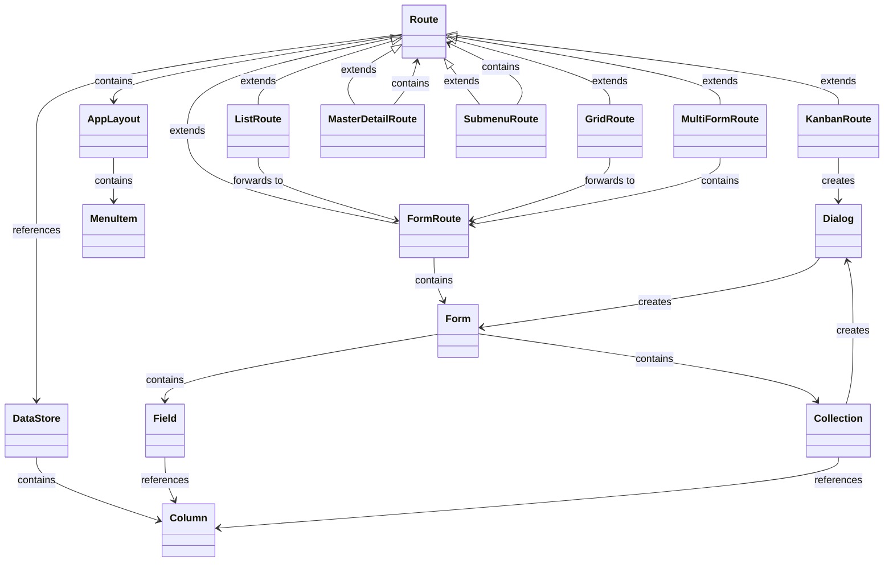
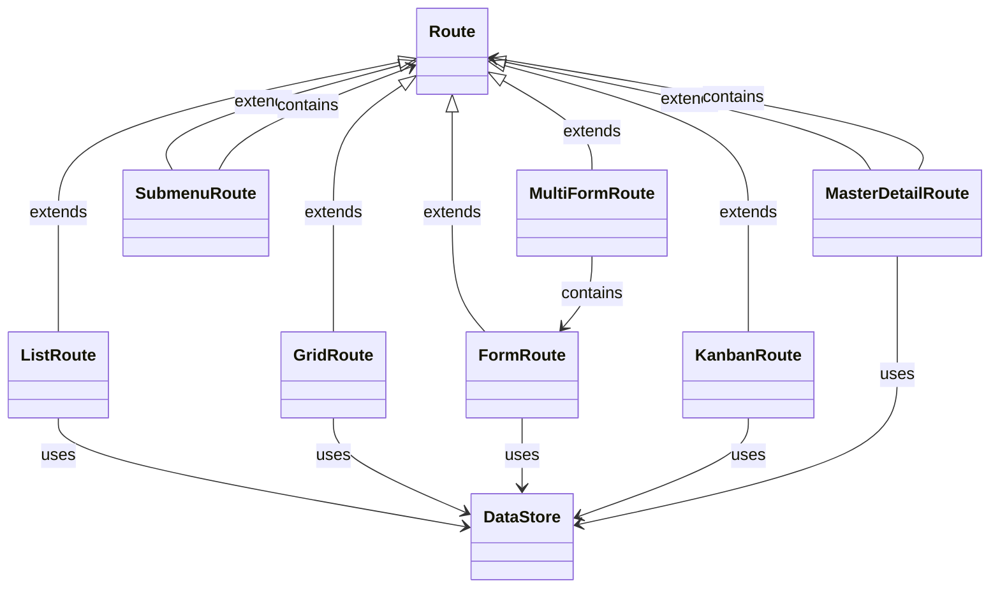

# turbo-crud 


`turbo-crud` is a high-level framework built on top of Vaadin Flow, designed to simplify the creation of CRUD applications. It uses a declarative configuration approach to define routes, UI components, entities, relationships and data bindings, reducing the need for manual coding. By providing multiple abstraction layers, turbo-crud leverages Vaadin Flow to dynamically generate routes and offers default implementations for UI representation, allowing developers to quickly build and manage CRUD interfaces with minimal effort.

## Inspiration
`turbo-crud` was inspired by systems such as [Directus](https://github.com/directus/directus), which enable user-friendly management of entities, structures and ui.

## Tech-Stack
- **Spring Boot**: Backend API development and dependency injection
- **Vaadin Flow**: Frontend UI components for building interactive applications

## Key Features
- **Declarative definition of UI and Route Generation**: create rapidly complex, user-friendly CRUD applications by describing the application.
- **Modular Architecture**: If default implementations don't suffice, rely on a fully modular and flexible architecture ([see under Architecture](#Architecture)), to supply custom implementations.
- **DataStores**: Let `turbo-crud` handle simple entity management; For more complicated use-cases provide a custom implementation.
  - **Jooq Support**
  - **JPA Support**
    - **Database Schema Validation**: Get noticed if the data model does no longer match the data model
- **UI Components**
  - Inputs
    - Text
    - Date
    - DateTime
    - Image
    - Number
    - Select
    - Checkbox
    - TextArea
  - Relationships
    - One-To-One
    - Many-To-One
    - [WIP] Many-To-Many
  - Routes
     - Form
     - MultiForm
     - Grid
     - Cards
     - Kanban
- **i18n Support**
- **Entity Relationship Support**: Manage relationships between entities (One-To-One, One-To-Many).
- **Nested Hierarchies**
- **Filtering data**: Filter entity lists in "grid," "list," and "master-detail" routes.
- **[WIP] Media Support**: Manage and view media easily
- **Add routes not visible in the menu**

## Roadmap (in no particular order)
- **Form Navigation**: Enable navigation within forms to other routes or sub-routes using a new input type called "routeRenderer".
- **Field Validation**: Support for basic and advanced field validation hooks.
- **User and Role Management & Authentication**: (optionally using [Authentik](https://github.com/goauthentik/authentik) / [Keycloak](https://github.com/keycloak/keycloak))
- **Additional Form Controls**: Include controls like Radio Button Groups, Select Groups, Links, etc.
- **Role-Based Access Control (RBAC)**
- **Entity Versioning**
- **Entity Auditing**
- **Hook Points**: Add custom hook points for enhanced flexibility.
- **Prefiltered Routes**: Display only specific items in routes as needed.
- **Additional Routes**:
    - **Calendar Route**: Example from [Directus](https://directus.pizza/admin/content/posts?bookmark=45)
    - **Map Route**: Display entities on a map based on latitude and longitude columns.
    - **Generic Block Route**: Support for generic blocks with a flexible factory system.
- **Custom Menu Routes**: Add custom routes to the menu.
- **Alternative Collection Editing**: Offer different ways to edit collections.
- **Configuration Pre-Checks**: Validate the application configuration fully at startup.
- **Styling**: Improve styling options.
- **Database Index Check**: Verify that suitable indices are available, given that the UI and database are defined in a machine-parsable format.
- **Route Filters**: Add filtering options for "kanban" routes.
- **API-Endpoints**: Allow providing API endpoints to access the data stores programmatically

## Data Handling and Management
turbo-crud utilizes the SQLite database during development. The database is accessed by the service `TurboCrudDataStore`, while the `TurboCrudDatabaseSchemaValidator` ensures the schema aligns with the Java configuration at startup. Custom DataStore implementations are also supported, requiring only an interface implementation.

### Core Concept: User-Defined Database Model
The database model is defined by the user, with turbo-crud validating that the view representation aligns with this model. Some system-defined tables, such as those for auditing, user, and role management, are exceptions:

```sql
-- Predefined system tables (examples)
CREATE TABLE users (...);
CREATE TABLE roles (...);
CREATE TABLE user_roles (...);
CREATE TABLE audit_log (...);
```

### Example User-Defined Tables
Users can define tables like `projects`, `tasks`, and `task_comments` as needed:

```sql
CREATE TABLE projects (...);
CREATE TABLE tasks (...);
CREATE TABLE task_comments (...);
```

## Configuration via Java
Turbo-crud supports currently only configuration using java to define routes and data stores. Here’s smaller example on how to configure a part of a project management application using Jooq and JPA:

### Jooq
In the following a smallish example on how to use the Jooq integration of turbo-crud. A more complete example can be found under `examples/jooq-sqlite-example`.

```java
@Service
public class ExampleJooqConfiguration implements TurboCrudConfigurationProvider<Table<?>, TableField<?, ?>> {
  @Override
  public Application<Table<?>, TableField<?, ?>> get() {
    Map<Table<?>, DataStoreConfig<Table<?>, TableField<?, ?>>> dataStores = Map.of(
            PROJECTS, JooqDataStoreConfig.of(JooqDataStore.class)
                    .withFields(Map.of(
                            PROJECTS.ID, new JooqField(IdFieldFactory.class, true),
                            PROJECTS.NAME, new JooqField(TextFieldFactory.class, true, true, Validation.Builder.of().withMaxLength(255).build()),
                            PROJECTS.DESCRIPTION, new JooqField(TextAreaFieldFactory.class, false, false, Validation.Builder.of().withMaxLength(500).build()),
                            PROJECTS.START_DATE, new JooqField(DateFieldFactory.class),
                            PROJECTS.END_DATE, new JooqField(DateFieldFactory.class),
                            PROJECTS.CREATED_AT, new JooqField(DateTimePickerFactory.class),
                            PROJECTS.UPDATED_AT, new JooqField(DateTimePickerFactory.class)))
                    .build()
            // ...
    );

    Route<Table<?>, TableField<?, ?>> projectForm = JooqRoute.of(FormRouteFactory.class)
            .withDataStore(PROJECTS)
            .withTitle("route.projects.title-cards")
            .withConfiguration(JooqRouteConfiguration.of(CardFactory.class)
                    .withTitleField(PROJECTS.NAME)
                    .withChildren(
                            new JooqFormElement(PROJECTS.NAME, "field", "route.projects.labels.name"),
                            new JooqFormElement(PROJECTS.DESCRIPTION, "field", "route.projects.labels.description"),
                            new JooqFormElement(PROJECTS.START_DATE, "field", "route.projects.labels.start_date"),
                            new JooqFormElement(PROJECTS.END_DATE, "field", "route.projects.labels.end_date")
                    )
                    .build())
            .build();

    Map<String, Route<Table<?>, TableField<?, ?>>> routes = Map.of(
            "projects-cards", JooqRoute.of(GridRouteFactory.class)
                    .withDefaultRoute(true)
                    .withDataStore(PROJECTS)
                    .withIconFactory(FACTORY::create)
                    .withTitle("route.projects.title-cards")
                    .withConfiguration(GridOrListConfiguration.Builder.<Table<?>, TableField<?, ?>>of(CardFactory.class)
                            .withTitleField(PROJECTS.NAME)
                            .withDescriptionField(PROJECTS.DESCRIPTION)
                            .build())
                    .withRoles(List.of("manager", "admin"))
                    .withChild(projectForm)
                    .build()
            // ...
    );

    return JooqApplication.of()
            .withName("application.name")
            .withI18nBundlePrefix("some_i18n")
            .withUserManagement(UserManagement.Builder.of()
                    .withEnabled(true)
                    .withAccessControl(AccessControl.Builder.of().withRoles(List.of("manager", "admin")).build())
                    .withSignUp(true)
                    .withAdditionalFields(List.of(AdditionalField.Builder.of()
                            .withName("start_date")
                            .withType("date")
                            .build()))
                    .build())
            .withRoutes(routes)
            .withVersioning(Versioning.Builder.<Table<?>>of().withDataStores(PROJECTS, TASKS, TASK_COMMENTS).build())
            .withAuditing(Auditing.Builder.of().withActions("create", "update", "delete", "login", "logout").build())
            .withSelects(Selects.Builder.of().withConfigs(
                    Map.of("task-status",
                            Map.of(
                                    "open", "selects.task-status.open",
                                    "todo", "selects.task-status.todo",
                                    "work-in-progress", "selects.task-status.progress",
                                    "closed", "selects.task-status.closed"
                            )
                    )).build())
            .withDataStores(dataStores)
            .build();
  }
}
```

### JPA
In the following another smallish example on how to use the JPA integration of turbo-crud. A more complete example can be found under `examples/jpa-sqlite-example`.

```java

@Service
public class ExampleJpaConfiguration implements TurboCrudConfigurationProvider<String,String> {

  @Override
  public Application<String, String> get() {
    Route<String, String> projectForm = JpaRoute.of(FormRouteFactory.class)
            .withDataStore("projects")
            .withTitle("route.projects.title-cards")
            .withConfiguration(JpaRouteConfiguration.of(CardFactory.class)
                    .withTitleField("name")
                    .withChildren(
                            new JpaFormElement("name", "field", "route.projects.labels.name"),
                            new JpaFormElement("description", "field", "route.projects.labels.description"),
                            new JpaFormElement("start_date", "field", "route.projects.labels.start_date"),
                            new JpaFormElement("end_date", "field", "route.projects.labels.end_date")
                    )
                    .build())
            .build();

    Map<String, DataStoreConfig<String, String>> dataStores = Map.of(
            "projects", JpaDataStoreConfig.of(JpaDataStore.class)
                    .withFields(Map.of(
                            "id", new JpaField(IdFieldFactory.class, true),
                            "name", new JpaField(TextFieldFactory.class, true, true, Validation.Builder.of().withMaxLength(255).build()),
                            "description", new JpaField(TextAreaFieldFactory.class, false, false, Validation.Builder.of().withMaxLength(500).build()),
                            "start_date", new JpaField(DateFieldFactory.class),
                            "end_date", new JpaField(DateFieldFactory.class),
                            "created_at", new JpaField(DateTimePickerFactory.class),
                            "updated_at", new JpaField(DateTimePickerFactory.class)))
                    .build()
            //...
    );

    Map<String, Route<String, String>> routes = Map.of(
            "projects-cards", JpaRoute.of(GridRouteFactory.class)
                    .withDefaultRoute(true)
                    .withDataStore("projects")
                    .withIconFactory(FACTORY::create)
                    .withTitle("route.projects.title-cards")
                    .withConfiguration(GridOrListConfiguration.Builder.<String, String>of(CardFactory.class)
                            .withTitleField("name")
                            .withDescriptionField("description")
                            .build())
                    .withRoles(List.of("manager", "admin"))
                    .withChild(projectForm)
                    .build()
            //...
    );

    return JpaApplication.of()
            .withName("application.name")
            .withI18nBundlePrefix("some_i18n")
            .withUserManagement(UserManagement.Builder.of()
                    .withEnabled(true)
                    .withAccessControl(AccessControl.Builder.of().withRoles(List.of("manager", "admin")).build())
                    .withSignUp(true)
                    .withAdditionalFields(List.of(AdditionalField.Builder.of()
                            .withName("start_date")
                            .withType("date")
                            .build()))
                    .build())
            .withRoutes(routes)
            .withVersioning(Versioning.Builder.<String>of().withDataStores("projects", "tasks", "task_comments").build())
            .withAuditing(Auditing.Builder.of().withActions("create", "update", "delete", "login", "logout").build())
            .withSelects(Selects.Builder.of().withConfigs(
                    Map.of("task-status",
                            Map.of(
                                    "open", "selects.task-status.open",
                                    "todo", "selects.task-status.todo",
                                    "work-in-progress", "selects.task-status.progress",
                                    "closed", "selects.task-status.closed"
                            )
                    )).build())
            .withDataStores(dataStores)
            .build();
  }
}
```


## Architecture

The following diagram provides a simplified view of the architecture, illustrating relationships between various components. Note that classes are not instantiated directly; instead, they are instantiated based on types specified in the configuration. A `FactoryRegistry` retrieves and returns the appropriate component factory based on this configuration.

### Relationship between Routes and Forms


### Data Access

The following shows a simplified representation on how data is being accessed. As previously the same applies here, classes are not instantiated directly; instead, they are instantiated based on types specified in the configuration.


## Getting Started with Development

1. **Clone the repository**
2. **Run one of the example application**:
   - The database will be initialized automatically
   - Start example application:
     ```bash
     ./mvnw spring-boot:run
     ```
