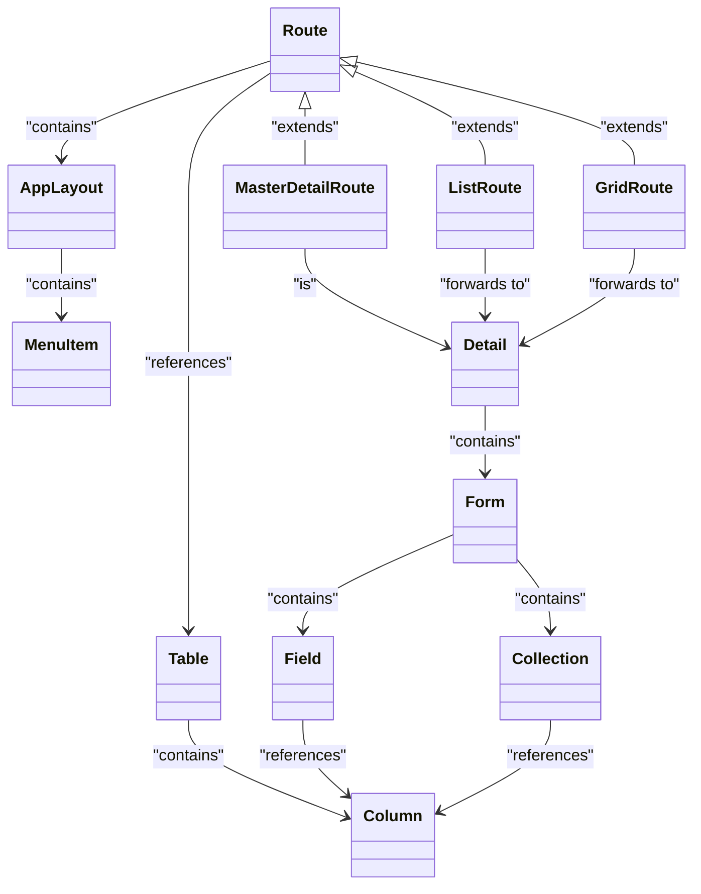

# FlowCMS (Current Working Title)
 

FlowCMS is a powerful framework designed to accelerate the development of CRUD-style applications using Vaadin Flow. By offering a high-level abstraction layer, it allows developers to rapidly build and customize applications while maintaining the flexibility and control Vaadin Flow provides for more advanced use cases. FlowCMS is built with extensibility in mind, making it easy to adapt and expand features as project requirements evolve.

FlowCMS is not a replacement for Vaadin Flow but rather an extension that streamlines repetitive tasks, helping developers focus on application-specific logic and customization.

## Tech Stack
- **Spring Boot**: Backend API development and dependency injection
- **Vaadin Flow**: Frontend UI components for building interactive applications
- **HOCON**: Configuration format that is compact, readable, and supports imports

## Core Architecture and Basic Functions
- **Modular UI System**: The UI follows a modular structure, with factories operating at various levels (e.g., Component List Factory, Factory System).
- **Flexible Configuration System**: Utilizes HOCON for dynamic configuration. Examples demonstrate how to configure different parts of the application.
- **Database Schema Validation**: The `FlowCmsDatabaseSchemaValidator` validates the database schema against the application’s configuration at startup.
- **Dynamic Routing**: The `DynamicRoute` class enables routing based on configuration files, allowing flexible route management.
- **UI Components and Factories**: Several factory implementations, such as `DefaultEntityDetailFactoryImpl`, `DefaultEntityItemCardFactoryImpl`, and `DefaultRouteFactoryImpl`, are available for configuring UI components dynamically.
- **Entity Management**: The `GenericEntity` and `FlowCmsEntityManagerService` classes provide generic entity management capabilities.
- **Internationalization Support**: Translations are integrated from the start for a multi-language experience.
- **Customizable Icons**: Icons can be easily swapped or customized.

## Roadmap (in no specific order)
- **Support for Entity Relationships**: Add, remove, and view relationships between entities (1:1, 1:n, n:n)
- **Nested Hierarchies**: Support navigating nested data structures
- **Field Validation**: Support for simple cases of validation also custom hooks for complex validation cases
- **Media Support**: Enable media handling in forms and views
- **User and Role Management & Authentication** (optionally using Authentik)
- **Additional Form Controls**: Radiobutton Group, Select Group, etc.
- **Role-Based Access Control (RBAC)**: Configurable via HOCON
- **Entity Versioning**: Track versions of entities
- **Entity Auditing**: Support for auditing entity changes
- **Extensibility and Hook Points**: Additional extension and hook points for customization
- **Generic Block Route Factory**: Add support for generic blocks and implement a flexible factory system for block routes
- **Custom Repositories**: Enable integration with custom repositories

## Data Handling and Management
FlowCMS uses an H2 database for development, managed by the custom class `FlowCmsEntityManagerService`. The `FlowCmsDatabaseSchemaValidator` ensures the database schema matches the HOCON configuration at startup.

### Core Concept: User-Defined Database Model
The database model is defined by the user, and FlowCMS verifies that the view representation fits this model. However, some system-defined tables are exceptions, such as those for auditing, user, and role management:

```sql
-- Predefined system tables (examples)
CREATE TABLE users (...);
CREATE TABLE roles (...);
CREATE TABLE user_roles (...);
CREATE TABLE audit_log (...);
```

### Example User-Defined Tables
Users can define tables like `projects`, `tasks`, and `task_comments` to fit their needs:

```sql
CREATE TABLE projects (...);
CREATE TABLE tasks (...);
CREATE TABLE task_comments (...);
```

This version is concise, focusing on the key points while providing essential examples.
## Architecture

The diagram below presents a simplified version of the architecture, illustrating the relationships between the different components. The main difference between this representation and the actual architecture is that classes are not instantiated directly. Instead, instantiation is determined by the type specified in the configuration (e.g., "factory" = "grid" or "type" = "form"). A FactoryRegistry is used to retrieve and return the appropriate component factory based on this configuration.



## Configuration via HOCON
FlowCMS supports configuration through HOCON files where routes and tables are defined.

Note: While Java classes could theoretically be used for configuration, as HOCON files are parsed into Java classes, this approach is not currently supported. HOCON is preferred as it enhances both readability and maintainability.

### Example Configuration

Below is an example of configuring a route and the associated table:

```hocon
application {
  #...
  tables = {
    "projects" = {
      columns = {
        id = {type = "id", primary = true},
        name = {type = "text", required = true, max-length = 255},
        description = {type = "text", max-length = 500},
        start_date = {type = "date"},
        end_date = {type = "date"},
        created_at = {type = "datetime"},
        updated_at = {type = "datetime"}
      }
    }
  }
  #...  
  routes = {
    projects = {
      name: "project_view",
      table: "projects",
      factory = "grid"
      render-configuration {
        item-factory = {
          type = "card"
          title-column = "name"
          description-column = "description"
        }
        detail-factory {
          title-column = "name"
          type = "form"
          children = [
            {column = "name", label = "route.projects.labels.name"},
            {column = "description", label = "route.projects.labels.description"},
            {column = "start_date", label = "route.projects.labels.start_date"},
            {column = "end_date", label = "route.projects.labels.end_date"}
          ]
        }
      }
    }
  }
}
```

## Application Configuration (HOCON Format)
Here’s a more complete sample configuration for setting up a project management application:

```hocon
application {
  name = "application.name"

  i18n-bundle-prefix = "some_i18n"

  selects {
    task-status {
      open = "selects.task-status.open"
      todo = "selects.task-status.todo"
      work-in-progress = "selects.task-status.progress"
      closed = "selects.task-status.closed"
    }
  }

  tables = {
    "projects" = {
      fields = {
        id = {type = "id", primary = true},
        name = {type = "text", required = true, max-length = 255},
        description = {type = "text", max-length = 500},
        start_date = {type = "date"},
        end_date = {type = "date"},
        created_at = {type = "datetime"},
        updated_at = {type = "datetime"}
      }
    },
    "tasks" = {
      fields = {
        id = {type = "id", primary = true},
        title = {type = "text", required = true, max-length = 255},
        description = {type = "text", max-length = 1000},
        assigned_to = {type = "number"},
        status = {type = "select", values = "task-status"},
        due_date = {type = "date", read-only-for-roles = ["developer"]},
        created_at = {type = "datetime"},
        updated_at = {type = "datetime"}
      }
    }
  }
  routes = {
    "projects" = {
      default-route = true
      table = "projects"
      title = "route.projects.title"
      factory = "grid"
      icon = "FACTORY"
      render-configuration {
        item-factory = {
          type = "item-card-factory"
          title-column = "name"
          description-column = "description"
        }
        detail-factory {
          title-column = "name"
          type = "form"
          children = [
            {column = "name", label = "route.projects.labels.name"},
            {column = "description", label = "route.projects.labels.description"},
            {column = "start_date", label = "route.projects.labels.start_date"},
            {column = "end_date", label = "route.projects.labels.end_date"}
          ]
        }
        access-control = {
          roles = ["manager", "admin"]
        }
      }
    },
    "tasks" = {
      table = "tasks"
      icon = "TASKS"
      title = "route.tasks.title"
      factory = "master-detail"
      render-configuration = {
        item-factory = {
          type = "item-card-factory"
          title-column = "title"
          description-column = "description"
        }
        detail-factory {
          title-column = "title"
          type = "form"
          children = [
            {column = "title", label = "route.tasks.labels.title"},
            {column = "description", label = "route.tasks.labels.description"},
            {column = "status", label = "route.tasks.labels.status"},
            {column = "due_date", label = "route.tasks.labels.due_date"}
          ]
        }
      }
      access-control = {
        roles = ["developer", "manager", "admin"]
      }
    }
  }
}
```

## Getting Started with Development

1. **Clone the repository**:
   ```bash
   git clone https://github.com/appreciated/flow-cms.git
   ```
2. **Run the application**:
   - Use the provided SQL schema to set up the database.
   - Configure application properties for H2 or other databases.
   - Start the Spring Boot server:
     ```bash
     ./mvnw spring-boot:run
     ```

## License
This project is licensed under the MIT License.