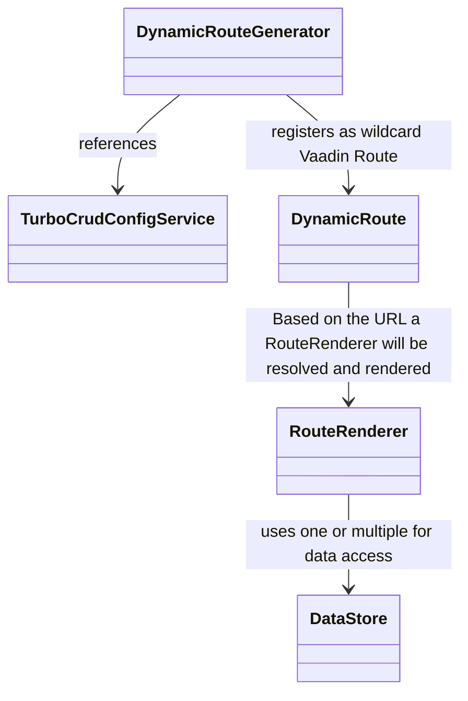
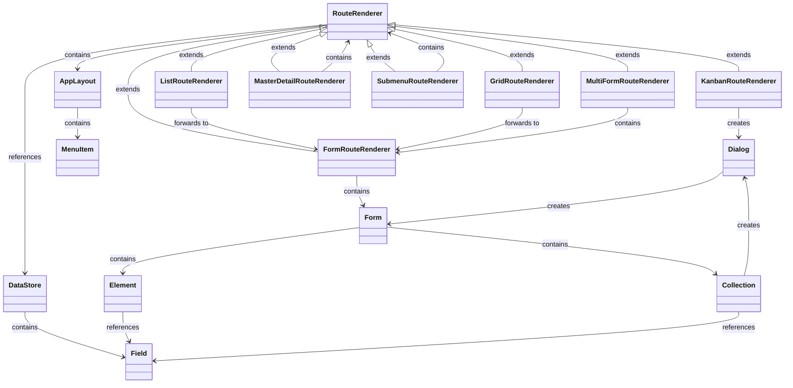
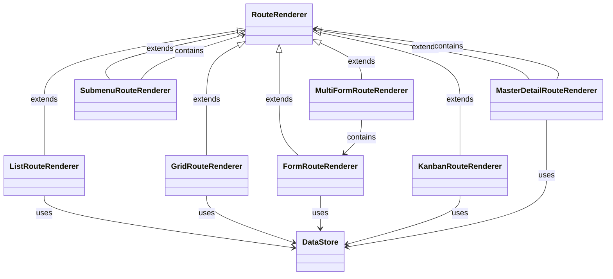

# turbo-crud 


`turbo-crud` is a high-level framework built on top of Vaadin Flow, designed to simplify the creation of CRUD applications. It uses a declarative configuration approach to define routes, UI components, entities, relationships and data bindings, reducing the need for manual coding. By providing multiple abstraction layers, turbo-crud leverages Vaadin Flow to dynamically generate routes and offers default implementations for UI representation, allowing developers to quickly build and manage CRUD interfaces with minimal effort.

## Table of Contents

1. **[Inspiration](#inspiration)**
2. **[Tech-Stack](#tech-stack)**
3. **[Key Features](#key-features)**
4. **[Getting Started](#getting-started)**
    - **[jOOQ Configuration](#configuration-jooq)**
    - **[JPA Configuration](#configuration-jpa)**
5. **[Core Concepts](#core-concepts)**
    - **[User-Defined Database Model](#core-concept)**
    - **[Example User-Defined Tables](#data-model-example)**
6. **[Available Route Renderers and Inputs](#supported-routes-inputs)**
    - **[Route Renderers](#route-renderers)**
    - **[Input Types](#inputs)**
    - **[Entity Relationships](#relationships)**
7. **[Architecture](#architecture)**
    - **[Basic Principles](#basic-principle)**
    - **[Relationship Between Routes and Forms](#relationship-routes-forms)**
    - **[Data Handling and Management](#data-handling)**
    - **[Data Access](#data-access)**
8. **[Roadmap](#roadmap)**
9. **[Contributing](#contributing)**
9. **[Further Development](#further-development)**

## <a name="inspiration">Inspiration</a>
`turbo-crud` was inspired by systems such as [Directus](https://github.com/directus/directus), which enable user-friendly management of entities, structures and ui.

## <a name="tech-stack">Tech-Stack</a>
- **Spring Boot**: Backend API development and dependency injection
- **Vaadin Flow**: Frontend UI components for building interactive applications
- **JPA or jOOQ**: `turbo-crud` supports either accessing the database using JPA or jOOQ 

## <a name="key-features">Key Features</a>
- **Declarative definition of Forms and Routes**: create rapidly complex, user-friendly CRUD applications by describing the application.
- **Modular Architecture**: If default implementations don't suffice, rely on a fully modular and flexible [architecture](#architecture).
- **Automatic Entity Management**: Let `turbo-crud` handle basic or more complex cases of entity management; For more complicated use-cases provide a custom implementation.
  - **jOOQ Support**
  - **JPA Support**
    - **Database Schema Validation**: Get noticed if the data model does no longer fits to your application
- **i18n Support**
- **Entity Relationship Support**: Manage relationships between entities (One-To-One, One-To-Many).
- **Nested Hierarchies**
- **Filtering data**: Filter entity lists in "grid," "list," and "master-detail" routes.
- **[WIP] Media Support**: Manage and view media easily
- **Add routes not visible in the menu**

## <a name="roadmap">Roadmap</a>
- **Form Navigation**: Enable navigation within forms to other routes or sub-routes using a new input type called "routeRenderer".
- **Field Validation**: Support for basic and advanced field validation hooks.
- **User and Role Management & Authentication**: (optionally using [Authentik](https://github.com/goauthentik/authentik) / [Keycloak](https://github.com/keycloak/keycloak))
- **Additional Form Controls**: Include controls like Radio Button Groups, Select Groups, Links, etc.
- **Role-Based Access Control (RBAC)**
- **Entity Versioning**
- **Entity Auditing**
- **Hook Points**: Add custom hook points for enhanced flexibility.
- **Prefiltered Routes**: Display only specific items in routes as needed.
- **Additional Routes**:
    - **Calendar Route**: Example from [Directus](https://directus.pizza/admin/content/posts?bookmark=45)
    - **Map Route**: Display entities on a map based on latitude and longitude columns.
    - **Generic Block Route**: Support for generic blocks with a flexible factory system.
- **Custom Menu Routes**: Add custom routes to the menu.
- **Alternative Collection Editing**: Offer different ways to edit collections.
- **Configuration Pre-Checks**: Validate the application configuration fully at startup.
- **Styling**: Improve styling options.
- **Database Index Check**: Verify that suitable indices are available, given that the UI and database are defined in a machine-parsable format.
- **Route Filters**: Add filtering options for "kanban" routes.
- **API-Endpoints**: Allow providing API endpoints to access the data stores programmatically

## <a name="configuration">Getting Started</a>
Turbo-crud supports currently only configuration using java to define routes and data stores. Here’s smaller example on how to configure a part of a project management application using jOOQ and JPA:

### <a name="configuration-jooq">turbo-crud with jOOQ</a>
In the following a smallish example on how to use the jOOQ integration of `turbo-crud`. A more complete example can be found under `examples/jooq-sqlite-example`.

```java
@Service
public class ExampleJooqConfiguration implements TurboCrudConfigurationProvider<Table<?>, TableField<?, ?>> {
  @Override
  public Application<Table<?>, TableField<?, ?>> get() {
    Map<Table<?>, DataStoreConfig<Table<?>, TableField<?, ?>>> dataStores = Map.of(
            PROJECTS, JooqDataStoreConfig.of(JooqDataStore.class)
                    .withFields(Map.of(
                            PROJECTS.ID, new JooqField(IdFieldFactory.class, true),
                            PROJECTS.NAME, new JooqField(TextFieldFactory.class, true, true),
                            PROJECTS.DESCRIPTION, new JooqField(TextAreaFieldFactory.class, false, false)
                            // ...
                    ))
                    .build()
            // ...
    );

    Route<Table<?>, TableField<?, ?>> projectForm = JooqRoute.of(FormRouteFactory.class)
            .withDataStore(PROJECTS)
            .withTitle("route.projects.title-cards")
            .withConfiguration(JooqRouteConfiguration.of(CardFactory.class)
                    .withTitleField(PROJECTS.NAME)
                    .withChildren(
                            new JooqFormElement(PROJECTS.NAME, "field", "route.projects.labels.name")
                            // ...
                    )
                    .build())
            .build();

    Map<String, Route<Table<?>, TableField<?, ?>>> routes = Map.of(
            "projects-cards", JooqRoute.of(GridRouteFactory.class)
                    .withDefaultRoute(true)
                    .withDataStore(PROJECTS)
                    .withIconFactory(FACTORY::create)
                    .withTitle("route.projects.title-cards")
                    .withConfiguration(GridOrListConfiguration.Builder.<Table<?>, TableField<?, ?>>of(CardFactory.class)
                            .withTitleField(PROJECTS.NAME)
                            .withDescriptionField(PROJECTS.DESCRIPTION)
                            .build())
                    .withRoles(List.of("manager", "admin"))
                    .withChild(projectForm)
                    .build()
            // ...
    );

    return JooqApplication.of()
            .withName("application.name")
            .withI18nBundlePrefix("some_i18n")
            .withRoutes(routes)
            .withDataStores(dataStores)
            .build();
  }
}
```

### <a name="configuration-jpa">turbo-crud with JPA</a>
In the following another smallish example on how to use the JPA integration of `turbo-crud`. A more complete example can be found under `examples/jpa-sqlite-example`.

```java

@Service
public class ExampleJpaConfiguration implements TurboCrudConfigurationProvider<String,String> {

  @Override
  public Application<String, String> get() {
    Route<String, String> projectForm = JpaRoute.of(FormRouteFactory.class)
            .withDataStore("projects")
            .withTitle("route.projects.title-cards")
            .withConfiguration(JpaRouteConfiguration.of(CardFactory.class)
                    .withTitleField("name")
                    .withChildren(
                            new JpaFormElement("name", "field", "route.projects.labels.name")
                            // ...
                    )
                    .build())
            .build();

    Map<String, DataStoreConfig<String, String>> dataStores = Map.of(
            "projects", JpaDataStoreConfig.of(JpaDataStore.class)
                    .withFields(Map.of(
                            "id", new JpaField(IdFieldFactory.class, true),
                            "name", new JpaField(TextFieldFactory.class, true, true),
                            "description", new JpaField(TextAreaFieldFactory.class, false, false)
                            // ...
                    ))
                    .build()
            //...
    );

    Map<String, Route<String, String>> routes = Map.of(
            "projects-cards", JpaRoute.of(GridRouteFactory.class)
                    .withDefaultRoute(true)
                    .withDataStore("projects")
                    .withIconFactory(FACTORY::create)
                    .withTitle("route.projects.title-cards")
                    .withConfiguration(GridOrListConfiguration.Builder.<String, String>of(CardFactory.class)
                            .withTitleField("name")
                            .withDescriptionField("description")
                            .build())
                    .withRoles(List.of("manager", "admin"))
                    .withChild(projectForm)
                    .build()
            //...
    );

    return JpaApplication.of()
            .withName("application.name")
            .withI18nBundlePrefix("some_i18n")
            .withRoutes(routes)
            .withDataStores(dataStores)
            .build();
  }
}
```

### <a name="supported-routes-inputs">Available route renders</a>
#### Route renderers
To make entities available via UI, `turbo-crud` relies on RouteRenderers.

The following possible kinds of route rendering are available:
- **Viewing**: Grid, Cards, Kanban
- **Editing**: Form, MultiForm
- **Nesting**: Subroute
- **Inputs**
  - Text
  - Date
  - DateTime
  - Image
  - Number
  - Select
  - Checkbox
  - TextArea
- **Relationships**: One-To-One, Many-To-One, [WIP] Many-To-Many

### <a name="core-concept">Database Modeling</a>
`turbo-crud` does not provide its own database model. Instead, the user designs the data model and `turbo-crud` hooks onto it. The `turbo-crud` JPA implementation validates the view representation aligns with this model. 
Some system-defined tables, such as those for auditing, user, and role management, are exceptions:

```sql
-- Predefined system tables (examples)
CREATE TABLE users (...);
CREATE TABLE roles (...);
CREATE TABLE user_roles (...);
CREATE TABLE audit_log (...);
```

### <a name="data-model-example">Example User-Defined Tables</a>
Users can define tables like `projects`, `tasks`, and `task_comments` as needed:

```sql
CREATE TABLE projects (...);
CREATE TABLE tasks (...);
CREATE TABLE task_comments (...);
```

## <a name="architecture">Architecture</a>
The `turbo-crud` architecture is modular and declarative, simplifying CRUD application development with minimal coding. Built on Vaadin Flow, it dynamically generates routes and manages entities and their relationships automatically using jOOQ or JPA.  
A registry centralizes factories generating Vaadin Components like routes, forms, and data stores based on configuration metadata, ensuring flexibility and scalability. This architecture enables customization while maintaining seamless integration of data handling, UI rendering, and complex entity management.

While the `core` module contains the ui implementations, and the necessary parts to generate routes etc. the dataStore implementations are placed in separate `jooq` and the `jpa` modules. 

### Basic principle
`turbo-crud` relies heavily on dependency injection, the root is a `TurboCrudConfigService`. The implementation of this service will be provided by the user. Based on configuration provided by the `TurboCrudConfigService` the `DynamicRouteGenerator` will register the necessary routes.



### <a name="data-handling">Data Handling and Management</a>
`turbo-crud` utilizes the SQLite database during development. The database is accessed by the service `TurboCrudDataStore`, while the `TurboCrudDatabaseSchemaValidator` ensures the schema aligns with the Java configuration at startup. Custom DataStore implementations are also supported, requiring only an interface implementation.

The following diagram provides a simplified view of the architecture, illustrating relationships between various components. Note that classes are not instantiated directly; instead, they are instantiated based on types specified in the configuration. A `FactoryRegistry` retrieves and returns the appropriate component factory based on this configuration.

### <a name="relationship-routes-forms">Relationship between Route renderers and Forms</a>
 


### <a name="data-access">Data Access</a>

The following shows a simplified representation on how the data renderers access data. As previously the same applies here, classes are not instantiated directly; instead, they are instantiated based on types specified in the configuration.


## <a name="contributing">Contributing</a>
turbo-crud is open-source and welcomes contributions! If you’d like to contribute open an issue and let's discuss.

## <a name="further-development">Further Development</a>

1. **Clone the repository**
2. **Run one of the example application**:
   - The database will be initialized automatically
   - Start example application:
     ```bash
     ./mvnw spring-boot:run
     ```

